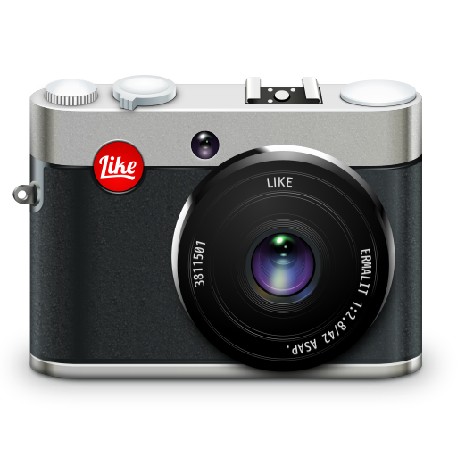
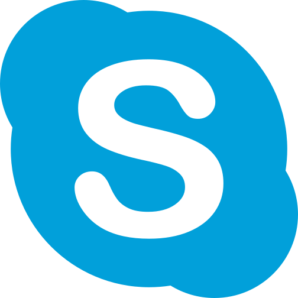
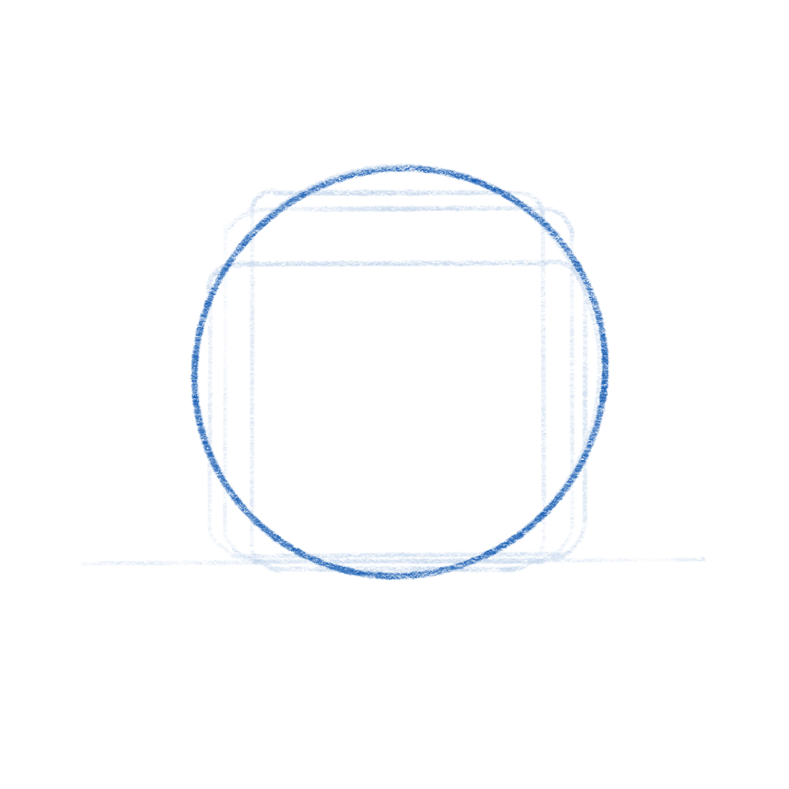
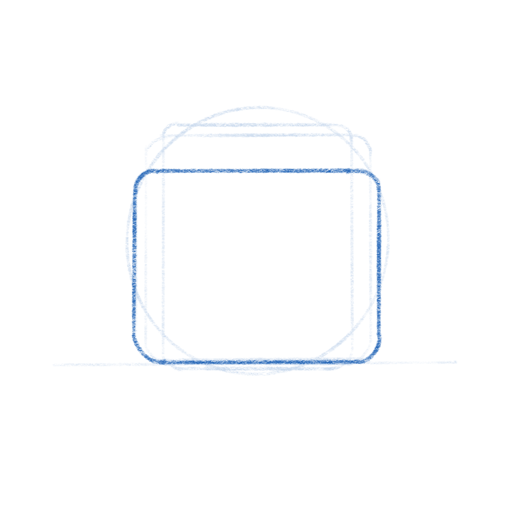
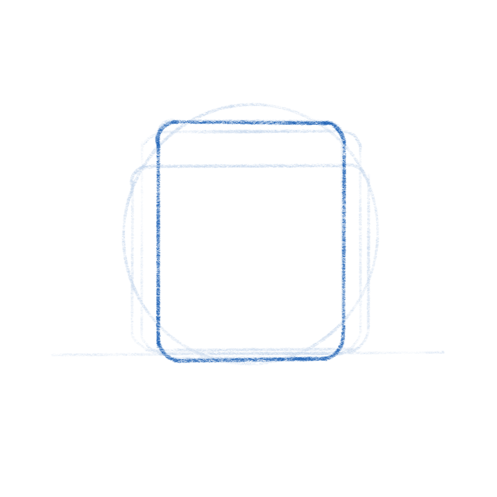
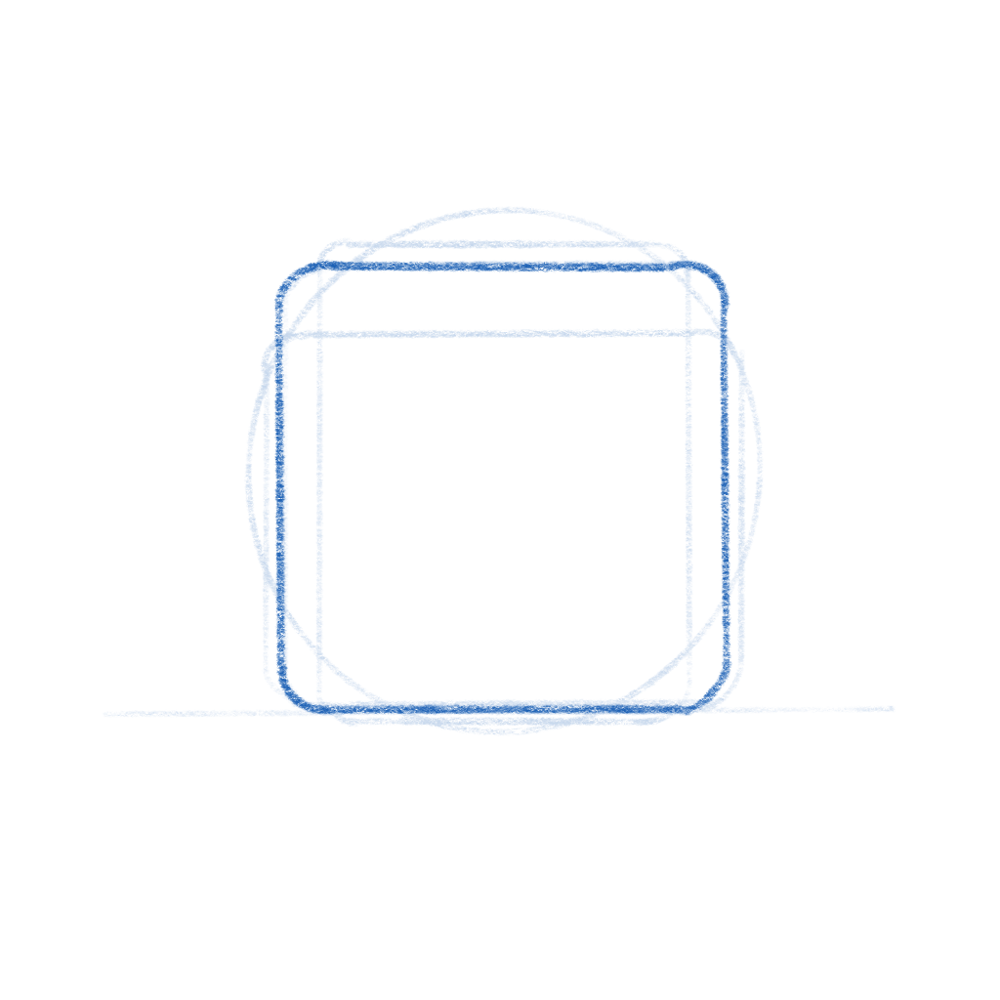
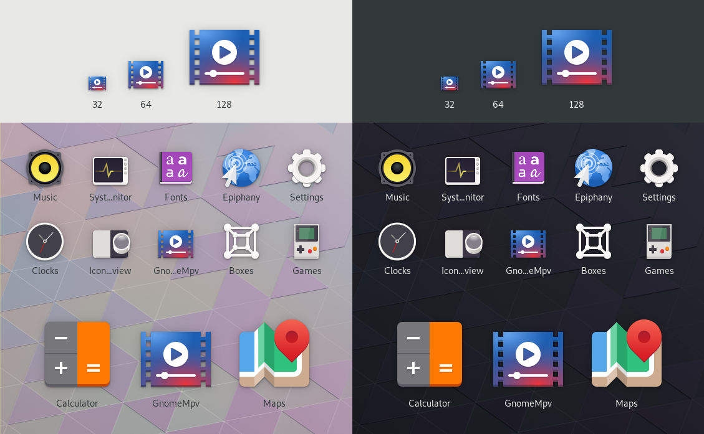
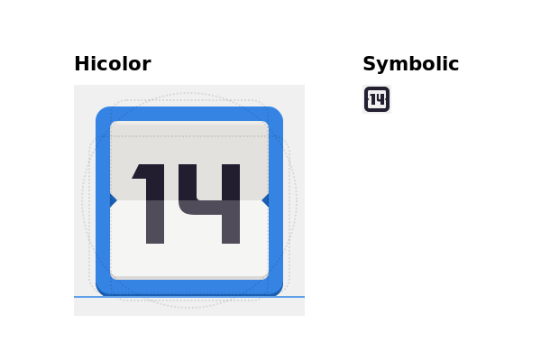
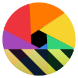
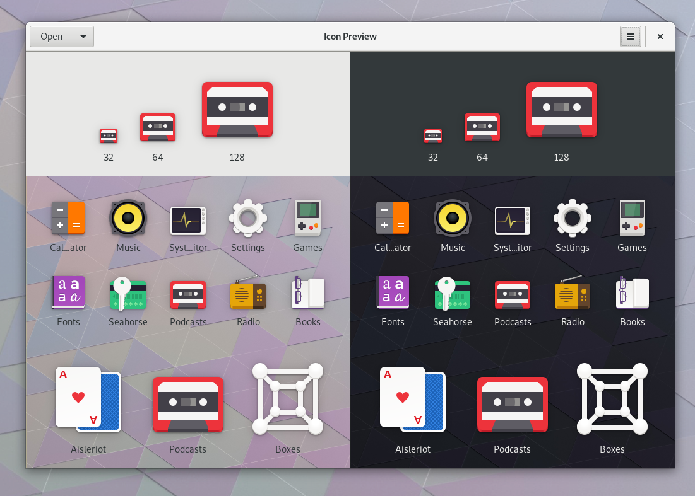

If your're reading this on Planet Gnome, please visit the <a href="{{ site.url }}{{ page.url }}">article on my site</a> to enjoy the inline CSS effects.

# The Revolution is Coming

As you may have heard, GNOME 3.32 is going to come with a radical new icon style and new guidelines for app developers. This post aims to give some background on why this was needed, our goals with the initiative, and our exciting plans for the future.

# The Problem
Our current icon style dates back all the way to the early 00s and the original [Tango](http://tango.freedesktop.org/Tango_Icon_Theme_Guidelines). One of the foundational ideas behind Tango was that each icon is drawn at multiple sizes, in order to look pixel-perfect in every context. This means that if you want to make an app icon you're not drawing one, but up to 7 separate icons (symbolic, 16px, 22px, 24px, 32px, 48px, and 512px).

{:class='centered'}

Making these icons takes quite a bit of experience and craftsmanship, and many of our high-detail icons are more [art than design](/blog/2018-07-18-detail-considered-harmful/). However, as a part of our design system the style has not succeeded, and is in dire need of reform. Some of the major issues:

- Many of the sizes aren't being used anywhere in the OS, and haven't been for the better part of a decade. Since we use either large sizes or symbolics in most contexts, the pixel-hinted small sizes are rarely seen by anyone.
- Only a handful of people have the skills to draw icons in this style, and it can take weeks to do a single app icon. This means that iterating on the style is very hard, which is one of the reasons why our icon style has been stagnant for years.
- Very few third-party apps are following the guidelines. Our icons are simply too hard to draw for mere mortals, and as a result even the best third-party GNOME apps often have bad icons.
- We (GNOME Designers) don't have the bandwidth to keep up with icon requests from developers, let alone update or evolve the style overall.
- The wider industry has moved on from the detailed icon styles of the 2000s, which gives new users the impression that our software is outdated.
- Cross-platform apps tend to ship with very simple, flat icons these days. The contrast between these icons and our super detailed ones can be quite jarring. 

# A New Beginning
One of the major project-wide goals GNOME over the past years has been empowering app developers. A big reason for this initiative is that we realized that the current style is holding us back as an ecosystem. Just as [Builder](https://wiki.gnome.org/Apps/Builder) is about providing a seamless development workflow, and [Flatpak](https://flatpak.org/) is about enabling direct distribution, this initiative is about making good icons more attainable for more apps.

So, what would a system designed from the ground up to empower app developers/designers to make good icons look like?

The first step is having clearer guidelines and [more constraints](/blog/2017-01-25-artistic-constraints/). The old style was all about eyeballing it and doing what feels right. That's fine for [veteran designers](https://twitter.com/lapz) used to the style, but makes it inaccessible to newcomers. The new style comes with a grid, a set of recommended base shapes, and a new color palette. We have also updated the section on [app icons](https://developer.gnome.org/hig/stable/icon-design.html.en) in the [HIG](https://developer.gnome.org/hig/stable/) with a lot more detailed information on how to design the icons.

The style is very **geometric**, making it easy to reuse and adapt elements from other icons. We're also removing baked-in drop shadows in favour of drawing them automatically from the icon's alpha channel in GTK/Shell depending on the rendering context. In most cases 3rd party icons don't come with baked in shadows and this makes icons easier to draw and ensures consistent shadows.

Another cornerstone of this initiative is reducing the number of icons to be drawn: From now on, you only need one full color icon and a monochrome symbolic icon.

The color icon is optimized for 64px (with a nominal size of 128px for historical reasons), but the simple geometric style without 1px strokes means that it also looks good larger *and* smaller.

This means the workflow changes from drawing 6 icons to just one (plus one symbolic icon). It also simplifies the way icons are shipped in apps. Instead of a a half dozen rendered PNGs, we can now ship a single color SVG (and a symbolic SVG). Thanks to the simple style most icons are only around 15kB.

<h1>Welcome to the Future</h1>

Having this single source of truth makes it orders of magnitude easier to iterate on different metaphors for individual icons, update the style as a whole, and a number of other exciting things we're working towards.

We've also been working on improving design tooling as part of this initiative. [Icon Preview](https://flathub.org/apps/details/org.gnome.IconPreview), a new app by [Zander Brown](https://github.com/ZanderBrown), is designed to make the icon design workflow smoother and faster. It allows you to quickly get started from a template, preview an icon in various contexts as you're designing it, and then finally optimizing and exporting the SVG to use in apps. The latter part is not quite ready yet, but the app already works great for the former two use cases.

# Let's Make Beautiful App Icons!

If you're a graphics designer and wish to bring consistency to the world of application icons, familiarize yourselves with [the style](https://developer.gnome.org/hig/stable/icon-design.html.en), grab [Icon Preview](https://flathub.org/apps/details/org.gnome.IconPreview), [Inkscape](https://flathub.org/apps/details/org.inkscape.Inkscape) and instead of patching up poor icons downstream with icon themes, please come join us [make beautiful upstream application icons](https://gitlab.gnome.org/GNOME/Initiatives/issues/2)!

