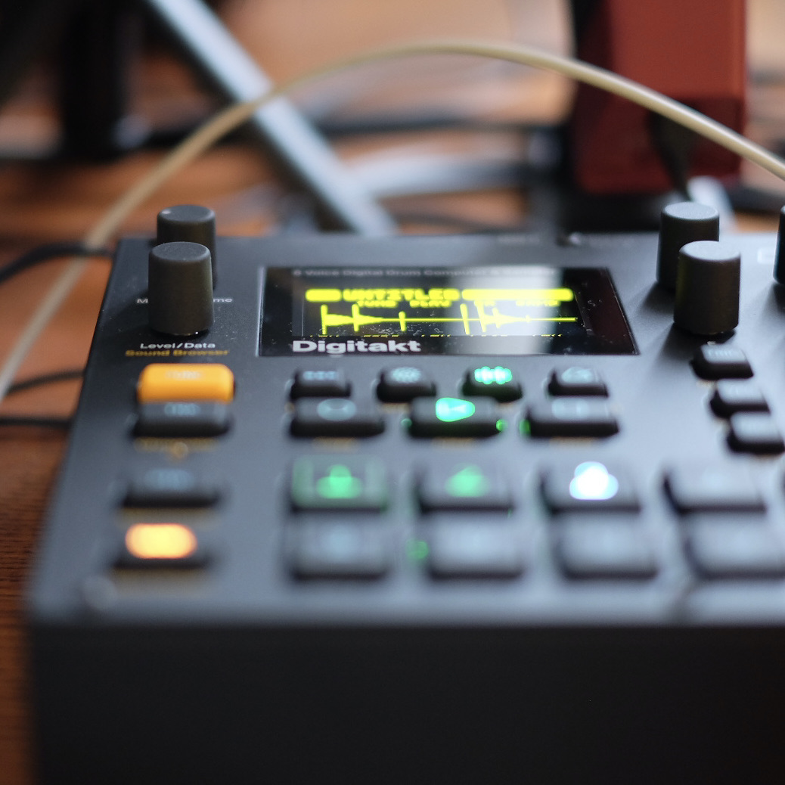

More than 20 years ago (gee), before I dipped my toes into Free software, I was into making electronic music using the tools that were available. In my case it was a PC with what was called a *mod tracker* ([Fast tracker 2](https://en.wikipedia.org/wiki/FastTracker_2) in particular). Later I found myself in love with a more sophisticated variant of a mod tracker, called [Jeskola Buzz](https://jeskola.net/buzz/) -- it *still exists!*

I had no theory behind me and never played any intrument, but I was driven by the amazing sounds the software produced and the gradual iteritative workflow it embraced. It allowed me to make things I actually [enjoyed listening to](https://jimmac.bandcamp.com/track/the-sphere), even years later. And that's perhaps the biggest value you get out of anything. If you are fortunate enough to be able to enjoy what you do, you've hit the jackpot. 

And this brings us to 20 years later, where I finally picked up where I left off. I dipped my toes in a hardware tracker, which didn't quite spark the joy, but it led me to the world of a swedish music gear make, [Elektron](https://elektron.se). These guys are the schoolbook example of *beautiful things works better*. There are common workflow patterns used throughout their gear, so through familiarity they win you over (non designer people like to call it the i-word, *intuitive*). The display is used really well. The knobs, pardon *encoders*, are multi-function, but they do a great job indicating the same filters/effects the same across the various UI pages. Everything about the physical objects they make is amazing, but then you get to the lush reverb sounds their Digitone produces and you're blown away.

I am still the amateur I was 20 years ago, but the joy of of nudging something that creates itself is still there. And I love it.

<!-- vimeo is a racket
<iframe src="https://player.vimeo.com/video/506578461" frameborder="0" allow="autoplay; fullscreen; picture-in-picture" allowfullscreen></iframe>

<a href="https://vimeo.com/506578461">Digitakt + Digitone: Boards of Landfill</a> from <a href="https://vimeo.com/jimmacfx">jimmac</a> on <a href="https://vimeo.com">Vimeo</a>.

-->

<iframe width="560" height="315" src="https://www.youtube.com/embed/sR_DaUlrM0o?si=n4dYHSjW7JgnmmMN" title="YouTube video player" frameborder="0" allow="accelerometer; autoplay; clipboard-write; encrypted-media; gyroscope; picture-in-picture; web-share" referrerpolicy="strict-origin-when-cross-origin" allowfullscreen></iframe>