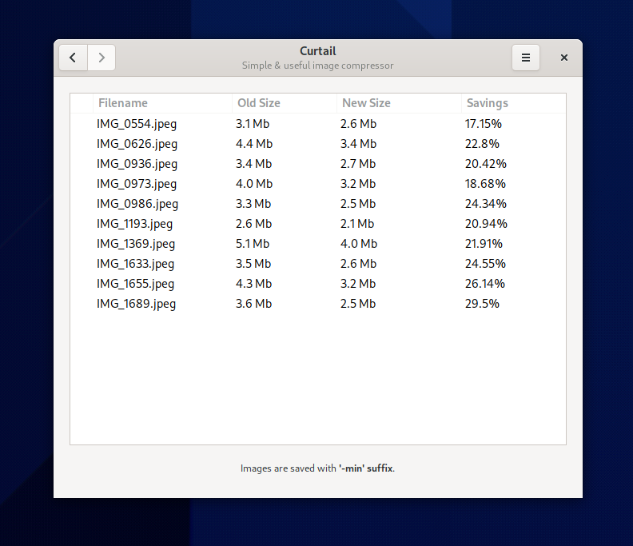

While the app got some spotlight on [GNOME Circle](https://circle.gnome.org), I found it super handy to my own use that I decided to write about it here as well.

<style type="text/css">
#curtailIcon {
  transform: scale(0.8);
  transition: all 1s ease-in-out;
  cursor: pointer;
  filter: drop-shadow(0 2px 4px rgba(0,0,0,0.8));
}
#curtailIcon:hover {
  transform: scale(0.9);
  filter: drop-shadow(0 30px 20px rgba(0,0,0,0.2));
}
</style>

<a href="https://flathub.org/apps/details/com.github.huluti.Curtail"><svg id="curtailIcon" ViewBox="0 0 128 128" xmlns="http://www.w3.org/2000/svg" xmlns:xlink="http://www.w3.org/1999/xlink"><linearGradient id="a" gradientUnits="userSpaceOnUse"><stop offset="0" stop-color="#63452c"/><stop offset=".038" stop-color="#865e3c"/><stop offset=".077" stop-color="#63452c"/><stop offset=".923" stop-color="#63452c"/><stop offset=".962" stop-color="#865e3c"/><stop offset="1" stop-color="#63452c"/></linearGradient><linearGradient id="e" gradientTransform="matrix(.23214 0 0 .20395 -8.567 209.652)" x1="88.596" x2="536.596" xlink:href="#a" y1="-449.394" y2="-449.394"/><linearGradient id="f" gradientTransform="matrix(.23214 0 0 .125 -8.567 152.174)" x1="88.596" x2="536.596" xlink:href="#a" y1="-449.394" y2="-449.394"/><linearGradient id="b" gradientUnits="userSpaceOnUse"><stop offset="0" stop-color="#3d3846"/><stop offset=".038" stop-color="#c0bfbc"/><stop offset=".077" stop-color="#77767b"/><stop offset=".164" stop-color="#cbcbcd"/><stop offset=".923" stop-color="#5f5e63"/><stop offset=".962" stop-color="#9a9996"/><stop offset="1" stop-color="#3d3846"/></linearGradient><linearGradient id="g" gradientTransform="matrix(.23214 0 0 .20395 -8.567 229.953)" x1="87.542" x2="535.261" xlink:href="#b" y1="-591.637" y2="-591.637"/><radialGradient id="h" cx="58.126" cy="294.38" gradientTransform="matrix(1.6319 0 0 1.37953 -36.73 -291.51)" gradientUnits="userSpaceOnUse" r="52"><stop offset="0" stop-color="#deddda"/><stop offset="1" stop-color="#deddda" stop-opacity="0"/></radialGradient><linearGradient id="i" gradientUnits="userSpaceOnUse" x1="30" x2="104" y1="94" y2="108"><stop offset="0" stop-color="#f6f5f4"/><stop offset="1" stop-color="#deddda"/></linearGradient><radialGradient id="j" cx="105.224" cy="148.63" gradientTransform="matrix(-.34149 -.18581 -.02812 .28036 103.637 95.975)" gradientUnits="userSpaceOnUse" r="160"><stop offset="0" stop-color="#e0371b"/><stop offset="1" stop-color="#f6d32d"/></radialGradient><radialGradient id="k" cx="352.98" cy="275.93" gradientTransform="matrix(.2992 .11247 .07205 -.18331 -46.417 48.045)" gradientUnits="userSpaceOnUse" r="192"><stop offset="0" stop-color="#50db81"/><stop offset="1" stop-color="#8ff0a4" stop-opacity=".004"/></radialGradient><radialGradient id="l" cx="527.624" cy="194.651" gradientTransform="matrix(-.15091 -.18657 -.19365 .15664 225.268 143.026)" gradientUnits="userSpaceOnUse" r="192"><stop offset="0" stop-color="#4a86cf"/><stop offset="1" stop-color="#87bae1" stop-opacity="0"/></radialGradient><linearGradient id="m" gradientTransform="matrix(.23013 0 0 .20218 -7.94 400.462)" x1="87.542" x2="535.261" xlink:href="#b" y1="-591.637" y2="-591.637"/><linearGradient id="n" gradientUnits="userSpaceOnUse" x1="52.55" x2="56.979" y1="103.619" y2="57.049"><stop offset="0" stop-color="#9b9a96"/><stop offset="1" stop-color="#c0bfbc"/></linearGradient><linearGradient id="c" gradientUnits="userSpaceOnUse"><stop offset="0" stop-color="#b1b0b6"/><stop offset=".5" stop-color="#d8d7d6"/><stop offset="1" stop-color="#6f667f"/></linearGradient><linearGradient id="o" gradientTransform="scale(-1 1) rotate(67.81 9.946 118.092)" x1="49.325" x2="53.605" xlink:href="#c" y1="222.747" y2="230.159"/><linearGradient id="p" gradientTransform="matrix(3.0015 0 0 -3.0015 -128.105 -573.326)" gradientUnits="userSpaceOnUse" x1="58" x2="70" y1="-211" y2="-211"><stop offset="0" stop-color="#77767b"/><stop offset=".5" stop-color="#9a9996"/><stop offset="1" stop-color="#77767b"/></linearGradient><linearGradient id="q" gradientUnits="userSpaceOnUse" x1="56.855" x2="71.127" y1="46.093" y2="46.093"><stop offset="0" stop-color="#5e5c64"/><stop offset=".5" stop-color="#c0bfbc"/><stop offset="1" stop-color="#3d3846"/></linearGradient><linearGradient id="d" gradientUnits="userSpaceOnUse"><stop offset="0" stop-color="#b1b0b6"/><stop offset=".272" stop-color="#c0c0be"/><stop offset="1" stop-color="#6f667f"/></linearGradient><linearGradient id="r" gradientTransform="scale(-1 1) rotate(51.875 13.743 81.732)" x1="61" x2="67" xlink:href="#d" y1="220" y2="220"/><linearGradient id="s" gradientTransform="matrix(2.37866 0 0 -2.37866 -88.244 -469.48)" gradientUnits="userSpaceOnUse" x1="58" x2="70" y1="-211" y2="-211"><stop offset="0" stop-color="#77767b"/><stop offset=".5" stop-color="#c0bfbc"/><stop offset="1" stop-color="#77767b"/></linearGradient><radialGradient id="t" cx="-203.367" cy="-63.488" gradientTransform="matrix(0 -1.18935 -1.18935 0 -12.128 -205.452)" gradientUnits="userSpaceOnUse" r="12"><stop offset="0" stop-color="#f0f0f0"/><stop offset="1" stop-color="#9a999a"/></radialGradient><linearGradient id="u" gradientTransform="scale(-1 1) rotate(51.875 15.076 81.083)" x1="61" x2="67" xlink:href="#d" y1="220" y2="220"/><linearGradient id="v" gradientTransform="scale(-1 1) rotate(67.81 10.503 117.717)" x1="49.325" x2="53.605" xlink:href="#c" y1="222.747" y2="230.159"/><radialGradient id="w" cx="96.054" cy="219.449" gradientTransform="matrix(-2.48287 0 0 2.7121 268.232 -538.415)" gradientUnits="userSpaceOnUse" r="2.415"><stop offset="0" stop-color="#cfcecd"/><stop offset="1" stop-color="#827b8f"/></radialGradient><radialGradient id="x" cx="96.741" cy="219.745" gradientTransform="matrix(2.35544 0 0 2.5729 -127.997 -507.96)" gradientUnits="userSpaceOnUse" r="2.415"><stop offset="0" stop-color="#92918f"/><stop offset="1" stop-color="#524d5b"/></radialGradient><path d="M20 56h88a8 8 0 018 8v46a8 8 0 01-8 8H20a8 8 0 01-8-8V64a8 8 0 018-8zm0 0" fill="url(#e)"/><path d="M20 30h88v66H20zm0 0" fill="#f6f5f4"/><path d="M20 58h88a8 8 0 018 8v22a8 8 0 01-8 8H20a8 8 0 01-8-8V66a8 8 0 018-8zm0 0" fill="url(#f)"/><path d="M20 58h88a8 8 0 018 8v46a8 8 0 01-8 8H20a8 8 0 01-8-8V66a8 8 0 018-8zm0 0" fill="url(#g)"/><path d="M21.453 28.082h85.094c5.219 0 9.453 3.582 9.453 8V108c0 4.418-4.234 8-9.453 8H21.453c-5.219 0-9.453-3.582-9.453-8V36.082c0-4.418 4.234-8 9.453-8zm0 0" fill="url(#h)"/><path d="M21.453 26.082h85.094c5.219 0 9.453 3.582 9.453 8V106c0 4.418-4.234 8-9.453 8H21.453c-5.219 0-9.453-3.582-9.453-8V34.082c0-4.418 4.234-8 9.453-8zm0 0" fill="#5e5c64"/><path d="M20 64h88v46H20zm0 0" fill="url(#i)"/><path d="M108 106l-.137 4H20.121L20 106zm0 0" fill-opacity=".137"/><path d="M107.691 106.969H35.93l71.242 1.027s.52-.773.52-1.027zm0 0" fill="#f6f5f4" fill-opacity=".598"/><path d="M106.773 108.488H34.168l71.266 1.024c.554-.29 1.132-.63 1.34-1.024zm0 0" fill-opacity=".171"/><path d="M29.777 67.469l52.239-42.254c2.41-1.953 5.898-1.613 7.812.758l21.664 26.777L108.145 82l-40.266 32.57c-2.414 1.953-5.899 1.614-7.817-.754L28.883 75.27c-1.913-2.372-1.519-5.848.895-7.801zm0 0" fill="#f6f5f4"/><path d="M111.547 52.816L99.574 62.5c-2.41 1.95-2.808 5.43-.89 7.8l9.46 11.7zm0 0" fill="#deddda"/><path d="M33.27 71.785l31.148 38.508 40.266-32.57-6-7.422c-1.918-2.371-1.52-5.852.89-7.801l7.617-6.16-21.683-26.813zm0 0" fill="url(#j)"/><path d="M33.27 71.785l31.148 38.508 40.266-32.57-6-7.422c-1.918-2.371-1.52-5.852.89-7.801l7.617-6.16-21.683-26.813zm0 0" fill="url(#k)"/><path d="M33.27 71.785l31.148 38.508 40.266-32.57-6-7.422c-1.918-2.371-1.52-5.852.89-7.801l7.617-6.16-21.683-26.813zm0 0" fill="url(#l)"/><path d="M83.855 101.496l34.844-34.11a3.903 3.903 0 001.176-2.906 3.913 3.913 0 00-1.328-2.84l-9.207-8.09zm0 0" fill="#f6f5f4"/><path d="M20.02 64.328h88.07a8 8 0 018 8v21.73a8 8 0 01-8 8H20.02a8 8 0 01-8-8v-21.73a8 8 0 018-8zm0 0" fill="url(#g)"/><path d="M21.824 190.43h84.23c5.223 0 9.454 3.582 9.454 8v63.363c0 4.418-4.23 8-9.453 8h-84.23c-5.22 0-9.454-3.582-9.454-8V198.43c0-4.418 4.234-8 9.453-8zm0 0" fill="url(#m)" stroke="#9a9996" transform="translate(0 -172)"/><path d="M21.375 16h85.129c5.223 0 9.457 3.582 9.457 8v64.059c0 4.418-4.234 8-9.457 8H21.375c-5.223 0-9.453-3.582-9.453-8V24c0-4.418 4.23-8 9.453-8zm0 0" fill="url(#n)"/><path d="M57.66 210.34l34.78-25.779" fill="#77767b" stroke="url(#o)" stroke-linecap="round" stroke-width="6.726" transform="matrix(1.18935 0 0 1.18935 -12.127 -214.827)"/><path d="M63.992 36.352c-9.949 0-18.012 8.066-18.012 18.011v5.63C45.98 69.936 54.043 78 63.992 78 73.938 78 82 69.937 82 59.992v-5.629c0-9.945-8.063-18.011-18.008-18.011zm0 0" fill="url(#p)"/><path d="M63.992 36.629c-9.5 0-17.199 7.7-17.199 17.195 0 9.5 7.7 17.2 17.2 17.2 9.495 0 17.194-7.7 17.194-17.2 0-9.496-7.699-17.195-17.195-17.195zm0 0" fill="#deddda"/><path d="M58.043 31.227l-1.188 2.378 1.188 2.38-1.188 2.378 1.188 2.38-1.188 2.378 1.188 2.379-1.188 2.379 1.188 2.379-1.188 2.379v1.187a7.133 7.133 0 0010.704 6.18 7.133 7.133 0 003.566-6.18v-3.566l-1.188-2.38 1.188-2.378-1.188-2.379 1.188-2.379-1.188-2.379 1.188-2.379-1.188-2.379 1.188-2.378-1.188-2.38zm0 0" fill="url(#q)"/><path d="M69.938 33.605s-1.61 4.348-5.84 4.778c-4.235.43-6.055-2.399-6.055-2.399l-1.188 2.38s2.489 3.308 7.243 3.034c4.75-.277 6.882-5.367 7.027-5.414zm0 0" fill="#fff" fill-opacity=".382"/><path d="M71.125 35.984c-.145.047-2.277 5.137-7.027 5.414-4.754.274-7.243-3.035-7.243-3.035l1.188 2.38s1.82 2.823 6.055 2.398c4.23-.43 5.84-4.778 5.84-4.778l.05.102zm0 0" fill="#241f31" fill-opacity=".339"/><g fill="#fff" fill-opacity=".382"><path d="M69.938 43.121s-1.61 4.348-5.84 4.777c-4.235.426-6.055-2.398-6.055-2.398l-1.188 2.379s2.489 3.309 7.243 3.031c4.75-.277 6.882-5.363 7.027-5.41zm0 0"/><path d="M69.938 47.879s-1.715 4.348-5.946 4.777c-4.234.426-5.949-2.398-5.949-2.398l-1.188 2.379s2.383 3.308 7.137 3.031c4.75-.277 6.988-5.367 7.133-5.41zm0 0M69.938 38.363s-1.61 4.348-5.84 4.778c-4.235.425-6.055-2.399-6.055-2.399l-1.188 2.38s2.489 3.308 7.243 3.03c4.75-.273 6.882-5.363 7.027-5.41zm0 0"/></g><path d="M71.125 45.5c-.145.047-2.277 5.137-7.027 5.41-4.754.278-7.243-3.031-7.243-3.031l1.188 2.379s1.82 2.824 6.055 2.394c4.23-.425 5.84-4.773 5.84-4.773l.05.101zm0 0" fill="#241f31" fill-opacity=".339"/><path d="M71.125 40.742c-.145.047-2.277 5.137-7.027 5.41-4.754.278-7.243-3.03-7.243-3.03l1.188 2.378s1.82 2.824 6.055 2.395c4.23-.426 5.84-4.774 5.84-4.774l.05.102zm0 0" fill="#241f31" fill-opacity=".339"/><path d="M69.003 210.133L35.68 184.407" fill="#77767b" stroke="url(#r)" stroke-linecap="round" stroke-width="6.726" transform="matrix(1.18935 0 0 1.18935 -12.127 -214.827)"/><path d="M78.262 32.418c0-7.883-6.39-14.273-14.27-14.273-7.883 0-14.273 6.39-14.273 14.273s6.39 14.27 14.273 14.27c7.88 0 14.27-6.387 14.27-14.27zm0 0" fill="url(#s)"/><path d="M63.992 11.008c-7.883 0-14.273 6.39-14.273 14.273s6.39 14.274 14.273 14.274c7.88 0 14.27-6.39 14.27-14.274s-6.39-14.273-14.27-14.273zm0 0" fill="url(#t)"/><path d="M49.742 31.71c-.012.235-.02.47-.023.708 0 7.883 6.39 14.27 14.273 14.27 7.88 0 14.27-6.387 14.27-14.27a9.81 9.81 0 00-.024-.484c-.375 7.597-6.64 13.562-14.246 13.566-7.687-.012-13.988-6.105-14.25-13.79zm0 0" fill="#77767b"/><path d="M63.992 11.008c-6.812 0-12.336 5.523-12.336 12.336S57.18 35.68 63.992 35.68s12.332-5.524 12.332-12.336-5.52-12.336-12.332-12.336zm0 0" fill="#c0bfbc"/><path d="M92.32 227.56l-17.792-13.962" fill="#77767b" stroke="url(#u)" stroke-linecap="round" stroke-width="6.726" transform="matrix(1.18935 0 0 1.18935 -12.127 -214.827)"/><path d="M35.559 227.95l17.867-13.863" fill="#77767b" stroke="url(#v)" stroke-linecap="round" stroke-width="6.726" transform="matrix(1.18935 0 0 1.18935 -12.127 -214.827)"/><path d="M26.164 56.594a3.692 3.692 0 003.695 3.691c1.164 0 2.254-1.484 2.254-2.8a3.698 3.698 0 00-3.695-3.696c-1.125 0-2.254 1.172-2.254 2.805zm0 0" fill="url(#w)"/><path d="M101.648 55.969a4.044 4.044 0 01-4.043 4.043c-1.277 0-2.468-1.621-2.468-3.067a4.044 4.044 0 014.043-4.043c1.23 0 2.468 1.282 2.468 3.067zm0 0" fill="#9c98a2"/><path d="M101.648 56.508a3.503 3.503 0 01-3.503 3.504c-1.106 0-2.141-1.407-2.141-2.657a3.504 3.504 0 013.508-3.503c1.066 0 2.136 1.109 2.136 2.656zm0 0" fill="url(#x)"/><path d="M50.59 102.086l1.98 2.789h27.285l3.415-2.887zm0 0" fill-opacity=".225"/></svg></a>


# ImageMagick

Even though I keep forgetting syntax for everything, one of the few bash constructs I remember is the `for in` loop. Mainly because that's how I repeadly convert and modify images on the command line with ImageMagick's `convert` or `mogrify` (same but dangerously operating on the same file):

```
for image in *jpeg; 
	do 
	out=`basename $image .jpeg`-thumb.jpeg
	convert -geometry 400 $image $out
done
```

Well usually on one line as:

```
for image in *jpeg; do out=`basename $image .jpeg`-thumb.jpeg; convert -geometry 400 $image $out; done
```

# Curtail

Curtail's main weapon is **convention**. Convention trumps configurability in my book (even if there are some preferences). Rather than making you configure a behavior, before you can do anything, it provides one. You either dig it and can immediately be productive, or you don't and flame it on reddit and the orange site. Sorry I meant move on.



So what's the convention? The main workflow is you drop images onto it with drag and drop and it automatically compresses the images. The only decision you have to make upfront is whether you allow it to compress it more by going lossy or not. That's it. No selecting of output directory, scaling, formats. Nothing. Just drop images and get them processed. They will end up in the same directory as the source, with a `-min` suffix. Everything happens immediately and you will see a summary of the conversion in the window. It is very rare to run into such an app in the FOSS world. Thank you, [Hugo](https://hugo-posnic.fr/).
