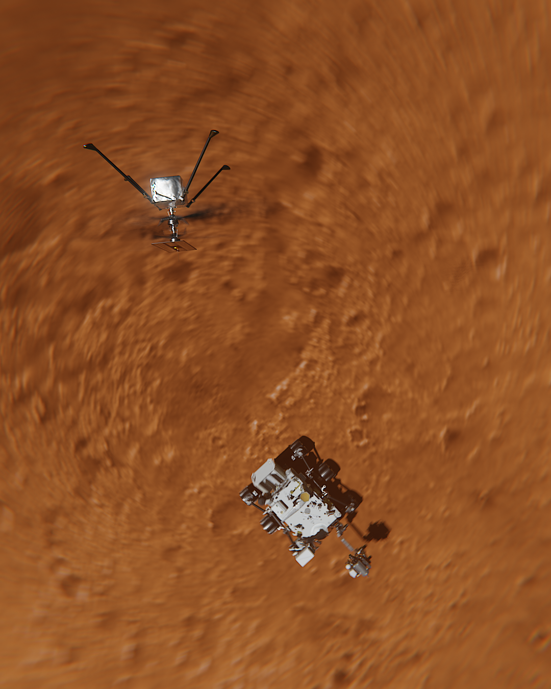

[comment]: <> 

[comment]: <> <a href="{{ site.url }}{{ page.url }}">absolute links</a>

When I [previously posted]()
about the Perseverance landing, I didn't realize NASA has actually published textured models of [the lander](https://mars.nasa.gov/resources/25042/mars-perseverance-rover-3d-model/) and it's cute not-so-little maritan helicopter, [Ingenuity](https://mars.nasa.gov/resources/25043/mars-ingenuity-helicopter-3d-model/).

Naturally I was drawn to play around with the model over the past few weeks and after posting a little [Instagram test](https://www.instagram.com/p/CLpfH-KHNHg/), a more elaborate [Instagram Reel](https://www.instagram.com/reel/CLuEO-fFzRi/), I was naturally bound to theme some of my fpv flights as martian exploration. I'm glad I managed to create one before the actual Ingenuity test flight, because the strict lockdown really limits any fitting location right now.

All of the martian footage has been rendered with the realtime eevee engine, maxing out at 20 seconds per frame. The focal blur has been improved in eevee recently, but Cycles was used for all the fpv overlays for now.

<iframe src="https://player.vimeo.com/video/526888385" frameborder="0" allow="autoplay; fullscreen; picture-in-picture" allowfullscreen></iframe>

<a href="https://vimeo.com/526888385">Digitone + Digitakt: Ingenuity FPV</a> from <a href="https://vimeo.com/jimmacfx">jimmac</a> on <a href="https://vimeo.com">Vimeo</a>.

The original track was recorded at 60BPM, but sadly the footage is unbearable to watch for over 4 minutes, so I've resampled it to 90BMP to keep the legth down. It does glitch at some points, but the motivation to work on this has reached critical levels, so I'm calling it done.
