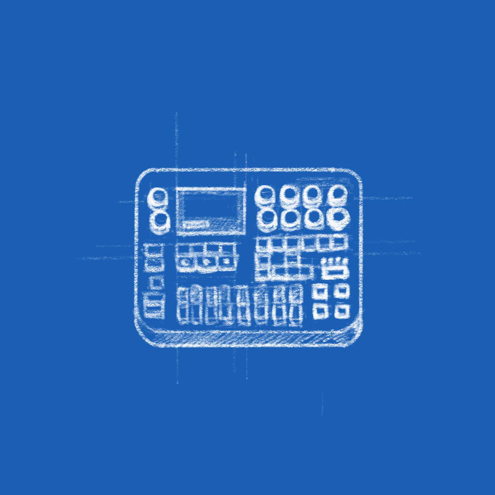

While I have a planned post about the Polyend Tracker, a marvelous music tracker in a box from Poland, I'm posting this short one about my newly found love of performing electronic music "live".

Obviously I have to preface this by saying that I am absoutely aware just how terrible I am. At the same time, there are very few things I do terribly, that bring me so much joy not only while I do them, but even when I get to listen to them back afterwards. I know I'm off here, I know I miss a quiet part after the energy rise there. And yet it feels like magic that *I've created that*.

<iframe title="vimeo-player" src="https://player.vimeo.com/video/531996041" width="640" height="360" frameborder="0" allowfullscreen></iframe>

I always enjoy processes where I only give a hint of direction and just enjoy the ride while the result builds itself. Trackers felt great because they allow you to consistently adjust and build upon some foundations. The idea that I have to have a plan in my head and have to move fast enough not to screw up sounded terrible when I started. Even without involving other people, it felt stressful. But I stuck with it and now I actually enjoy the process. Yes, I do have to take multiple takes and have to fight my urge to do a 100% clean run, but learning to publish something is something that also doesn't come naturally.

<iframe title="vimeo-player" src="https://player.vimeo.com/video/537374986" width="640" height="360" frameborder="0" allowfullscreen></iframe>

<!--
<iframe title="vimeo-player" src="https://player.vimeo.com/video/533270191" width="640" height="360" frameborder="0" allowfullscreen></iframe>
-->
Don't expect Tinlicker or Jon Hokins yet, but I'm hopeful that this time next year I will still be posting about my music.

[Previously]().
