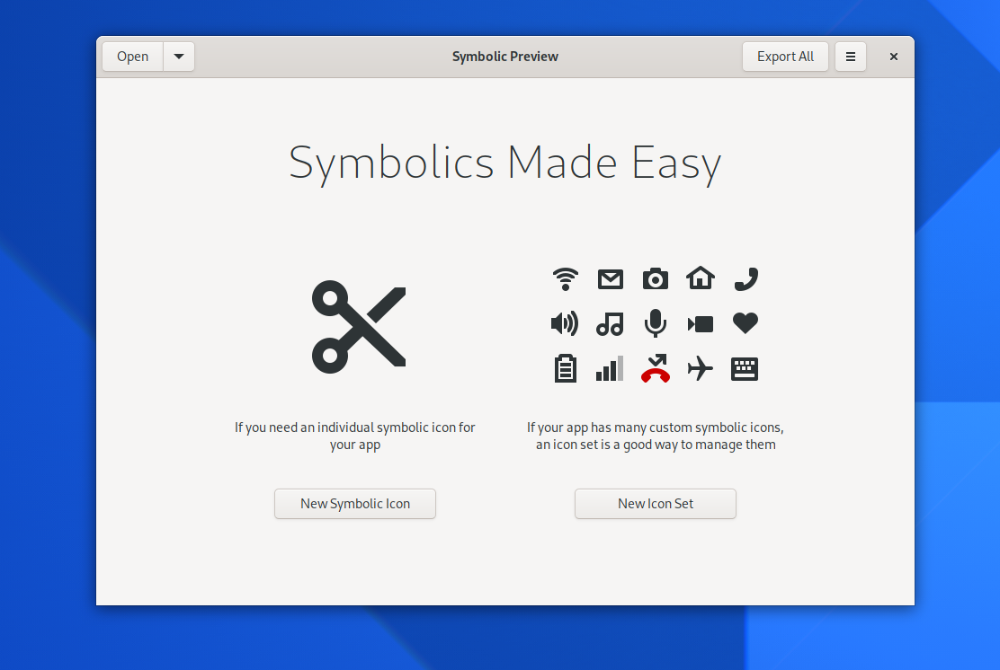
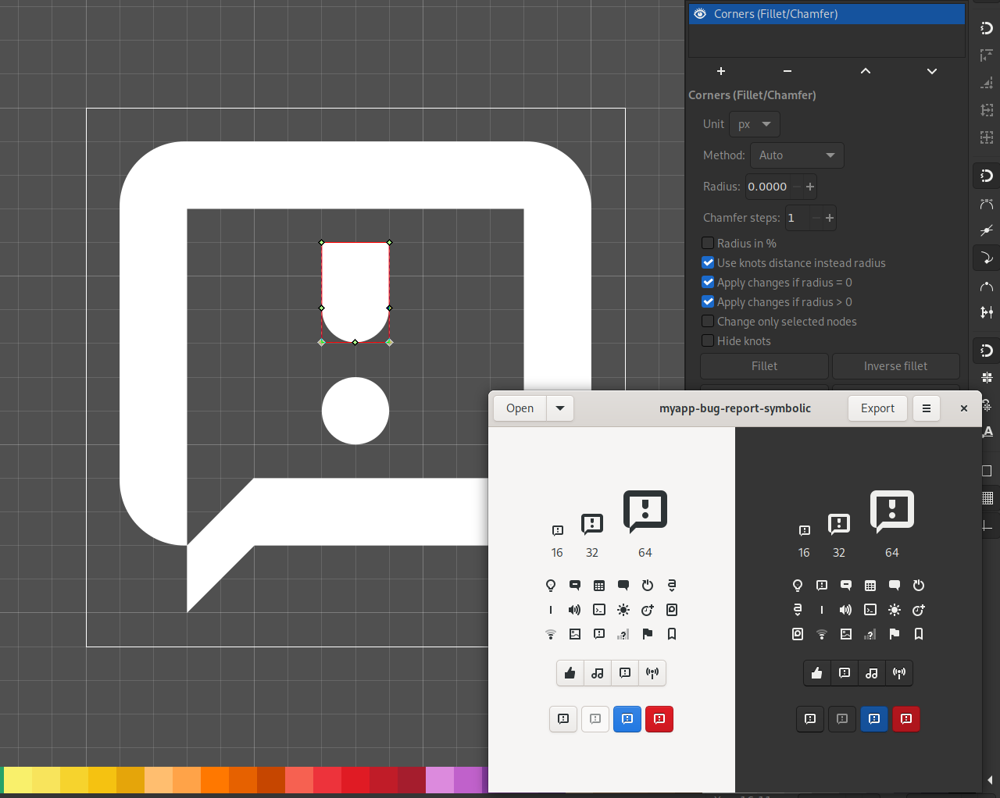
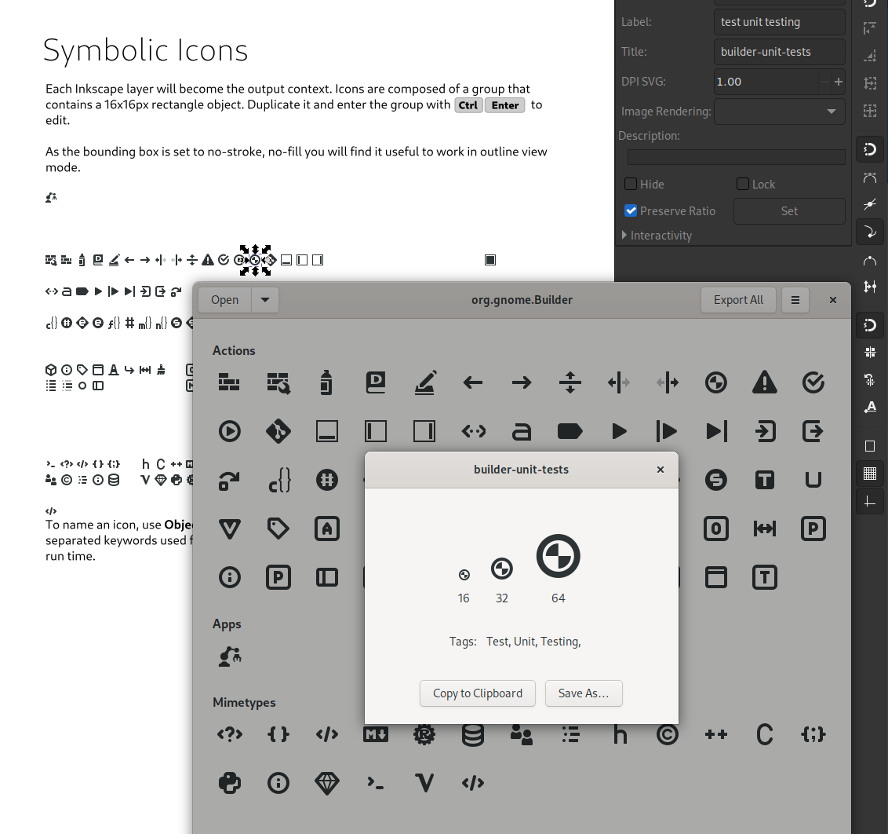

Unlike [application icons](), the [symbolic icons](https://teams.pages.gitlab.gnome.org/Design/hig-www/guidelines/ui-icons.html) don't convey application identity, but rely on visual metaphor to describe an action (what a button in the UI does).

GNOME has not used fullcolor icons in toolbars and most of the UI in many years. Instead we use symbols, adjusting legibility and their rendering the same way we do with text (recoloring the foreground and background as you can demo switching the dark theme on this blog post).



But how does one create such an icon? Here's a walkthrough of the process, using our 2021 tooling. While the actual drawing of shapes still happens in [Inkscape](https://flathub.org/apps/details/org.inkscape.Inkscape), the workflow is now heavily supported by a suite of [design tools](https://tools.design.gnome.org).

Before we dive into *creation* though, let's start with a more common case: In many cases developers just want to pick and use an existing icon rather than attempting to create it or commission a designer.

## Finding an Icon

Historically, looking up icons has been a matter of familiarizing yourself with the [icon naming spec](https://developer.gnome.org/icon-naming-spec/), which was built on the concept of *semantic naming*. However, it turns out developers really just want that symbol that *looks like a door*, rather than adhering to the strict semantic constraints. Combined with icon themes and evolving visual trends this semantic dream gradually faded over time.

The very basic set of icons is provided directly by the [toolkit](https://gtk.org). For the most part it still adheres to the semantic names such as `edit-copy` or `menu-open` rather than descriptive names like `scissors` or `pencil`. The coverage of the set is [quite conservative](https://gitlab.gnome.org/GNOME/gtk/-/tree/master/gtk/icons/scalable) and you're likely to need something that isn't provided by GTK itself. 

Sounds like a lot of work? Lucky for you we have [Icon Library](https://flathub.org/apps/details/org.gnome.design.IconLibrary) to make this easy!

### Icon Library

The app can help you not only to search for an appropriate icon using keywords, it can assist you distributing the assets along with your app (as a [gresource](https://developer.gnome.org/gio/stable/GResource.html)). While it's on you as a developer to maintain the assets you bundle, no longer will your app break when you've used the `the wrench` icon when the designers followed a trend of using a pegged wheel for `preferences` or decided to drop an old or unused icon.

It's worth noting the app is also quite useful for designers, since you can also copy & paste icons into mockups easily.

The application is currently being ported to [GTK 4](https://gtk.org) so there's a lot of moving parts in the air at the moment, but the latest release on Flathub is perfectly usable.

## Creation

So let's assume the icons available don't really fit your need and you need to create one from scratch. I should boldly proclaim that with no API-like maintenance burden, the design team is more than happy to fulfill app developers' requests. Especially apps aiming to be listed in [GNOME Circle](https://circle.gnome.org), feel free to request an icon [on Gitlab](https://gitlab.gnome.org/Teams/Design/icon-development-kit/-/issues). 

The first step is always to figure out **the metaphor**. Sketching out some ideas on paper is a solid recommendation. Even if you think you're no good at sketching, try it. In fact, especially when you're not good at sketching, the process will help you identify very strong metaphors that convey the meaning even using a few squibbly lines. The more definition you provide, the harder it is to tell whether the function isn't overshadowed by the form.

Once you're somewhat convinced a fitting metaphor can be executed on the 16x16 pixel grid, it's time to reach for the tool to guide your throughout the process, [Symbolic Preview](https://flathub.org/apps/details/org.gnome.design.SymbolicPreview).

### A Handful

Let's assume you have a small app that is very early in development and you decided to make it easy to report issues with it and need a `report bug` icon for the headerbar.

`Symbolic Preview` either allows you to create a single symbolic or a sheet with many symbolics. In our first case, we'll go for just one.

After providing a name for your icon (prefixing with app name can avoid some [theming issues](https://gitlab.gnome.org/GNOME/gnome-screenshot/-/issues/125)) a template is saved. Currently you have to do some file system surfing to open up the asset in [Inkscape](https://flathub.org/apps/details/org.inkscape.Inkscape).

Symbolic preview can be used as its name suggests. Currently it doesn't [auto-reload](https://gitlab.gnome.org/World/design/symbolic-preview/-/issues/26) on changes, but hopefully that will come soon. 

There are some [basic guidelines](https://teams.pages.gitlab.gnome.org/Design/hig-www/guidelines/ui-icons.html) on how to produce a GNOME symbolic icons, but to provide a *tl;dr* &mdash; 

* Use filled shapes to provide enough contrast
* Maintain the overall contrast not going edge to edge
* Main outline should not use a hairline stroke, 2px strokes are advised
* Convert strokes to outlines. The old toolchain allowed to use strokes as long as no fill was used on the same object, but it has been the source of many misrenderings. Just convert all strokes to outlines with `Path>Stroke to Path` in Inkscape.

The app provides different color contexts and displays your icon among existing symbolics, not unlike what App Icon Preview does for app icons. Again, this is when you only need to ship a handful of icons with your app.

Your needs may, however, exceed just a few. Maintaining lots of individual icons in separate files becomes daunting. Also, there is no need to see your icons in the context of others when they form a large enough set on their own. 

The same app we just used to create and test a single symbolic icon can be used to maintain a large set of symbolics in a single library file. The [icon-development-kit](https://gitlab.gnome.org/Teams/Design/icon-development-kit) that is the source for most of the icons you can search with [Icons Library](https://flathub.org/apps/details/org.gnome.design.IconLibrary) is also maintained this way. Let's take a look how you can maintain a whole set of symbolics icons.

### A Lot

Unlike individual icons, for preview and export to work, this workflow is very Inkscape centered and there are numerous constraints to be mindful of, so let's dive in.

#### Export Conventions
There are a few conventions you need to follow in order for the export to work. Icon devel kit describes the [conventions in detail](https://gitlab.gnome.org/Teams/Design/icon-development-kit), but let's sum them up here:

- Each icon is a group (`<g>`). To force its size to be 16x16px, the icon should include a `<rect>` with no stroke or fill, that is exactly 16x16 and aligns to the pixel grid. This rectangle is removed during export.
- The name of the icon is taken from the `title` property of the group in the object properties in Inkscape (`Object>Object Properties`). (`<title/>`).
- If you wish to omit an icon in the preview and export, don't provide a name for it or append `-old` to it. This can be useful for some 'build assets'.

#### Metadata
While it's mainly useful for maintaining a collection like icon-development-kit, you will save yourself time [looking up your own assets](https://gitlab.gnome.org/World/design/symbolic-preview/-/issues/31) if you provide some metadata describing your icon. 

Keywords for an icon are given as space separated words in the `label` attribute in object properties in Inkscape (`inkscape:label` attribute).

# Acknowledgments

Jokingly we refer to the [design tool page](https://tools.design.gnome.org) as the *Bilal page*. A huge thank you goes to [Bilal Elmoussaoui](https://belmoussaoui.com/) for writing brilliant apps for GNOME and making the design process a little less punishing.

