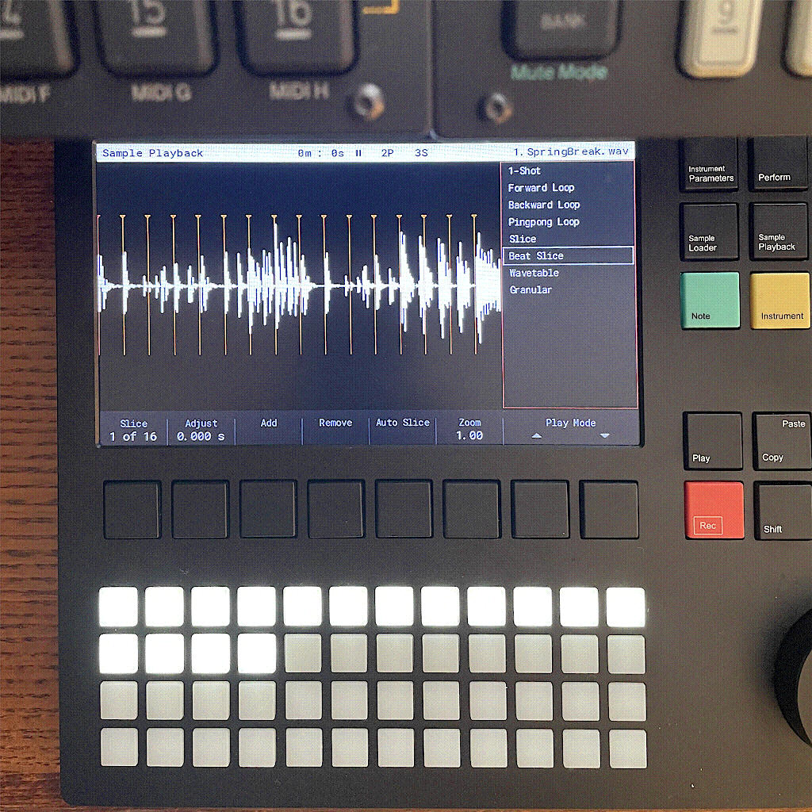

Having a hardware [tracker](https://en.wikipedia.org/wiki/Music_tracker) seems a little odd of a choice, but a small Polish company, [Polyend](https://polyend.com/) has really won me over.

[Beautiful things work better](https://www.nngroup.com/books/emotional-design/) and the machine is up there with [Elektron](https://www.elektron.se/) boxes. There are [more compact machines](https://dirtywave.com/) on the horizon, but over the weekend I was able to sit down outside and lay the basics of a track down. I have later finalized it in a [DAW](https://en.wikipedia.org/wiki/Digital_audio_workstation), based on the track stems you can export. Not sitting behind a computer and still arrange electronic music is a great luxury.

So without further ado, here's my weekend track:
<audio controls>
<source src="whatami.mp3" type="audio/mpeg">
<source src="whatami.aac" type="audio/aac">
<a href="https://soundcloud.com/jimmac/what-am-i">What am I? on Soundcloud</a>.
</audio>

[Previously](),
[Previously](),
[Previously]().
