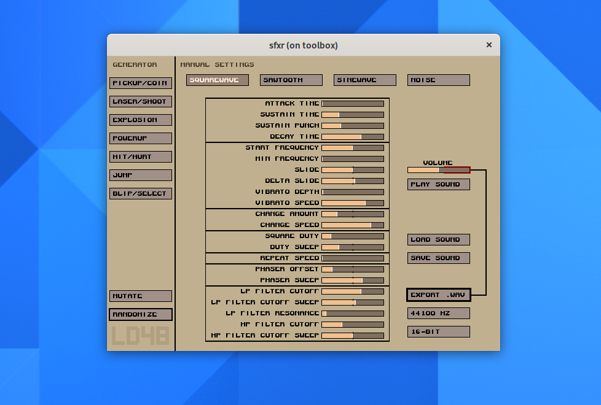
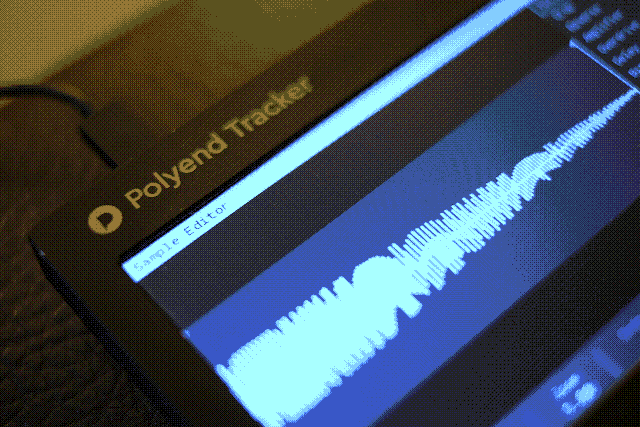
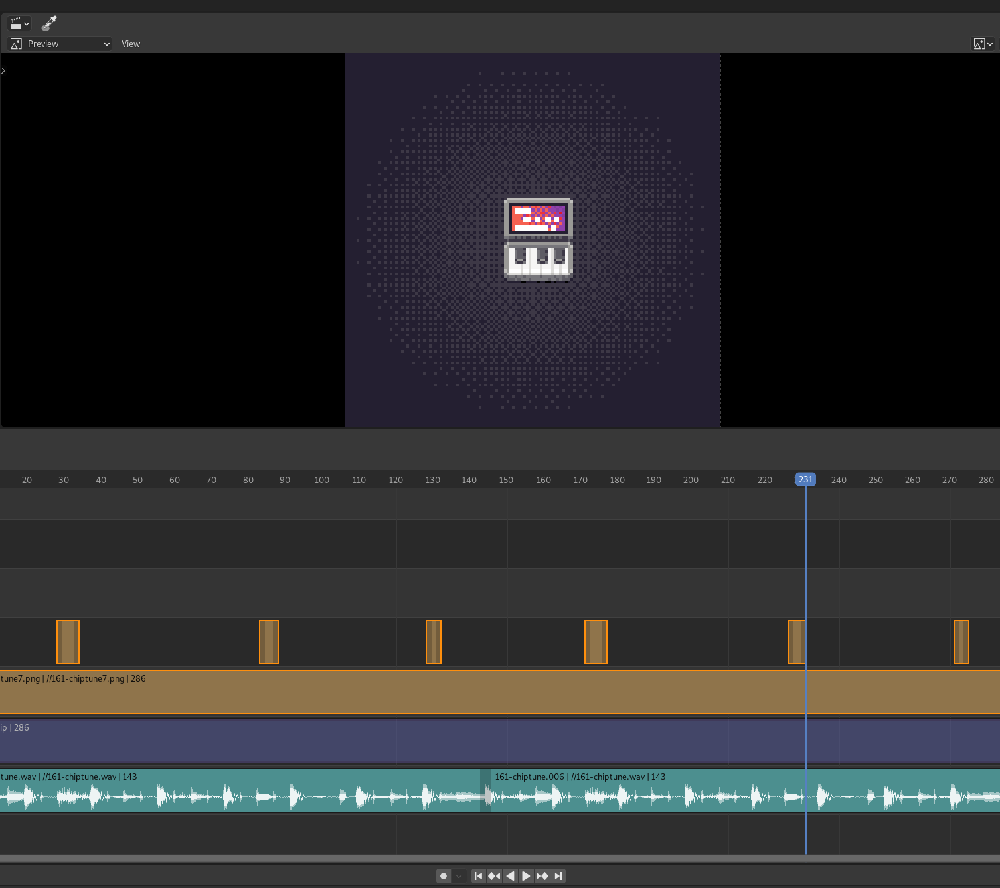

[comment]: <> <a href="{{ site.url }}{{ page.url }}">absolute links</a>
[comment]: [Previously]().

Been old-school-pixel-pushin' recently, for a project I'll hopefully reveal soon. But because I've also been really keen on music recently, a little side diversion happened that I'd like to share.

It started with generating some samples using the good old [SXFR](http://www.drpetter.se/project_sfxr.html). It's a tiny sythesizer for generating cute oldschool chiptune/game sound effects. Sadly it doesn't exist as [an app](https://flathub.org), which is a shame.

Then it was off to [Polyend Tracker](https://polyend.com/tracker/), even if in this case I was sitting in front of my computer so the benefit of having a physical machine to take anywhere was sort of diminished. 

In any case the included instrument editor with all its effects and filters came handy. I exported the [full song](https://soundcloud.com/jimmac/null-amusement) as well as a single pattern to use on the [Instagram loop](https://www.instagram.com/p/CTuF6TKoQHw/). This time I did no mastering at all, just plain uploaded the track to [soundcloud](https://soundcloud.com/jimmac/null-amusement) and called it done.

As for the visuals, I've used way many more tools than you'd expect. The icon assets were mainly done in [Pixaki](https://pixaki.com/), a fairly polished pixel editor for iPad. I have numerous beef with it for it being premium priced, mainly in the way it does layered animation, but it absolutely delivers on the immediacy and contrasts with filesystem diving of [Aseprite](https://www.aseprite.org/) which otherwise beats it bar none. Usually I convert GIFs exported from Aseprite or Pixaki using ffmpeg, but this time I needed to sync the animation to the sound, so I loaded up the GIF and the exported pattern from Tracker into Blender and with the *sound wave preview* that somehow isn't on by default, it was a quick job in the VSE.

[Previously](),
[Previously](),
[Previously](),
[Previously](),
[Previously](),
[Previously]().