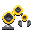
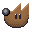
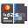

Recently I've been indulging myself in pixel art again. One might assume that's my comfort zone, but honestly I don't feel like I've ever truly mastered it. 

The initial push came from [my friend](https://vancura.design/), who quit his corporate job, to dive back into his passion and is [working on games](https://twitter.com/unientgames/status/1440048310962688000). Their first title is an oldschool pixel maze, (with a 2021 artistic twist, of course). His work inspired me to get back to pixel pushing.

To combine exploration with usefulness, I imagined mixing up of the new application icon style with pixels to perhaps bring back the [fun of colorful patterns](https://gitlab.gnome.org/GNOME/gnome-backgrounds/-/blob/gnome-3-36/backgrounds/Endless-shapes.jpg) into a wallpaper.

Sadly the result is visually [way too overwhelming](https://gitlab.gnome.org/GNOME/gnome-backgrounds/-/blob/wip/jimmac/prefers-dark-light/backgrounds/pixels-d.png), but the assets created can at least please your nostalgia bone here on planet GNOME (unless it becomes a mess without the stylesheet, we'll see). Stay curious!

{:.pixelicons}

