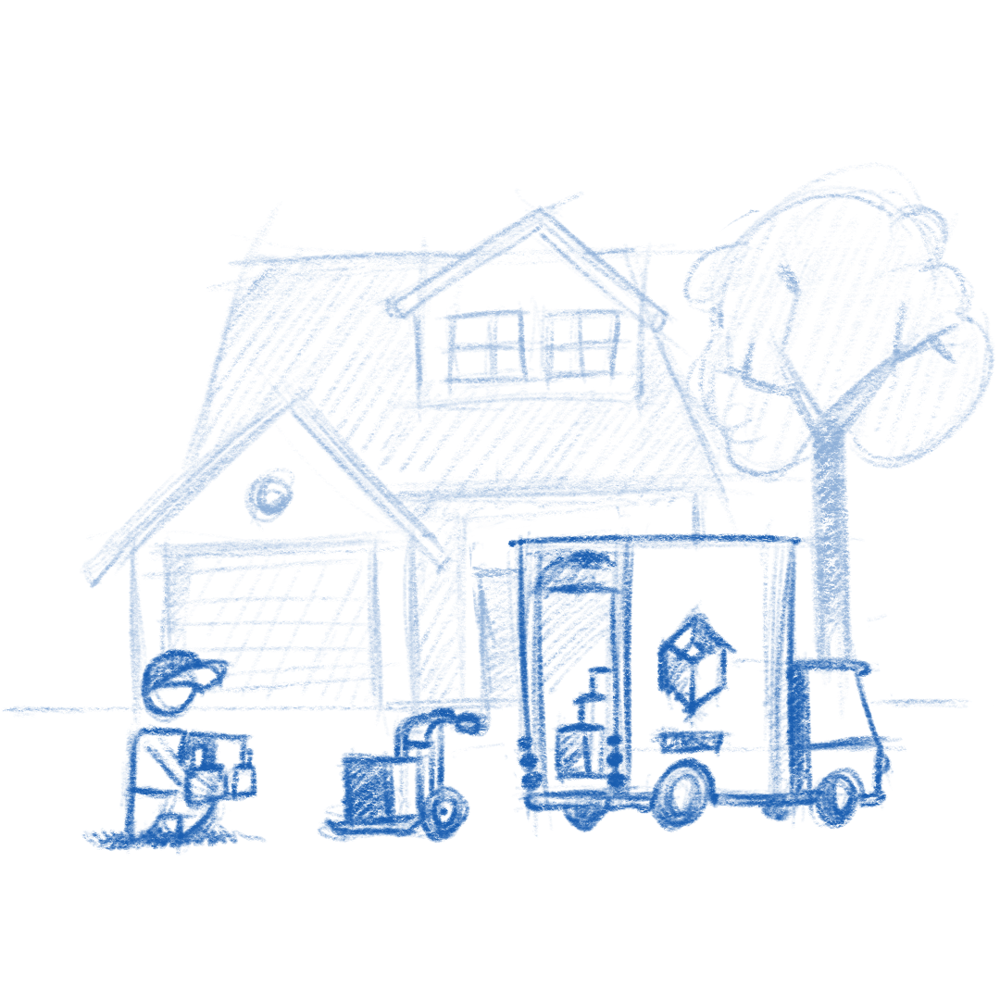
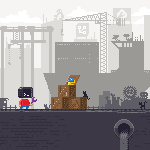
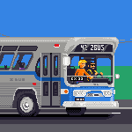

[comment]: <> <a href="{{ site.url }}{{ page.url }}">absolute links</a>

I've created a [couple](https://pipewire.org/) [of](https://fleet-commander.org/) [minisites](https://containertoolbx.org/) for key OS components, built using no frameworks, but plain CSS. Just having CSS grid and variables made it viable for me to avoid using frameworks recently. Having [includes/imports](https://www.w3.org/TR/html-imports/) one wouldn't even need [Jekyll](https://jekyllrb.com/).

The founding stone on all of these is the pixel art, which is now becoming my favorite art form.

{:.pixels}

If you maintain an upstream OS component and are looking to replace a wiki or a markdown readme with a simple site, I've [created a template](https://github.com/jimmac/os-component-website) to get you started quickly.
