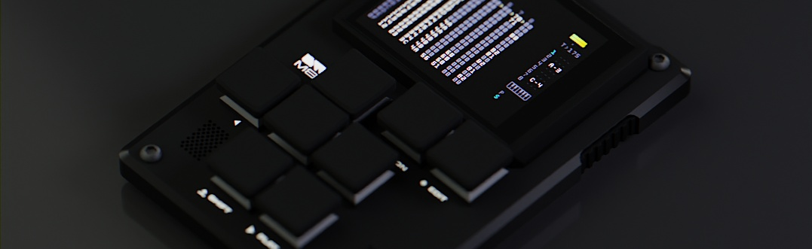

[comment]: <> <a href="{{ site.url }}{{ page.url }}">absolute links</a>
[comment]: [Previously]().

I drafted a post on how the [Dirtywave M8](https://dirtywave.com/) is an amazing synth, but given the time and the growing scope of that post, I'll sum it up in a short blurb instead. For a single man project, this synth is a miracle. Very geeky, all shortcut driven, standing on the shoulders of tracker giants, particularly [LSDJ](https://www.littlesounddj.com/lsd/index.php), it has a solid workflow and most definitely isn't a gimmick. You'll have to do without any visual aid. This is what I love on the Elektron boxes, where the display really helps you understand what you're doing when filtering or creating an LFO. All you have here are hex numbers and consistent shortcuts. But it sounds absolutely marvelous and allows you to create music *anywhere*.

I'd like to share two tracks I've learned the ropes of the device on, but also the genre itself. I've listened to DNB mainly through [Noisia/Vision radio podcast](https://soundcloud.com/visionrecordings) that made my runs possible (I hated running all my life, but it's really the best way to combat the negative effects of sitting behind a computer all day). But I've never actually tried producing a track within that DNB realm.

<audio controls>
<source src="Tengu.mp3" type="audio/mpeg">
<source src="Tengu.aac" type="audio/aac">
<a href="https://jimmac.bandcamp.com/track/tengu">Tengu on Bandcamp</a>.
</audio>

<audio controls>
<source src="Woohan.mp3" type="audio/mpeg">
<source src="Woohan.aac" type="audio/aac">
<a href="https://jimmac.bandcamp.com/album/woohan">Woohan on Bandcamp</a>.
</audio>

While I lean on samples for the beats, the base is all the internal FM (with multiple oscilator types, not just sine) and macrosynth engines.

I've also been learning the ropes of Blender's geometry nodes recently. While only scratching the surface, I created this visualizer for the track. The heavy lifting is done with baking the *sound to f-curves*, which is then somewhat tweaked to acceptable ranges with f-curve modifiers.

<iframe title="vimeo-player" src="https://player.vimeo.com/video/656135032?h=198d1aba55" width="100%" style="aspect-ratio: 9 / 16" frameborder="0" allowfullscreen></iframe>

I also have to mention the absolutely bonkers amazing visual identity of the M8 project. It just couldn't be more hip. This is also my very last gear acquisition. For sure.

[Previously](),
[Previously](),
[Previously](),
[Previously](),
[Previously](),
[Previously](),
[Previously]().