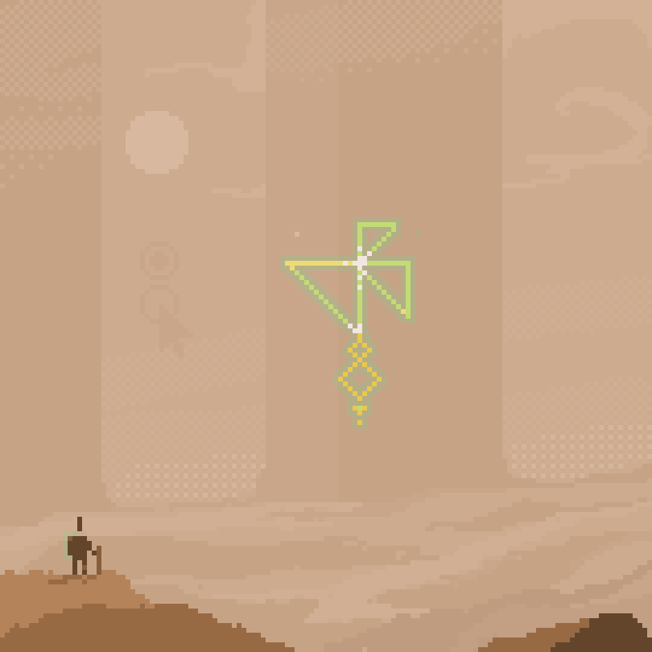

It's been exactly one year since I've done the foolish thing and changed my blog backend to write more. And to my own surprise it worked. Let me look back at 2021 from a rather narrow perspective of what I usually write about. Perhaps to your disappointment most of it is personal, not professional.

I've produced a [fraction of my drone videos](https://www.youtube.com/c/JakubSteiner/videos) from the past years in 2021 and haven't practiced or raced nearly at all this year. This void has been fully filled by music and synthesizers. After two decades of hiatus I enjoy making music again. Fully aware how crude and awful I am at it, there isn't any other medium where I enjoy my own creations as much as music.

<iframe src="https://player.vimeo.com/video/659013844?h=7c5e2e6e6d&amp;badge=0&amp;autopause=0&amp;player_id=0&amp;app_id=58479" frameborder="0" allow="autoplay; fullscreen; picture-in-picture" allowfullscreen style="position:absolute;top:0;left:0;width:100%;height:100%;" title="M8: Pentatonic Bells"></iframe>

I've also come back to pixel art, even though the joy is a lot tainted by the tools I use. Very convenient, very direct, so much fun, very proprietary. 

In 2022 I'd like to 

* Replace my reliance on iPad and Apple Pencil. Would be nice to use a [small screen tablet on my Fedora instead](https://gitlab.gnome.org/GNOME/gnome-control-center/-/issues/1392). Just plug it when I need it, run [GIMP](https://gimp.org) or [Aseprite](https://www.aseprite.org/) in the same time it takes me with Procreate and Pixaki.
* Embrace Fedora for music making. While I'm not a heavy Ableton Live user, I should totally embrace [Bitwig](https://flathub.org/apps/details/com.bitwig.BitwigStudio) instead as it's conveniently available as a Flatpak. The Pipewire revolution also made [Renoise](https://www.renoise.com/) usable for me again, so maybe I'll give it another stab.
* Continue using the gear I have and not buy any more. I have way more gear than I need. I'm going to sell some I don't actually enjoy using anymore, but even splitting time between the [Digitone](https://www.elektron.se/products/digitone/), [Digitakt](https://www.elektron.se/products/digitakt/), [Polyend Tracker](https://polyend.com/tracker/) and [Dirtywave M8](https://dirtywave.com/) is making me feel unfocused. If I only had a synth room where I could just walk in and jam :)
* Continue posting on this ancient platform called WWW. Before I figure out a replacement for comments, feel free to [tweet at me](https://twitter.com/jimmac) or [toot](https://mastodon.social/web/@jimmac).

A little late with wishing you a better 2022 than 2020 was! I didn't even catch 2021 fly by.

[comment]: <> <a href="{{ site.url }}{{ page.url }}">absolute links</a>
[comment]: [Previously]().

