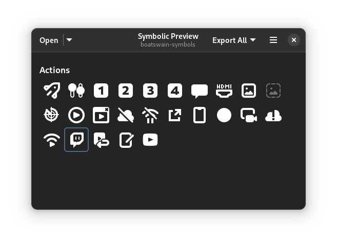
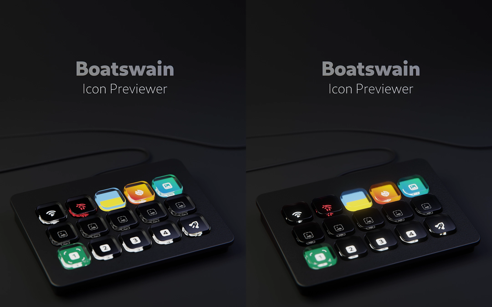

Mentioning my ever lasting adoration of the [realtime engine in Blender on twitter](https://twitter.com/jimmac/status/1512533410677469188) kind of exploded (for my standards), so I figured I'd write a blog post.

{: .fullcoloricon}

[Georges](https://feaneron.com/) wrote a great little app to configure [Elgato Stream Deck](https://www.elgato.com/en/stream-deck) buttons on non-proprietary platforms. I've been following Georges' ventures [into streaming](https://www.youtube.com/c/GeorgesStavracas/videos). He's done amazing job promoting GNOME development and has been helping with [OBS](https://obsproject.com/) a lot too.

To make [Boatswain](https://feaneron.com/2022/03/17/boatswain-your-stream-deck-app-for-linux/) work great by default, rather than just presenting people with a monstrous [shit work](https://zachholman.com/posts/shit-work/) mountain to even get going, Georges [needed some graphical assets](https://gitlab.gnome.org/World/boatswain/-/issues/18) to have the configurator ship with ready made presets. 

Sadly I've already invested in [an appliance that covers my video streaming and recording needs](https://www.blackmagicdesign.com/products/atemmini), so I wasn't going to buy the gear to test how things look. Instead I made the device virtual, and rendered an approximation of it in [Blender](https://flathub.org/apps/details/org.blender.Blender).

<iframe src="https://player.vimeo.com/video/697659862?h=41eb37e115&amp;badge=0&amp;autopause=0&amp;player_id=0&amp;app_id=58479" frameborder="0" allow="autoplay; fullscreen; picture-in-picture" allowfullscreen style="width: 100%; height: auto; aspect-ratio: 16 / 9;"></iframe>

For [GNOME wallpapers](https://gitlab.gnome.org/GNOME/gnome-backgrounds/) there are cases where I have to resort to waiting on Cycles, but if you compare this 2 minute render (left) to the 0.5s render (right) it's really not worth it in many cases. 

Personally switching to AMD GPUs a couple of years back has removed much pain updating the OS and the reason I was allowed to do that is Eevee.

There was some interest in how the shader is set up, so I'm happily making the file [available for dissection](https://www.blendswap.com/blend/29924).

To do it properly, I'd probably want to improve the actual display shader to rasterize the bitmaps in a more sophisticated manner than just displaying a bitmap with no filtering. But I'd say even this basic setup has served the purpose of checking the viability of a symbol rendered on a lousy display.

[comment]: <> <a href="{{ site.url }}{{ page.url }}">absolute links</a>
[comment]: [Previously]().