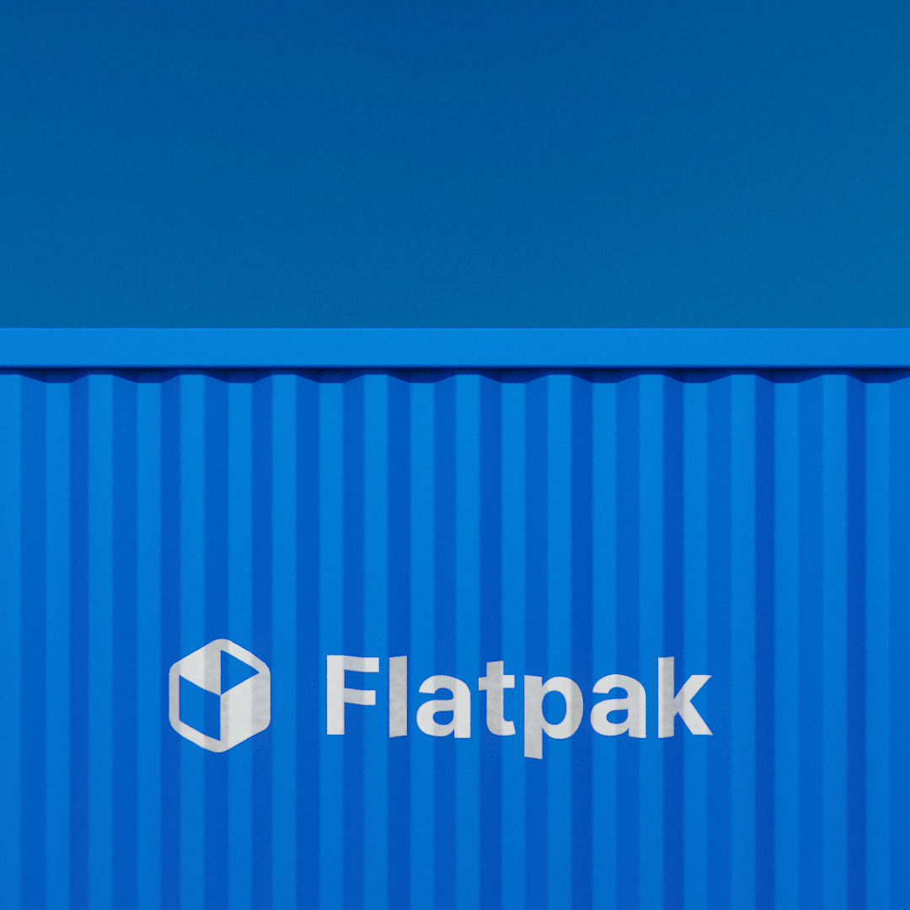
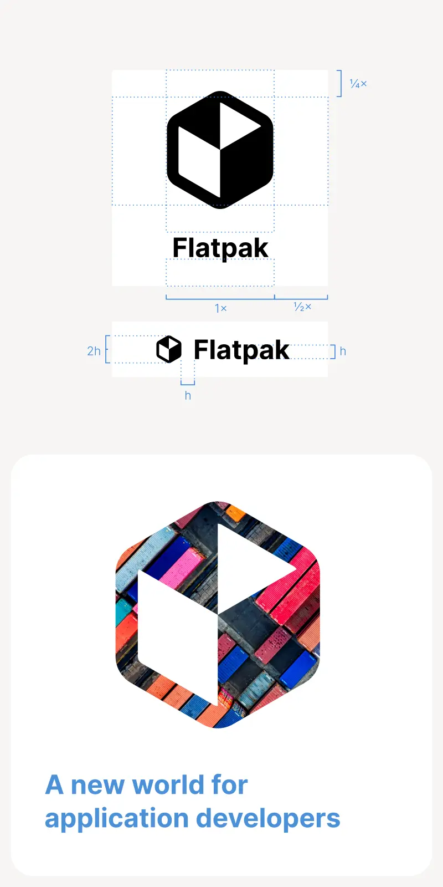

[comment]: <> <a href="{{ site.url }}{{ page.url }}">absolute links</a>

[Flatpak](https://flatpak.org) has been at the center of the recent app renaissance, but its visual identity has remained fairly stale. 

Without diverging too much from the [main elements of its visual identity](https://github.com/flatpak/flatpak.github.io/issues/537) we've made it more contemporary. The logo in particular has been simplified to work in all of the size scenarios and visual complexity contexts.

There's definitely a few spots where the rebrand has yet to propagate to, so please refer to [the guidelines](https://flatpak.org/img/flatpak-logos.zip) if you spot and old coat of paint.

If you're giving a talk on Flatpak, feel free to make use of the [LibreOffice Impress Template](impress-flatpak-template.otp).