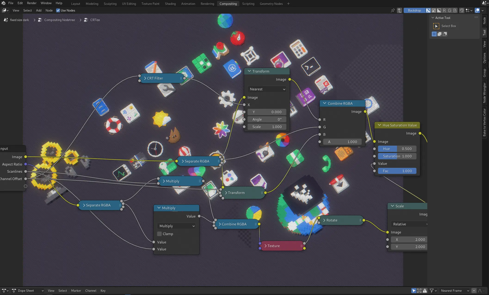

# GNOME 43 Wallpapers

*Evolution* and *design* can co-exist happily in the world of desktop wallpapers. It's desirable to evolve within a set of constraints to create a theme in time, set up a visual brand that doesn't rely on putting a logo on everything. At the same time it's healthy to stop once in a while, do a small reflection on what's perhaps a little dated and do a fresh redesign. 

<!-- vimeo is a racket
<iframe src="https://player.vimeo.com/video/736863449?h=2cfc1f93b0&amp;badge=0&amp;autopause=0&amp;player_id=0&amp;app_id=58479" frameborder="0" allow="autoplay; fullscreen; picture-in-picture" allowfullscreen style="width: 100%; height: auto; aspect-ratio: 16 / 9;" title="GNOME 43 Wallpaper Streams"></iframe>
-->

<iframe width="560" height="315" src="https://www.youtube.com/embed/UXctJgtPJrc?si=vQMFCK365YDbHG4T" title="YouTube video player" frameborder="0" allow="accelerometer; autoplay; clipboard-write; encrypted-media; gyroscope; picture-in-picture; web-share" referrerpolicy="strict-origin-when-cross-origin" allowfullscreen></iframe>

I took extra time this release to focus on refreshing the whole wallpaper set for 43. While the default wallpaper isn't a big departure from 3.38 hexagon theme, most of the supplemental wallpapers have been refreshed from the ground up. The [video above](https://vimeo.com/736863449) shows a few glimpses of all the one way streets it took for the default to land back in the hexagons.

GNOME 42 was the first release to ship a bunch of SVG based wallpapers that embraced the flat colors and gradients and benefited from being just a few kilobytes in file size. It was also the first release to ship *dark preference* variants. All of that continues into 43.

Major change comes from addressing a wide range of display aspect ratios with one wallpaper. 43 wallpapers should work fine on your ultrawides just as well as portrait displays. We also rely on WebP as the [file format](https://gitlab.gnome.org/GNOME/gnome-shell/-/issues/5457) getting a much better quality with a nice compression ratio (albeit lossy).

What's still missing are photographic wallpapers [captured under different lighting](https://gitlab.gnome.org/GNOME/gnome-backgrounds/-/issues/20). Hopefully next release.

[Blender's geometry nodes](https://docs.blender.org/manual/en/latest/modeling/geometry_nodes/index.html) is an amazing tool to do generative art, yet I feel like I've already forgotten the small fraction of what can be done that I've learned during this cycle. Luckily there's always the next release to do some repetition. Thanks to everyone following my struggles on the [twitch streams](http://twitch.tv/jimmacfx).

The release is dedicated to [Thomas Wood](https://foundation.gnome.org/2016/02/12/remembering-thomas-wood/), a long time maintainer of all things visual in GNOME.