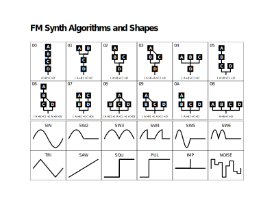

In the classic analog synthesizer, a sound is created by a simple oscillator and then carving/shaping the sound with filters. That's why it's sometimes called subtractive synthesis.

The sound effects in the Settings' panel have been recreated with a method called [Frequency Modulation](https://en.wikipedia.org/wiki/Frequency_modulation_synthesis) where some oscillators aren't used to generate the sound itself (carrier), but modulate it futher. Even here the significant role of filtering remains. In addition more complex sounds are achieved with so called layereing which is exactly what the name hints to, just using a bunch of sounds together in a mix.

Sounds created for GNOME 43 were generated on a mini-computer called [Teensy](https://www.pjrc.com/store/teensy41.html) (currently unavailable due to the global chip shortage), running software called [Dirtywave Headless](https://github.com/DirtyWave/M8HeadlessFirmware) written by [Timothy Lamb](https://trash80.com/). The software includes other synthesizer engines, but majority of the sounds were made using the 4 operator FM engine. To further complicate things, my favorite algorithm is No.16 where all of the 4 oscillators are carriers, effectively being equivalent to a 4 oscillator analog synth.

{:class="full"}

Finally everything was cleaned up in [Audacity](https://flathub.org/apps/details/org.audacityteam.Audacity).

To form a complete circle, and to my genuine surprise, my old friend Noggin from the [Jeskola Buzz](http://jeskola.net/buzz/) days has composed a great track using only samples from the [gitlab issue](https://gitlab.gnome.org/GNOME/gnome-control-center/-/issues/264) (my involvement with music trackers predates GNOME or Free software in general. An old friend indeed).

[Take a listen](https://weeklybeats.com/noggin/music/gnomesounds).

I wish I had published the project bundle to allow for easier adjustments, but [better late](gnome-alerts.zip) than never.

