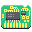
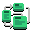
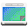
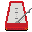

To keep the habbit alive, I continue to do a [daily pixel routine](), now covering almost all of the [GNOME Circle](https://circle.gnome.org) apps.

{:.pixelicons}

I've been practicing the art of animation a little too in an effort to promote GNOME Circle on [Twitter](https://twitter.com/jimmac) and [Mastodon](https://mastodon.social/web/@jimmac). Presenting all these GIFs would probably not be kind to [Planet GNOME](http://planet.gnome.org) readers though. Perhaps I could compose a video in the future (no GIF support in Blender, strangely!). Keep grinding your (pointless) skills, kids!

[Previously]()