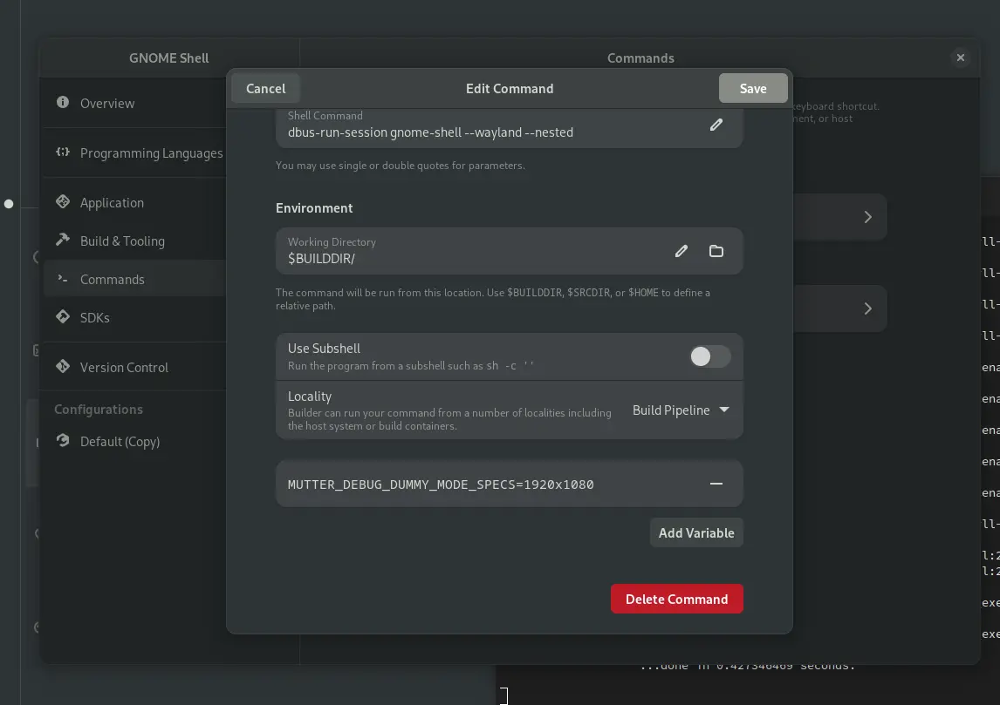

Builder has been absolutely wonderful for a designer to dive in and fix up graphics assets for Application. It allows to easily build and test run patches before submitting a merge/pull request on apps hosted on gitlab or github. Ideally you'd press the `run button` and voilá.

What has been far from wonderful &mdash; doing even one line fixes for the GNOME Shell was very hard to test for anyone not building shell daily. getting the environment ready every release has been a chore. From virtual machines, jhbuild, toolbox, jhbuild in VMs to jhbuild in toolbox there was a dozen of way to fail building the latest shell.

{:.pixels.full}

Builder 43, impressively marathoned into perfection, features (among many other things) the ability to target [Toolbox](https://containertoolbx.org)/podman containers as development environments. So I was really happy to see [Bylan McCall](https://mastodon.social/@dylanmccall@mastodon.online/109243458052123633) have a nested session going on the run button.

Now I couldn't get the full detailed receipe out of him, but as they say it's easier to get the internet prove you wrong than to give you advice, here's my terrible way (with some help from the most authoritative capacities that probably don't want anything to do with this pkexec hack):

1) Create a toolbx container and install all gnome-shell dependencies. 
```
toolbox create shell
toolbox enter shell
sudo dnf install gnome-shell mutter ninja-build meson
sudo dnf builddep gnome-shell mutter
```

While at the beginning of a cycle packages cover most of the dependencies, at the later stages you'll have to build more things (Usually `gsettings-desktop-schemas`, `libgweather`, `gjs`, `gcr` and `mutter`). We're in a container so I just oldschool brute install to `--prefix=/usr`. To build mutter for example I'd

```
mkdir ~/Projects
cd ~/Projects
git clone https://gitlab.gnome.org/GNOME/mutter.git
cd mutter
meson --prefix=/usr build '-Dman=false'
ninja -C build
sudo ninja -C build install
```

So assuming we have successfuly built shell in the `shell` toolbox container, we'll move over to Builder.

2) In Builder, open the project we cloned to `~/Projects/gnome-shell`. Create a new configuration (`Alt+,`) by duplicating the `Default`. Change the runtime to `shell` (the toolbx containers are below the usual flatpak runtimes). Set the *Installation Prefix* to `/usr`. Don't forget to make it active (`Make Active`).

3) Still in configuration, in the `Commands` section, create a new command (call it *Run Nested Shell*):
```
dbus-run-session gnome-shell --wayland --nested
```
At the bottom of the dialog `add a Variable`:
```
MUTTER_DEBUG_DUMMY_MODE_SPECS=1920x1080
```
This will make the shell run at least in HD, rather than the super tiny default size.

4) In the *Application* section, change the `Run Command` from *Automatically Discover* to our *Run Nested Shell*. Now we only need to do the last nasty bit to allow for the install to `/usr` to succeed.

5) Open a new *runtime terminal* (`Ctrl+Alt+T`) and replace pkexec with a `just-do-it` script. It's a container, it's fiiiiine, chill.
```
cd /usr/bin
mv pkexec pkexec.orig
```

Now with your preferred CLI editor create the following shell script in place of pkexec:
```
#!/bin/bash
su -c "$*"
```

Set it executable with `chmod +x pkexec`. 



Now pressing the run button should build your shell, install it and run the nested session. Hopefully stylesheet patches will be less painful now, maybe?

Please do not hesistate to [toot at me](https://mastodon.social/@jimmac) what the proper way is rather than installing to `/usr`