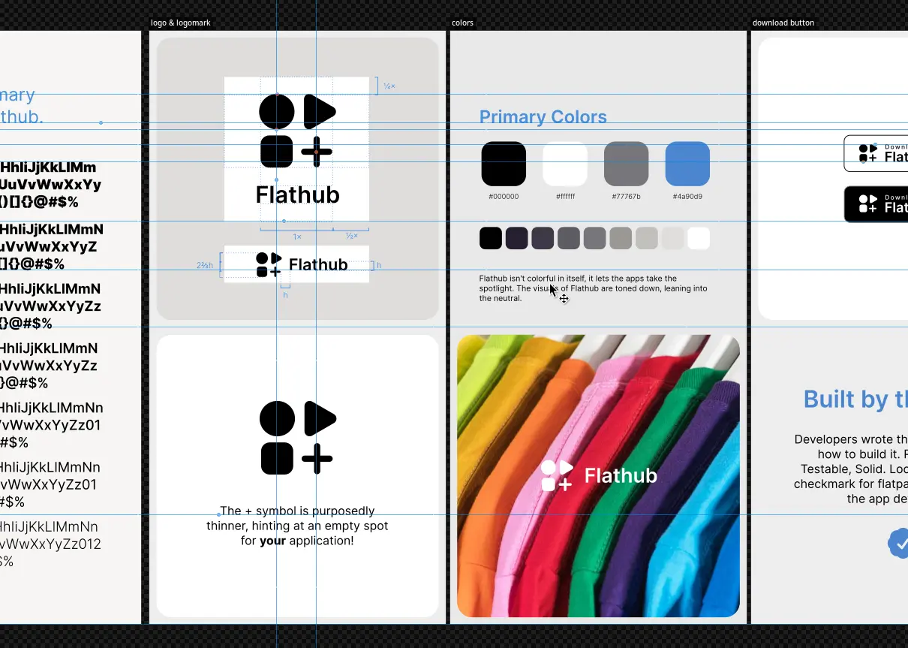
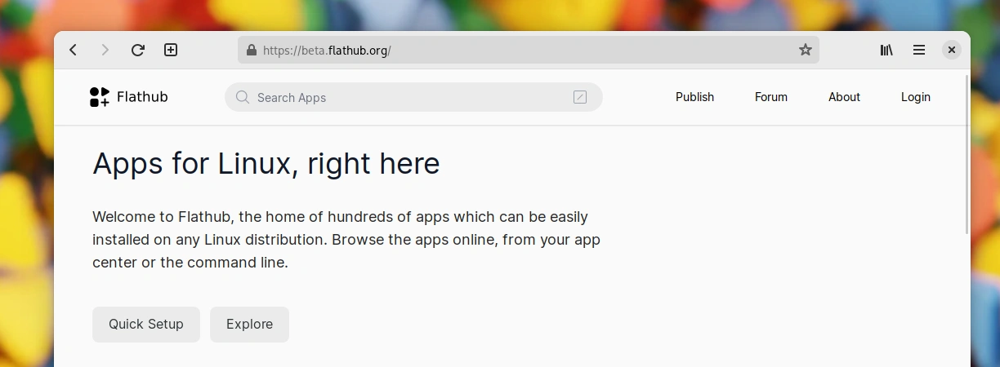
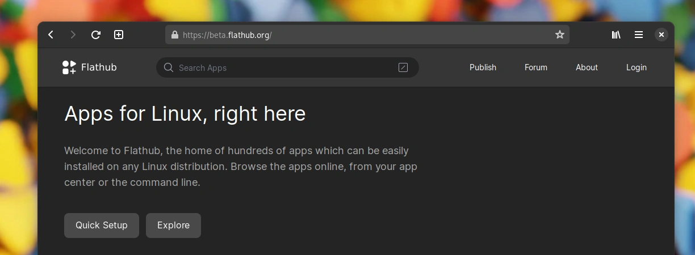
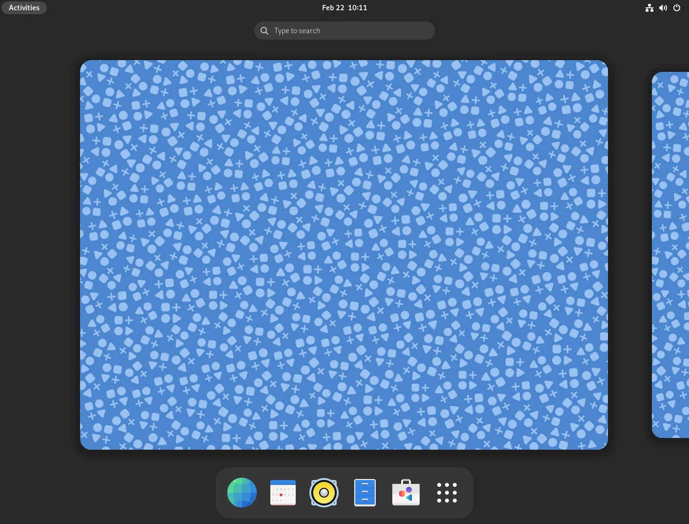
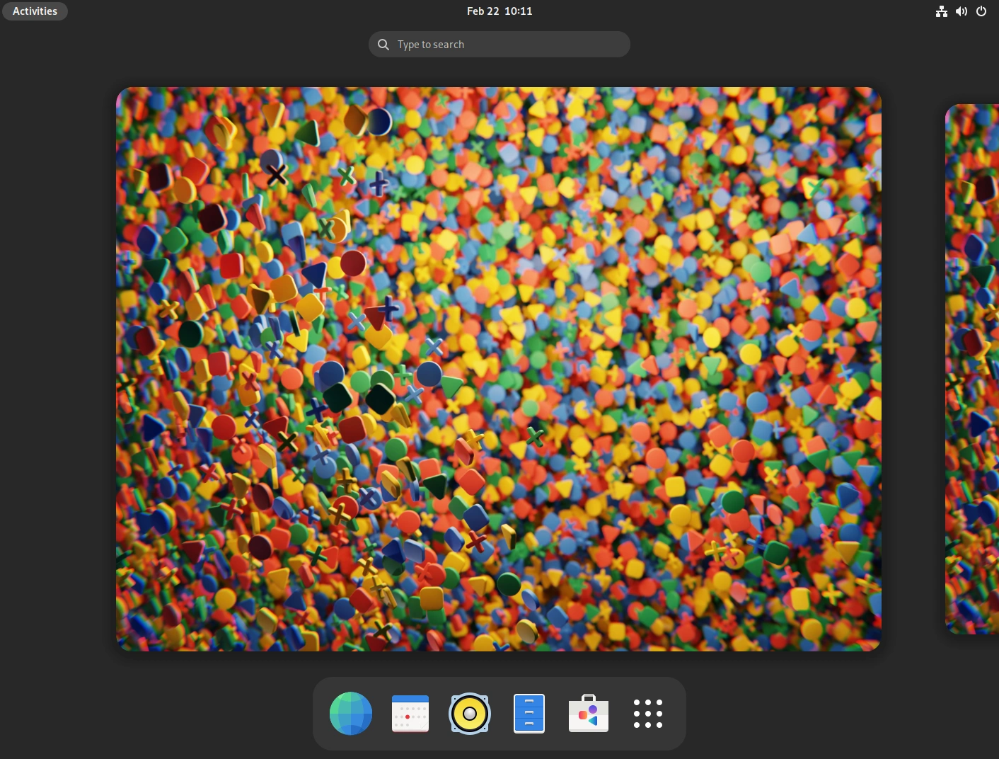

[comment]: <> <a href="{{ site.url }}{{ page.url }}">absolute links</a>

While [Flatpak](https://flatpak.org) itself is an architecturally decentralized way to distribute apps, [Flathub](https://beta.flathub.org) embraces the convenience for people to come to one place to install apps. There's some fairly big changes coming to Flathub that I'm extremely excited about, that will make sure the new wave of Linux apps doesn't fizzle out and we'll maintain a sustainable application ecosystem.

<!-- vimeo is a racket
<iframe src="https://player.vimeo.com/video/801393970?h=73a1ea84e4&amp;badge=0&amp;autopause=0&amp;player_id=0&amp;app_id=58479" frameborder="0" allow="autoplay; fullscreen; picture-in-picture" allowfullscreen title="flathub-rebrand"></iframe>
-->

<iframe width="560" height="315" src="https://www.youtube.com/embed/d770zFM4jIE?si=TyuylOVmFM4FsaiK" title="YouTube video player" frameborder="0" allow="accelerometer; autoplay; clipboard-write; encrypted-media; gyroscope; picture-in-picture; web-share" referrerpolicy="strict-origin-when-cross-origin" allowfullscreen></iframe>

Thus there is no better time to refresh what has become a little dated, Flathub's visual identity. It centers around the core of what Flathub is — the apps themselves. The identity isn't very loud and shouty. The flashy colors and emphasis remains on the apps themselves, Flathub is the neutral platform for the apps to shine.

Take a peek at the [brand guidelines](https://github.com/flathub/website/files/10815847/brand-guide.pdf) to learn more about the new Flathub brand or [download the logos](https://github.com/flathub/website/files/10815849/flathub-branding.zip) in scalable format. The download buttons for app websites are also [available](https://github.com/flathub/website/files/10814600/download-button.zip).

Building a brand on neutral greys isn't quite an easy sell, but precisely targets the main point of the Flathub brand. It creates the stage for apps to shine. Flathub isn't flashy by itself. It allows the apps to be at the center of your attention.

If you've read until this point, you deserve a treat! Here's some eye candy from the early stages of the process. Wallpapers derived from the elemental shapes of the logomark. Clearly off limits now, but can't just throw them away, can I?

{:.tiledscr}

Big shoutout to [razze](https://osna.social/@razze) for his ongoing work on the website and implementing the brand so quickly. Many thank yous to [Tobias Bernard](https://tobiasbernard.com/) for significant involvment in this during the [Berlin Mini GUADEC]() and [Václav Vančura](https://vancura.dev/) for sensible feedback.

[Previously]()
