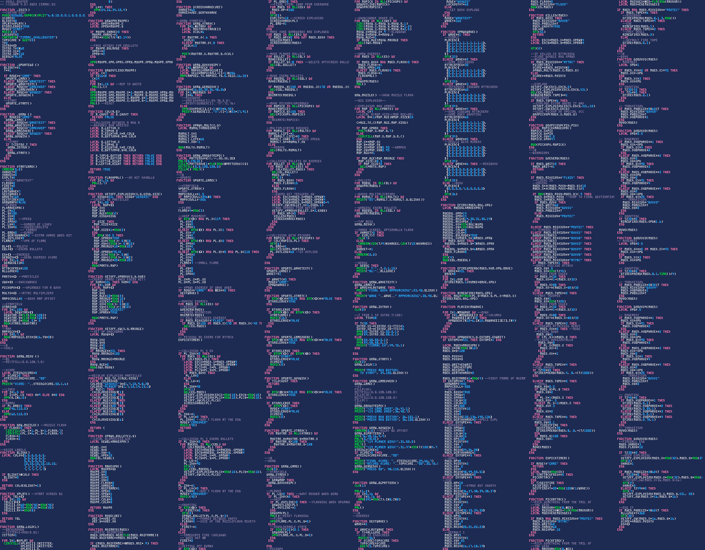
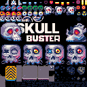

I've been wanting to make a game for as long as I remember. Granted I don't remember much, it's been on my mind since I was about 10. But somehow it never happened. Regardless how low of a bar I've set, I've never gotten to it. Until today!

<!-- vimeo is a racket

<iframe src="https://player.vimeo.com/video/869483483?badge=0&amp;autopause=0&amp;player_id=0&amp;app_id=58479" frameborder="0" allow="autoplay; fullscreen; picture-in-picture" style="position:absolute;top:0;left:0;width:100%;height:100%;" title="Go Bust Some Skulls!"></iframe>

-->

<iframe width="560" height="315" src="https://www.youtube.com/embed/A4IEt4OpzEw?si=-Z_sinGfKmsqKqxw" title="Take Frequent Breaks" frameborder="0" allow="accelerometer; autoplay; clipboard-write; encrypted-media; gyroscope; picture-in-picture; web-share" allowfullscreen></iframe>

## Pixel Art Obsession

During the lockdown years a [good friend](https://vancura.design/) of mine became a fulltime game dev and I've been getting that sweet sweet smell of pixels in a very high concentration. You probably noticed my fascination for pixel art in recent years. 

A couple of weeks ago I was introduced to [PICO8](https://www.lexaloffle.com/pico-8.php). While it's confusingly identified as a fantasy console, what it really is, is a full blown platform. While writing LUA in a 128x128 screen is not everyone's thing, I have largely enjoyed the super constrained world of PICO8. Its 16 color palette, 8x8px sprites, a super quick iteration workflow with integrated graphics, sound effects and music editors. To put it in perspective, yes, GNOME icons are exactly the same size as the whole PICO8 environment. But its highly integrated editor allows for a very quick iterative approach and I love that.

## HTML5 Release

You can give the game a [shot here](https://jimmac.github.io/pico-shed/skulls.html). Let me know what you think. Initially the game was pretty easy and approachable, but given how short it is, the final boss stage is now only for the devoted arcade lovers. :)

Let me know what you think of it and post your high scores at me on [Mastodon/Fediverse](https://mastodon.social/@jimmac)!

{:.pixels.full}

I'm not planning to ever make another game, but I will definitely use the PICO8 platform to do some small interactive demos for projects like [Weeklybeats](https://weeklybeats.com/). It's dope!

