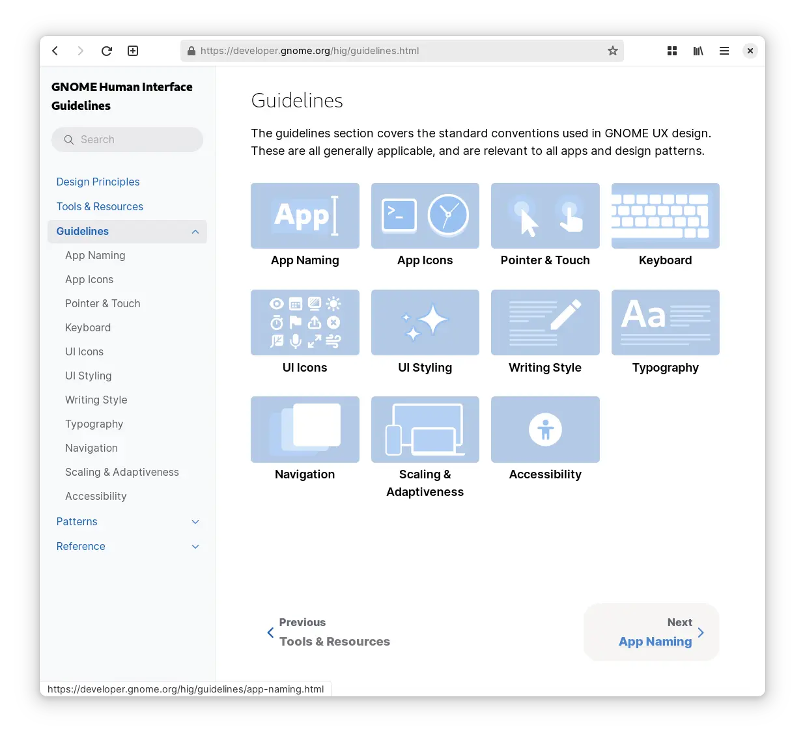
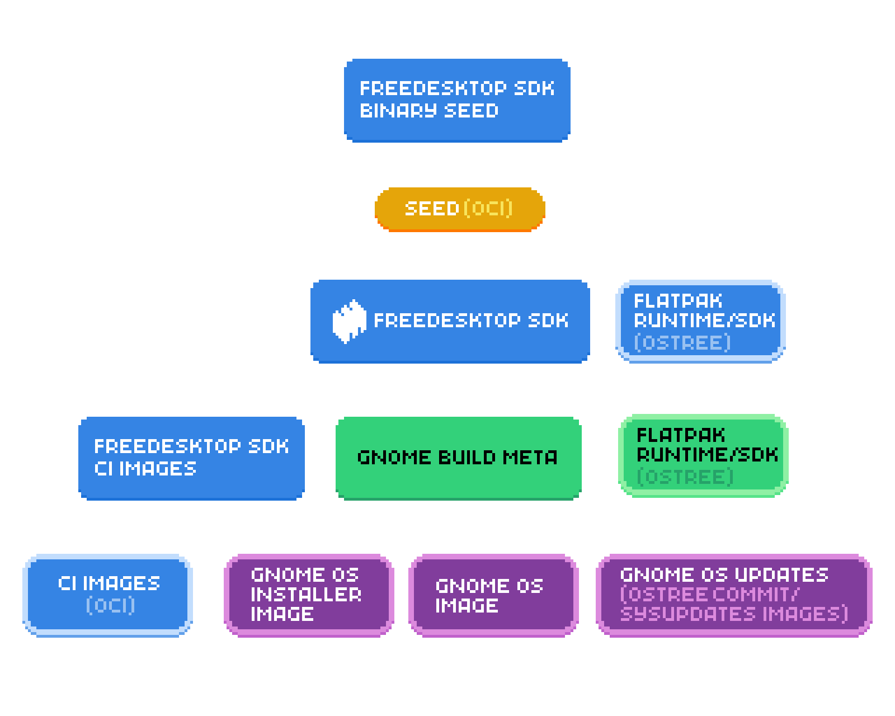
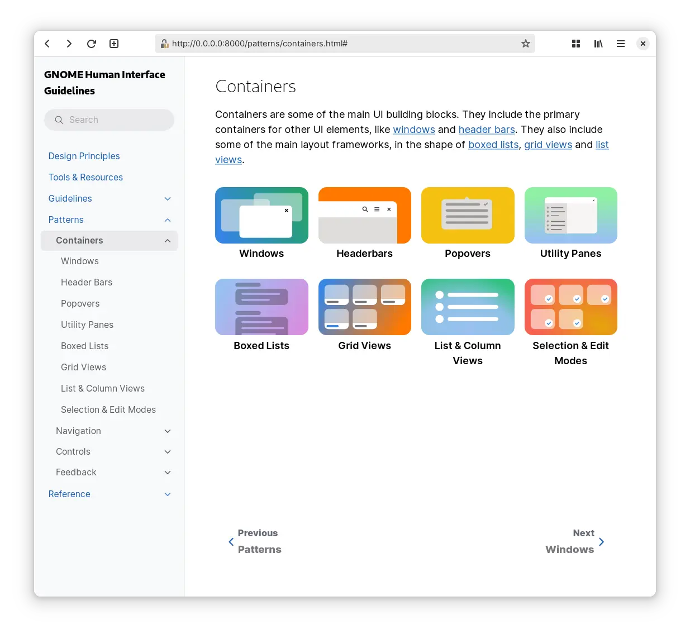
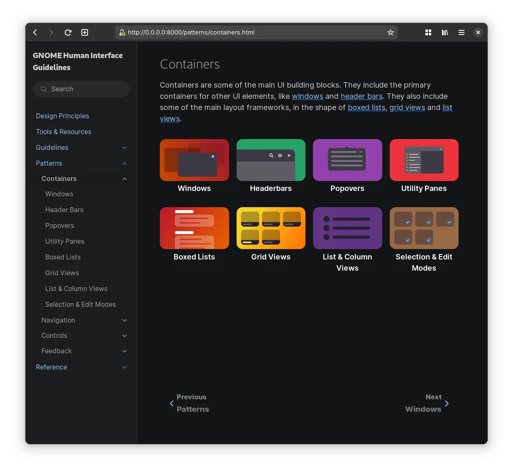

The refresh of the [Human Interface Guidelines](https://developer.gnome.org/hig) in both the content and presentation is something to be proud of, but there were a couple of areas that weren't great. Where we don't quite shine in the area of [blueprint illustration style](https://gitlab.gnome.org/Teams/Design/app-illustrations/-/blob/master/README.md?ref_type=heads) is the contrast for the dark mode. While in many cases a single graphic can work in the two contexts just fine, in other it struggles. And while we tried to address it in the HIG, it became clear we do need to do better.



# Inline SVG Stylesheet

there's a little trick I learned from [razze](https://osna.social/@razze) while working [Flathub](https://flathub.org) &mdash; a single favicon working in both dark and light mode can be achieved using a single SVG. The SVG doesn't have inline defined fills, but instead has a simple embedded `<style>` that defines the `g,path,rect,circle` and whatnot element styles and sets the `fill` there. For the dark mode it gets overriden with the `@media (prefers-color-scheme: dark){}` rule. While generally favicons are a single color stencil, it can work for fullcolor graphics (and more complex rules): 

```css
<style>
  rect.fg { fill: #5e5c64; }
  path.bg { fill: #fff; }
  @media (prefers-color-scheme: dark) {
    rect.fg { fill: #fff; } 
    path.bg { fill: #5e5c64; }
  }
</style>
```

This made me think of a similar approach working for inline images as well. Sadly there's two obstacles. While the support for inline stylesheets in SVGs seems to be quite wide among browsers, [Epiphany](https://wiki.gnome.org/Apps/Web) only seems to respect `prefers-color-scheme` when using the image directly (or the favicon case), but didn't seem to work when emebded inside and html page as ``.

The more severe issue is that producing such SVGs is a little cumbersome as you have to clean up the document generated by Inkscape, which likes to use `fill` attribute or inline css in `style`. While it generally doesn't remove markup, it will reformat your markup and you will be fighting with it every time you need to edit the SVG visually rather than inside a text editor. 

# HTML5 Picture

For inline images, the approach that seems more straight forward and I've taken on many occasions is using the HTML5 `<picture>` element. It works great for providing dark mode variants using `source` with a `media` attribute as well as a neat accessibility feature of showing non-animated image variant for people who opt out:

```html
<picture>
    <source srcset="static.png" 
        media="(prefers-reduced-motion: reduce)" />
    
</picture>
```
<picture>
    <source srcset="fdosdk-dia.png" media="(prefers-reduced-motion: reduce)" />
    
</picture>

<div style="padding:75% 0 0 0;position:relative;"><iframe src="https://player.vimeo.com/video/878724389?h=a5216f4b20&amp;badge=0&amp;autopause=0&amp;quality_selector=1&amp;player_id=0&amp;app_id=58479" frameborder="0" allow="autoplay; fullscreen; picture-in-picture" style="position:absolute;top:0;left:0;width:100%;height:100%;" title="prefers-reduced-motion"></iframe></div><script src="https://player.vimeo.com/api/player.js"></script>

# Sphinx/RST

GNOME *Human Interface Guidelines* are written in restructured text/Sphinx, however. Escaping to html for images/pictures would be quite cumbersome, but luckily dark mode is supported in the furo theme (and derivates) using the `only-light` and `only-dark` classes. The markup gets a little chatty, but still quite legible. There's some iterations to be made, but in terms of legibility it's finally a bit more accessible.

{:.full}
{:.full}
