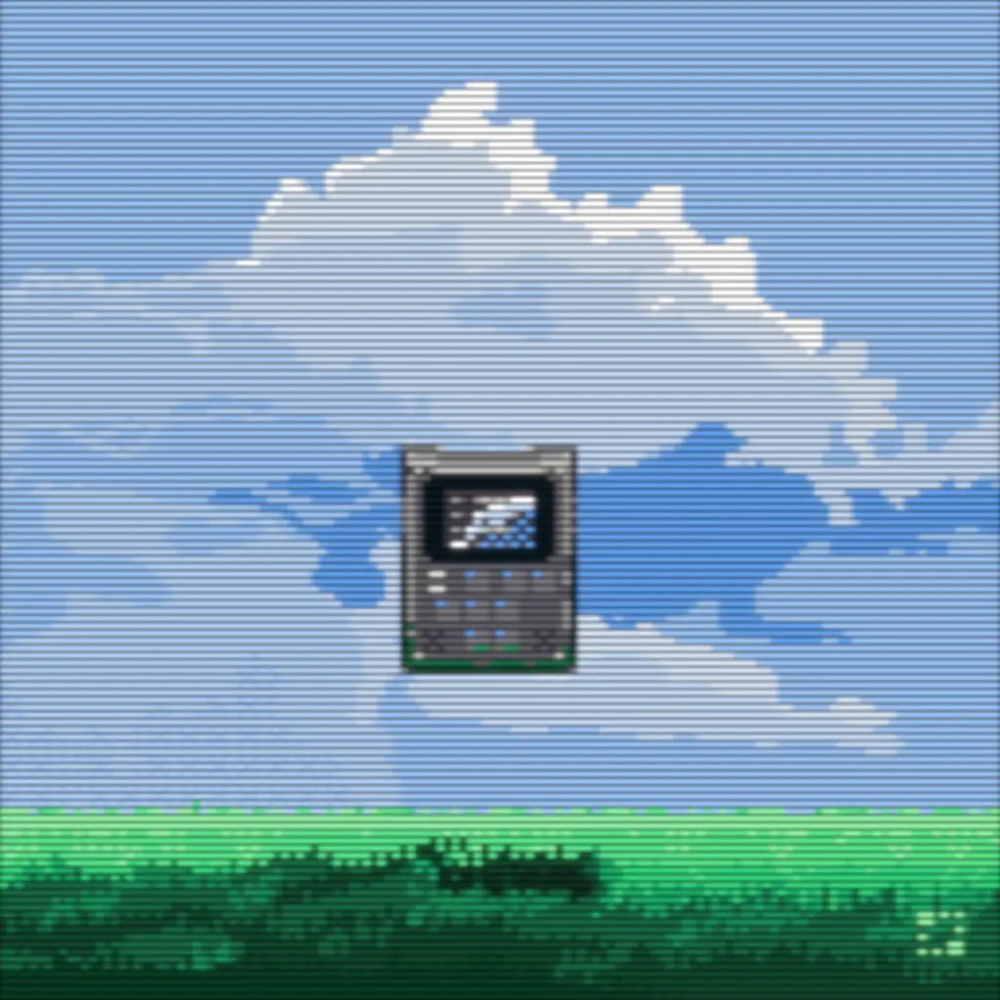

Congratulations on finishing yet another ride around the Sol with me. Here's some noteworthy events from it from the perspective of a dust spec.

# Music

While of course I'm stuck in my young taste like everybody else, I do try to pick up some new music. This year I've discovered *Venjent* doing a [silly skit](https://www.youtube.com/shorts/iYf7Hlme9s4) (he's fully aware of that being how people discover his music and really leans into it). In surreal turn of events I went to see him in a club, looking like a misplaced pensioner at 1am, when he finally spun his set. But I seriously enjoy how he can transform the [absolute silliness](https://www.youtube.com/watch?v=A4bpaKnWg5M) into a total banger I play on repeat.

[{:.full}](https://jimmac.bandcamp.com/album/take-frequent-breaks)

I've published some music of my own as well. After [Desync](https://jimmac.bandcamp.com/album/desync) assembled from material from weeklybeats 22 came [Solar Coffee](https://jimmac.bandcamp.com/album/solar-coffee) and [Take Frequent Breaks](https://jimmac.bandcamp.com/album/take-frequent-breaks) right at the end of the year. I doubt I'll release anything this year, because [Weekly Beats 24](https://weeklybeats.com) will probably suck all my energy for music production. Hopefully I'll enjoy it as much as the first half of 22 :)

# FPV

From about 3 videos a week in 2018 I'm down to about 3 a year. One might say I've thrown the towel in, but I still enjoy a decent tree surf from time to time. 

<iframe width="560" height="315" src="https://www.youtube.com/embed/QMTmC736Um4?si=P4vJY5Di5pMoJLEl" title="Take Frequent Breaks" frameborder="0" allow="accelerometer; autoplay; clipboard-write; encrypted-media; gyroscope; picture-in-picture; web-share" allowfullscreen></iframe>

I've completely dropped the ball when it comes to racing though. Didn't even qualify in Klatovy this year, because absolutely everyone has been training like crazy. It's been lovely to hang around with the weirdos in the three competitions I attended.
