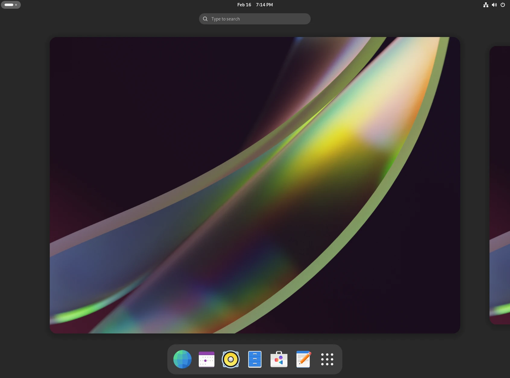
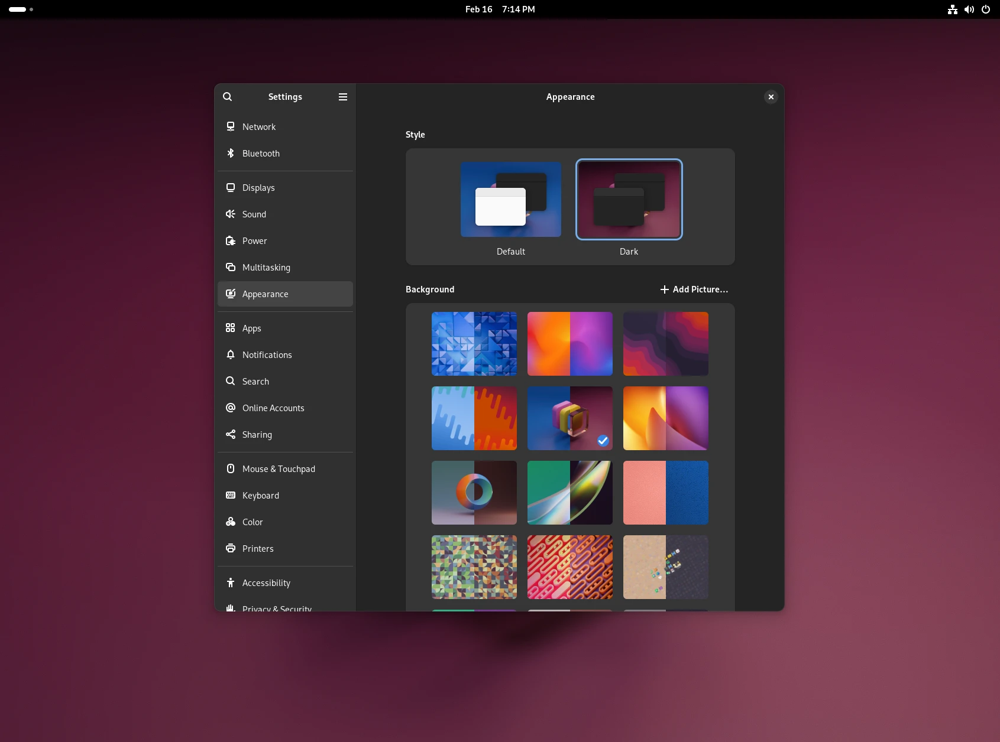
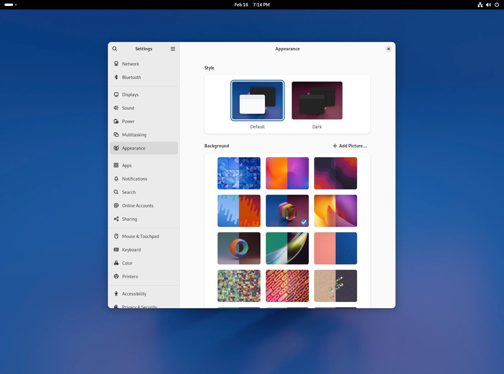
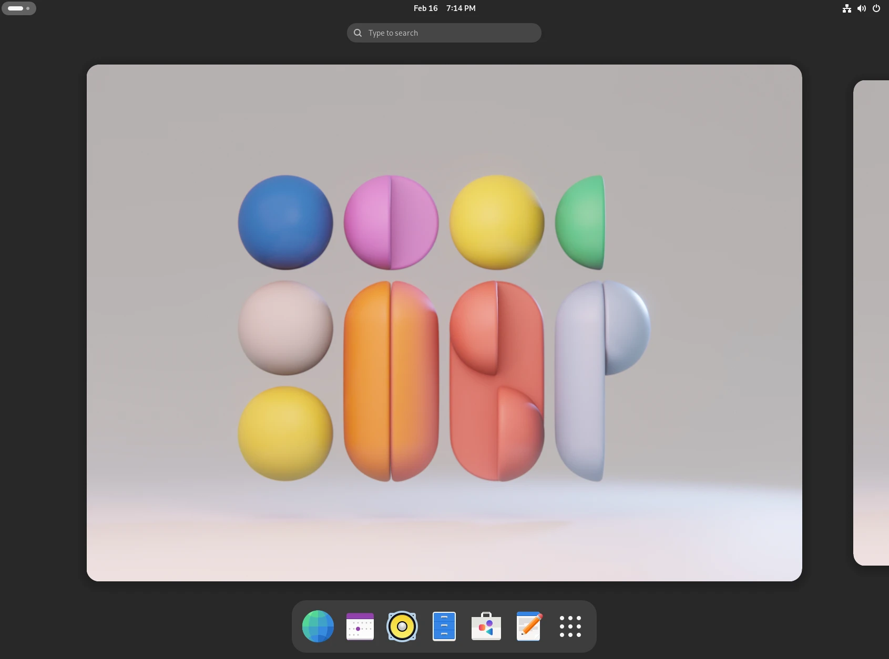
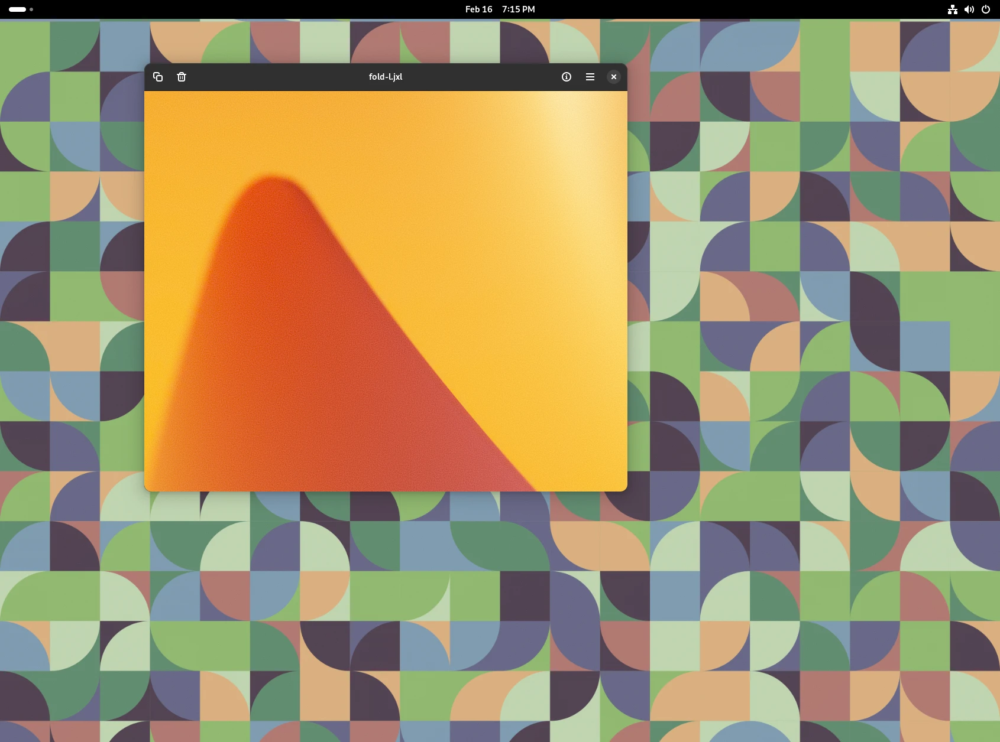

GNOME 46 is on its final stretch to be released. It's been a custom to blog a little about the wallpaper selection, which is a big part of GNOME's visual identity. 

The first notable change in 46 is that we're finally delivering on the promise of bringing you a next generation image file format. Lots of performance issues had to be addressed first, apologies for the delay. While efficiency and filesize requirements might not be too high on the list outside of the geek crowd, there is one aspect of JPEG-XL that I am very excited about.

JPEG-XL allows the use of client-side synthesized grain. A method pioneered by Netflix/AV1 I believe. Compression algorithms struggle with high frequency detail, which often introduce visible artifacts. JPEG-XL allows to decouple the grain component from the actual image data. This allows for significantly more efficient compression of images that inherently require noise, such as those in `gnome-backgrounds` — smooth gradients that would otherwise be susceptible to color banding. To achieve similar fidelity of the grain if it were baked in, a classic format like JPEG would need an order of magnitude larger filesize. Having the grain in the format itself also allows to skip various techniques in the rendering or compositing in the 3D software. 

Instead of compressing a noisy image, JPEG-XL allows to generate film-like grain as part of the decoding process. This synthesized grain combats issues like color banding while allowing a much more efficient compression on the original image data.

In essence, client-side grain in JPEG-XL isn't simply added noise, but a sophisticated strategy for achieving both efficient compression and visually pleasing image quality, especially for images that would otherwise require inherent noise.

The fresh batch of wallpapers includes evolutions of the existing assets as well as new additions. A few material/shape studies have been added as well as simple 2D shape textures. Thanks to the lovely JPEG-XL grain described earlier, it's not just [Inkscape](https://inkscape.org) and [Blender](https://blender.org) that [were used](https://gitlab.gnome.org/Teams/Design/wallpaper-assets/-/blob/master/46/experiments/py/geo.py?ref_type=heads).

I hope you're going to pick at least one of the wallpapers when GNOME 46 releases later next week as your favorite. Let me know [on fediverse](https://mastodon.social/@jimmac)!

[Previously](),
[Previously](),
[Previously](),
[Previously](),
[Previously]()
