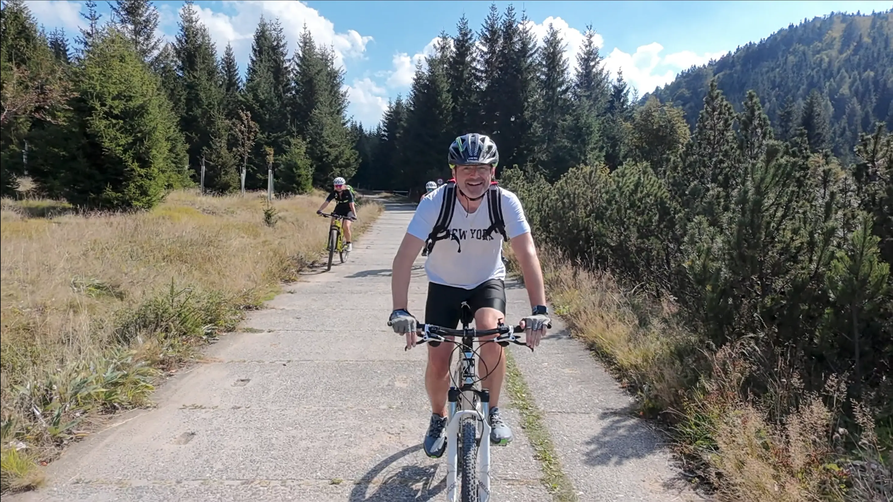

It’s been a while since I’ve annoyed you by mentioning drones, but here we are with DJI’s latest creation—the Neo. DJI is a giant, soulless corporation, but they’ve made some clever design decisions with this drone. It’s a flying camera that works without a phone or remote, and for about half the price of a GoPro, you get a self-sufficient, button-operated flying cameraman. Take it out, push a button, and off it goes, capturing footage like it knows what it's doing. It might also just simply be a response to the actually innovative HoverAir X1, just made extremely affordable.

<iframe title="vimeo-player" src="https://player.vimeo.com/video/1007568748?h=4416493d62" frameborder="0" allowfullscreen></iframe>

The camera quality won’t blow you away, but it’s solid enough if you can overlook its overly-sharpened aesthetic. The Neo can even play the part of a lightweight cinewhoop or a poor man’s DJI Mini, though that’s only if you own DJI’s latest goggles and remotes—so there’s a bit of a catch. I bought it mainly for the fun shots you’re watching here, and while I’m not interested in keeping up with DJI’s endless upgrades, I must admit the little drone has charm and utility.

Neo’s `Follow` mode is a standout, tracking you accurately with just its camera feed and no fancy sensors. It tries to follow your path to avoid hitting anything. But beware the `Direction Tracking` mode in crowded areas—it has a habit of misjudging where you’re facing and wobbling about. The biggest hiccup I encountered? No gesture to make it return home, which left me standing under it after performing a `Rocket` shot, until the battery ran out. Luckily the pain lasted only about 10 minutes. Overall, it’s a great toy for hikes, casual outings, and occasional public embarrassment.

Soundtrack for the poorly edited video above comes from my 2024 weekly beats endeavors. Looks like I have enough material for a 2025 album. Stay tuned!
