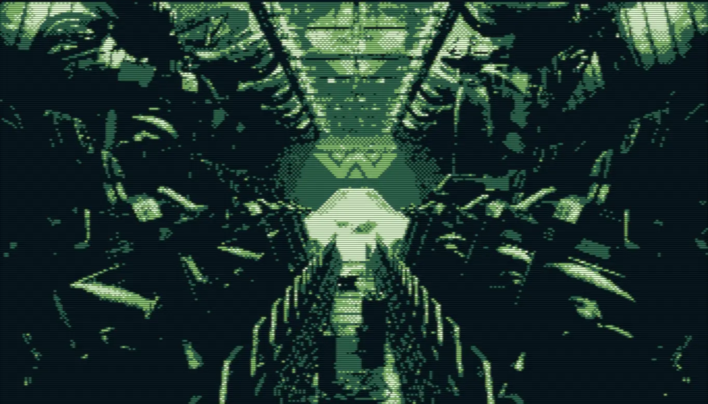

A couple of weeks ago, I went to see *Alien: Romulus*. While many of my friends were disappointed, I actually enjoyed it. In fact, it exceeded my expectations — mainly because I didn’t expect much! :)

Fede Alvarez delivered exactly what producer Ridley Scott asked of him, leaning heavily on the nostalgia of the original masterpiece while skirting the edge of a reboot. The world of *Prometheus* wasn't ignored, but purposedly avoided referencing too deeply.

The dystopian world of corporate feudalism set a tone even darker than the original, to the point where the xenomorph didn’t seem like the worst thing that could happen. I’m still holding out hope for 90-minute movies as the gold standard, but the two-hour runtime was manageable—though my aging buttocks may disagree. The slow-burn first act was actually the most enjoyable part, as that’s where the fresh world-building took center stage. Even as the familiar plot unfolded, Alvarez delivered memorable suspense and action scenes.

Of course, it’s never going to feel the same as seeing *Alien* or *Aliens* as a teenager. I can’t fully dive into my minor criticisms without spoilers, but let’s just say the movie understood that "less is more" — except in one area. Other than that, *Alien: Romulus* proved that going to the movies can still be a pretty great experience. 

★★★★☆