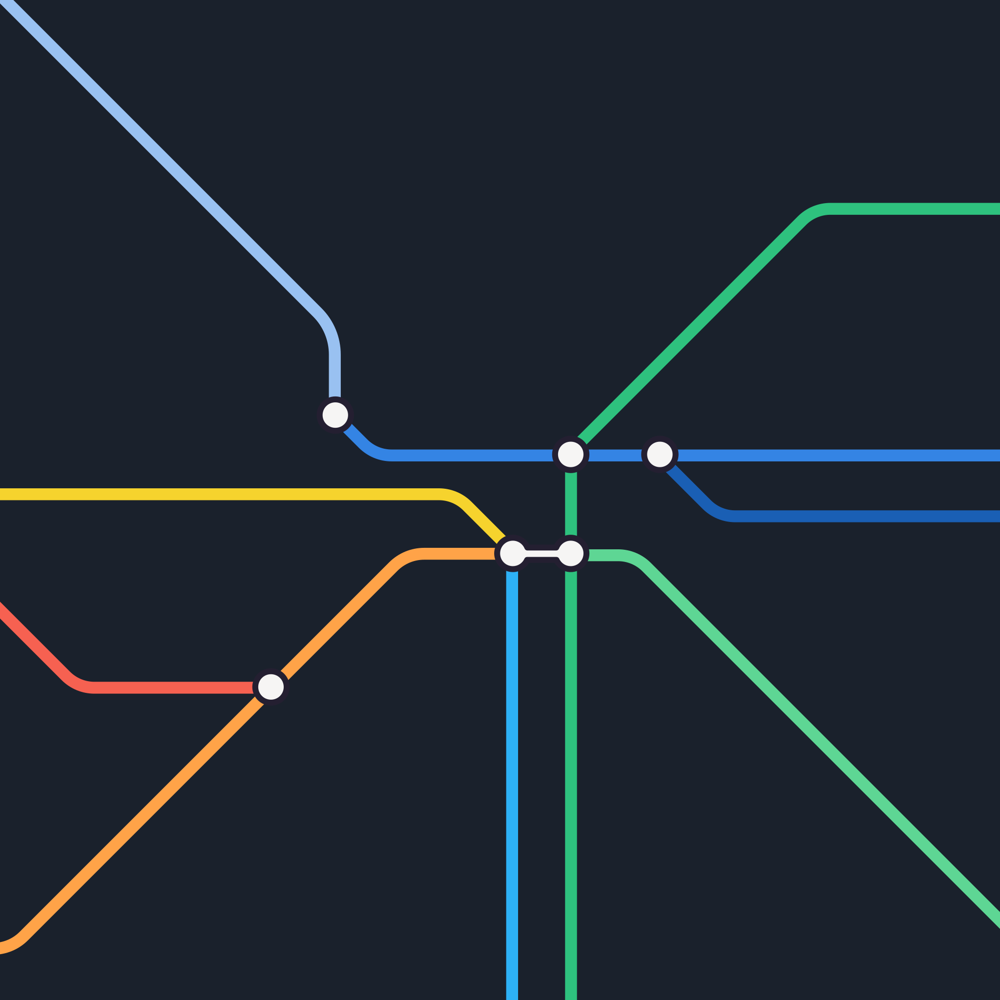

With GNOME 47 out, it’s time for my bi-annual wallpaper deep dive. For many, these may seem like simple background images, but GNOME wallpapers are the visual anchors of the project, defining its aesthetic and identity. The signature blue wallpaper with its dark top bar remains a key part of that.

In this release, GNOME 47 doesn’t overhaul the default blue wallpaper. It's more of a subtle tweak than a full redesign. The familiar rounded triangles remain, but here’s something neat: the dark variant mimics real-world camera behavior. When it's darker, the camera’s aperture widens, creating a shallower depth of field. A small but nice touch for those who notice these things.

<video controls nosound autoplay loop class="image full">
<source src="{{site.url}}{{page.url}}focus.webm" type="video/webm">
<source src="{{site.url}}{{page.url}}focus.mp4" type="video/mp4">
</video>

The real action this cycle, though, is in the supplemental wallpapers.

We haven’t had to remove much this time around, thanks to the JXL format keeping file sizes manageable. The focus has been on variety rather than cutting old designs. We aim to keep things fresh, though you might notice that photographic wallpapers are still missing (we’ll get to that eventually, [promise](https://gitlab.gnome.org/GNOME/gnome-backgrounds/-/issues/20).

In terms of fine tuning changes, the classic, `Pixels` has been updated to feature newer apps from [GNOME Circle](https://circle.gnome.org).

<video controls nosound autoplay loop class="image full">
<source src="{{site.url}}{{page.url}}pixels-timelapse.webm" type="video/webm">
<source src="{{site.url}}{{page.url}}pixels-timelapse.mp4" type="video/mp4">
</video>

The dark variant of `Pills` also got some love with lighting and shading tweaks, including a subtle subsurface scattering effect.

As for the new wallpapers, there are a few cool additions this release. I collaborated with *Dominik Baran* to create a tube-map-inspired vector wallpaper, which I’m particularly into. There’s also `Mollnar`, a nod to Vera Molnar, using simple geometric shapes in SVG format.

Most of our wallpapers are still bitmaps, largely because our rendering tools don’t yet handle color banding well with vectors. For now, even designs that would work better as vectors—like mesh gradients—get converted to bitmaps.

We’ve introduced some new abstract designs as well -- meet `Sheet` and `Swoosh`. And for fans of pixel art, we’ve added `LCD` and its colorful sibling, `LCD-rainbow`. Both give off that retro screen vibe, even if the color gradient realism isn’t real-world accurate.

Lastly, there’s `Symbolic Soup`, which is, well... a bit chaotic. It might not be everyone’s cup of tea, but it definitely adds variety.

## Preview

{:.big}

{:.big}

{:.walls}

If you're wondering about the strange square aspect ratio, take a look at the wallpaper sizing guide in our [GNOME Interface Guidelines](https://developer.gnome.org/hig/reference/backgrounds.html).

