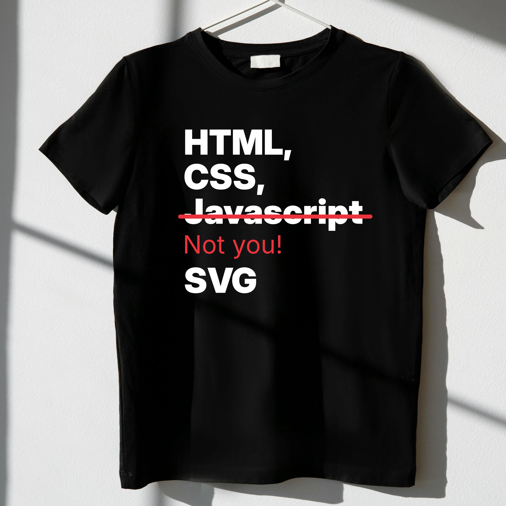

I'm not a professional web designer. I’ve been making websites for decades, but I haven't kept up with the latest browser quirks and common approaches. What I do have is a solid grasp of the web’s foundations—thanks to my time teaching IP networking at the university.

My journey with Linux started when I struggled to get PHP running on Windows. (To my surprise, my student side project autoroku.cz kept running in production for years.)

<!--
The reason I ever got interested in Linux was partly due to the difficulties getting a PHP interpreter running on Windows (I was shocked to see my student freelance side job autoroku.cz continue to be run at production for years).
-->

At SUSE I've tasted the DRY principles while working on a Rails project, SUSE Studio.  I left PHP behind and embraced static site generators like [Middleman](https://middlemanapp.com/), then [Jekyll](https://jekyllrb.com/) as it integrated into GitHub. But over time, maintenance fatigue pushed me further—back to basics. No SASS. No site generators. Just clean, modern HTML and CSS.

People are often surprised to see major projects like [gnome.org](https://www.gnome.org), [brand.gnome.org](https://brand.gnome.org), [circle.gnome.org](https://circle.gnome.org) and my own [jimmac.eu](https://jimmac.eu) built with plain HTML. Yes you *do repeat yourself* and inconsistencies creep in. But with integrated version control and web based editors, fixes are a click away. More people can edit plain HTML than any bespoke stack.

Do I miss some form of `include()`? Sure. Would I reach for Jekyll+markdown when someone else is responsible for the content? Probably. But for focused, small sites, nothing beats good old HTML.

