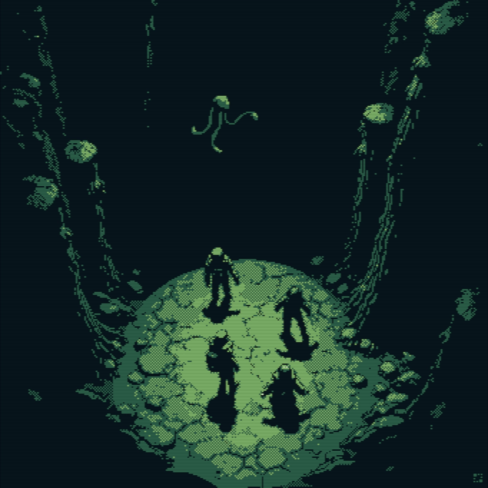

I savored every episode, knowing this was going to be one of those rare shows, like Severance season one, that you only get to experience for the first time once. It pulls you into a vivid, immersive world that’s equal parts mesmerizing and unsettling. A place you’re fascinated by, but would never want to be put in. The atmosphere seeps into you — the sound design, the environments, the way it all just lingers under your skin. You can’t shake it off.

And now I’ve watched the final 12. episode and I already miss it. So I need to say: watch it. It’s something special.

The series is a full-length expansion of the short [Scavengers](https://www.youtube.com/watch?v=1TRzemJbUsw) by Joseph Bennett and Charles Huettner (With visible improvements across the board). They’ve cited Nausicaä as a major influence, but if you’re into Akira, you’ll catch a few visual nods there too. It’s brutal. It’s gorgeous. And honestly, I haven’t been this excited about an animated series in a long time. 

Neither Netflix nor HBO wanted to greenlight the [second season](https://www.youtube.com/watch?v=kSEPJ9OtQb8). But the show has come to a very satisfying closure, so I'm not complaining. 

★★★★★
