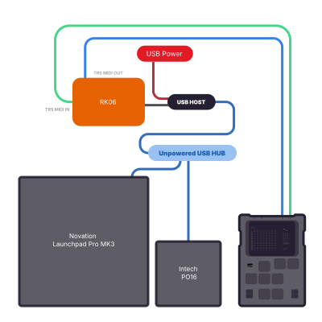
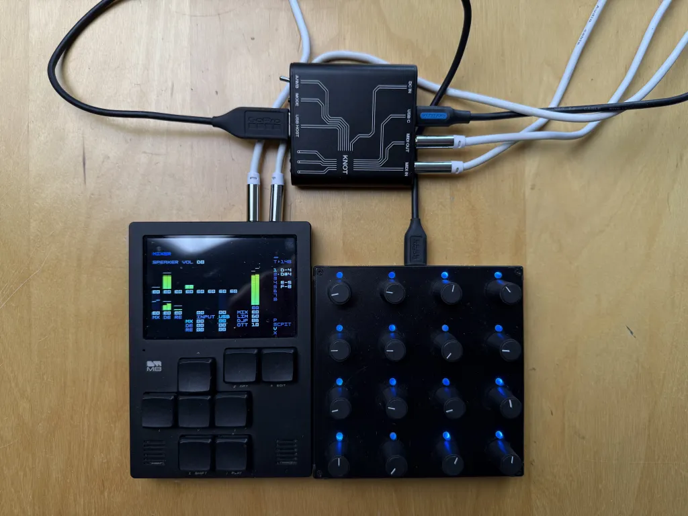
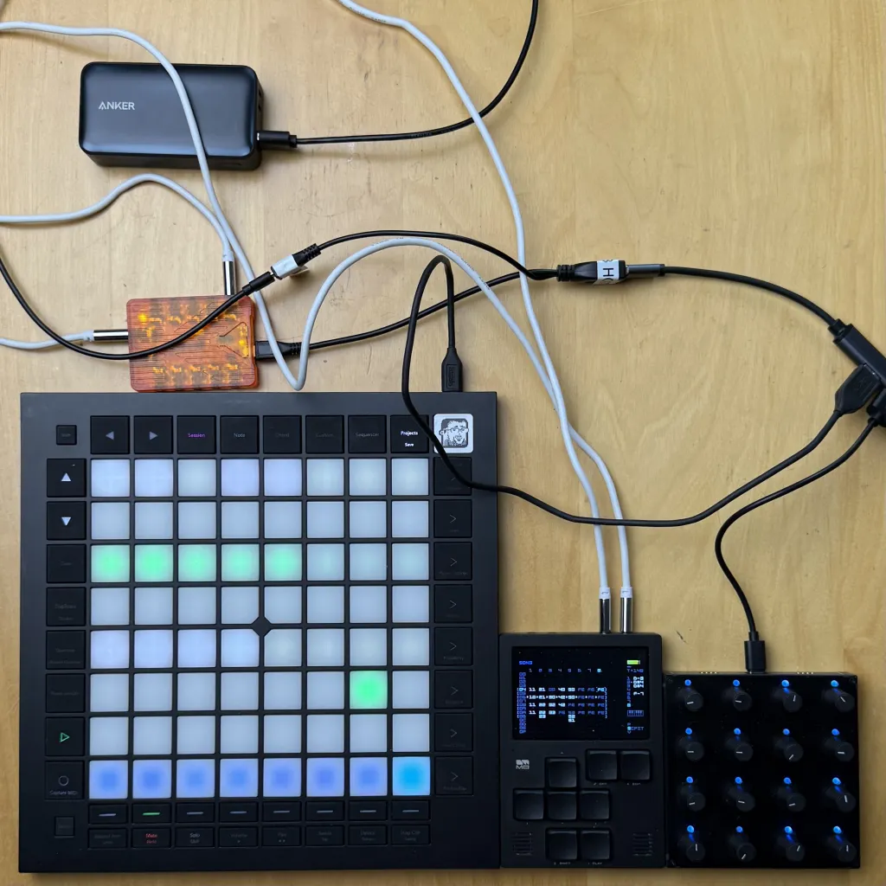

The M8 has extensive USB audio and MIDI capabilities, but it cannot be a USB MIDI host. So you can control other devices through USB MIDI, but cannot sent to it over USB.

# Control Surface & Pots for M8

Controlling things via USB devices has to be done through the old TRS (A) jacks. There's two devices that can aid in that. I've used the [RK06](https://retrokits.com/shop/rk006/) which is very featureful, but in a very clumsy plastic case and USB micro cable that has a splitter for the HOST part and USB Power in. It also sometimes doesn't reset properly when having multiple USB devices attached through a hub. The last bit is why I even bother with this setup. 

The Dirtywave M8 has amazing support for the [Novation Launchpad Pro MK3](https://novationmusic.com/products/launchpad-pro-mk3). Majority of peolpe hook it up directly to the M8 using the TRS MIDI cables. The Launchpad lacks any sort of pots or encoders though. Thus the need to fuss with USB dongles. What you need is to use the Launchpad Pro as a USB controller and shun at the reliable MIDI connection. The RK06 allows to combine multiple USB devices attached through an unpowered USB hub. Because I am flabbergasted how I did things here's a schema that works. 

If it doesn't work, unplug the RK06 and turn LPPro off and on in the M8. I hate this setup but it is the only compact one that works (after some fiddling that you absolutely hate when doing a gig).

# Intech Knot

The Hungarians behind the Grid USB controlles (with first class Linux support) have a USB>MIDI device called [Knot](https://intech.studio/landing/shop/knot). It has one great feature of a switch between TRS A/B for the non-standard devices. It is way less fiddly than the RK06, uses nice aluminium housing and is sturdier. Hoewer it doesn't seem to work with the Launchpad Pro via USB and it seems to be completely confused by a USB hub, so it's not useful for my use case of multiple USB controllers.

# Non-compact but Reliable

Novation came out with the [Launch Control XL](https://novationmusic.com/products/launch-control-xl), which sadly replaced pots in the old one with encoders (absolute vs relative movement), but added midi in/ou/through with a MIDI mixer even. That way you can avoid USB altogether and get a reliable setup with control surfaces and encoders and sliders. 

One day someone comes up with a compact midi capable pots to play along with Launchpad Pro ;) This post has been brought to you by an old man who forgets things.