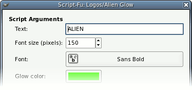
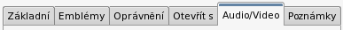

There are two things I'd like to see implemented in the industrial engine.
As it stands it is pretty much impossible to tell what entry widget has focus
if you don't count the blinking of the cursor which depending on your settings
can be pretty hard.

The other thing is rather cosmetic. I wouldn't mind giving more visual clue
on what tab is currently selected by adding the selection tripe, similar to
what XP does.

Oh and once Industrial is in gnome-themes, I'd love to see the [sodipodi ruler bug](http://bugzilla.ximian.com/show_bug.cgi?id=45579) squashed. Pwetty pwueese!
