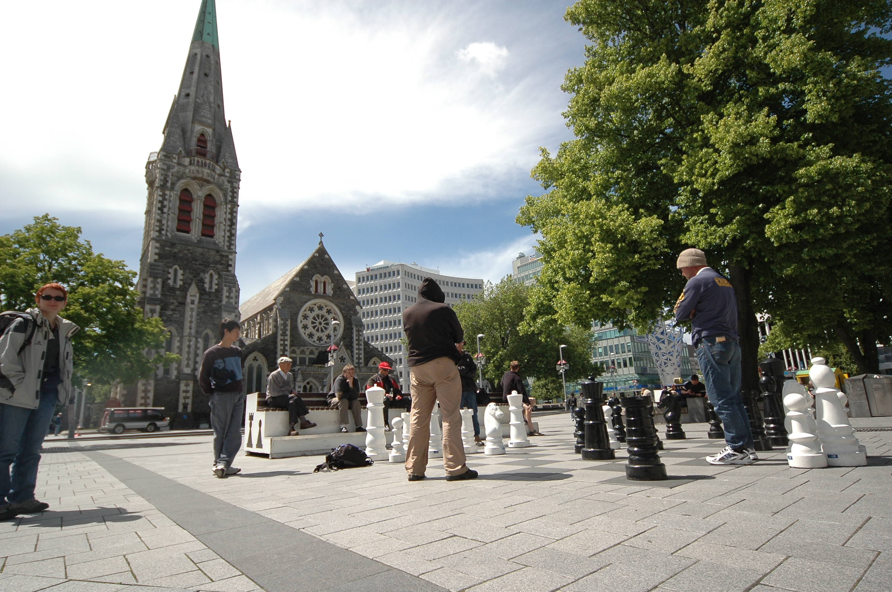
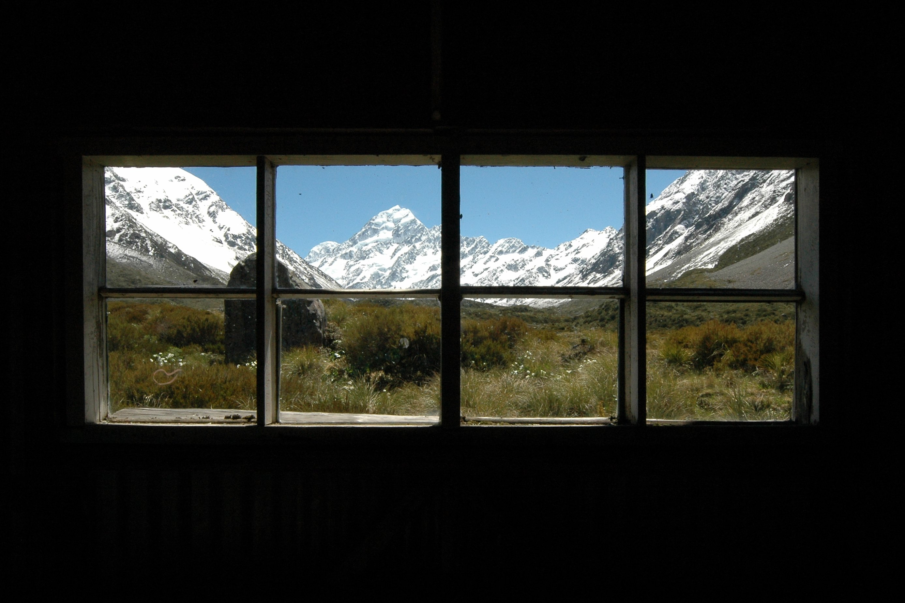
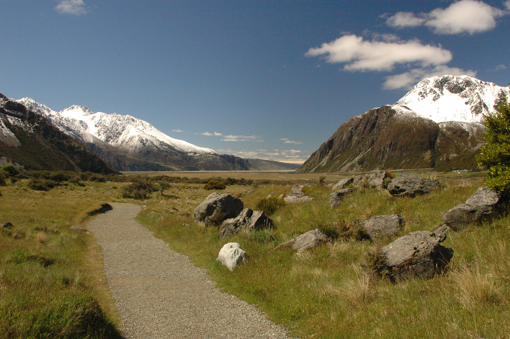

Since it's about 5000 pictures and 13.3GB to go through, I'll be posting my New Zealand images in batches. This first batch covers the first three days of the trip with a single shot from the 38 hour flight ;). Czech republic is almost exactly on the other side of the globe and we had a lot of waiting between the flights (`PRG>AMS>KUL>AUC>CHR`).

We arrived in Christchurch after waiting for the last plane in Auckland. We totally looked like zombies there. I managed to leave all contact info for [Glynn](http://www.gnome.org/~gman/blog/) at home, so we wandered around Christchurch on our own. NZ towns look way more american than anything else I've seen. Wide roads, everything orthogonal.  That's quite a contrast to the
roads out in the open, where it's not uncommon for it to become dirt roads and back to "state highway" again. The highway only has one lane per direction though. And most of the bridges merge into one lane in both directions.  Oh and we even went on a bridge that shared the line with a train. Very funky.

Of course driving on the _wrong side_ of the road got me a honk honk at the very first crossing in Christchurch ;). I got used to it later on (driving on left, not the honking), but at one point we stopped at a nice place to make some pictures and when we got back on the road I said to Iva that it wasn't the safest place to park. And she replied with "Shouldn't you be driving left?". At the second I got back to the right lane a speeding toyota truck went past us just when we were going out of that curve. One second. Phew.

The weather in New Zealand was changing day to day, and later on even minute to minute. Overall it wasn't too bad, although the kiwis said this summer was very cold. I found it funny when a complete stranger approached us in New Plymouth, asked about where we come from and apologised for the weather ;) The
people in NZ are the firendliest I've ever met.

We had some snow around lake Tekapo, yet the next day we got sunburnt on the Hooker valley track near Mt Coook village. It doesn't take long for a european to get burnt even when you try to avoid it.

