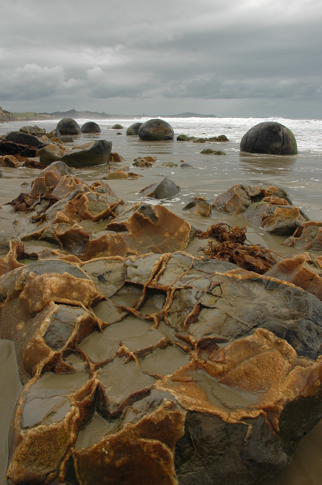
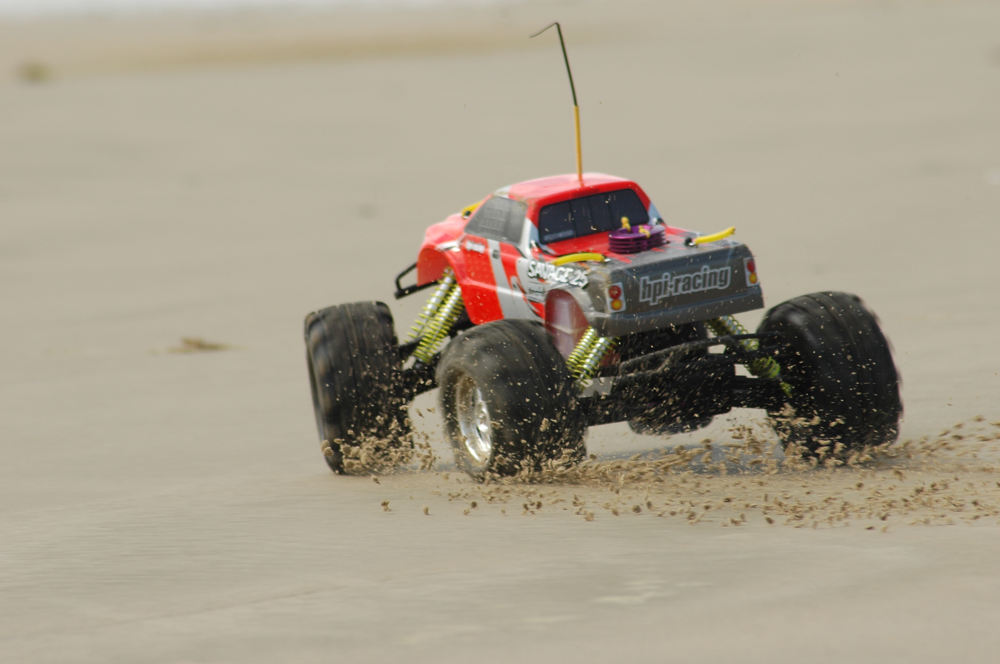
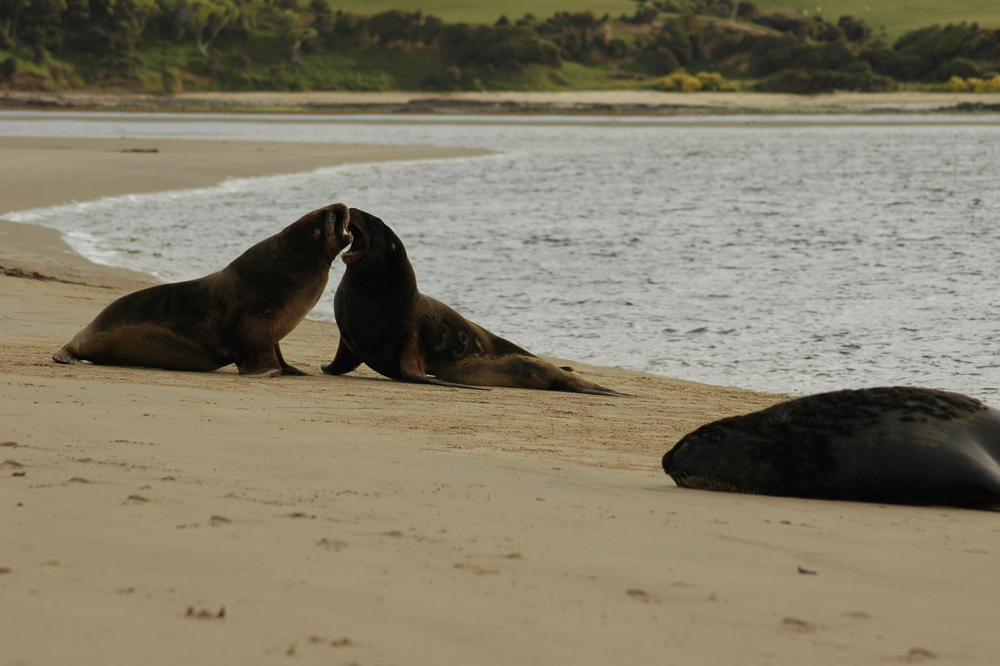

From Oamaru we went to Catlins park area, which we didn't plan initially, but turned out to be one of the nicest places we visited in New Zealand.

On the way, at a place they call Nugget Point, we met two blokes who were enjoying themselves driving two very fast radio controlled cars on the beach. I enjoyed shooting a lot pictures there. Some turned out quite nice, but the fun framing those fast beasts was even more fun than the result. I'm sure they had fun driving them too :)

When we saw a few seals at Nugget Point we thought we saw something. Later we managed to get a few feet from big sea lions at Surat Bay and later at Abel Tasman kayak close to the seals and have dolphins swim around us. Stuff like that happens in NZ about as commonly as cars get stolen in CZ.

