I haven't written a post in quite a while, so I decided to document my failure to come up with a viable alternative to the translatable animations we use in [Getting Started](https://help.gnome.org/users/gnome-help/3.18/getting-started.html.en) documentation. So let's start with what's wrong with it. Despite being far more maintainable than a screencast, it's still a major hassle to keep the videos in sync with the developing designs. Every translation requires a re-render of all the frames and it quickly grows into gigabytes per language.

# Video

<video controls class="image full">
<source src="{{site.url}}{{page.url}}gnome-windows-and-workspaces.webm" type="video/webm">
<a href="{{site.url}}{{page.url}}gnome-windows-and-workspaces.webm">Czech version of one of the Getting Started videos</a>
</video>


If you're interested in seeing how these were produced, see the [Behind the Scenes of getting Started](https://www.youtube.com/watch?v=IhFcErztgeA) video.

The animations themselves aren't super complex. Basic transforms (translation, scale and rotation) and opacity is all that's needed. And because we are using translatable SVGs in Mallard, it was time to look into SVG animation. There are numerous options available to animate in SVG, which already gave me a hint that none of them will work properly for my use case. I hate being right. 


# SMIL 

I'll starts with the one I like least. The inline garbage approach. SMIL. Each attribute of an SVG element is animateable. Creating a global sequence using this by hand is close to impossible. Its capabilities do include a few extras like animating an object *along a path*, but in general I cannot imagine editing this by hand. Incorporating Inkscape into the workflow seemed feasible first. Inkscape will not touch the XML it doesn't know about. It will not clean out any of the animation stuff when you save. The xlink namespace definition to animate along path seems to have worked, but I can't figure out some weird offsets. Groups usually get some matrix transforms as soon as you reposition them. It all may boil down to Inkscape using its own coordinate system, I don't know. I haven't succeeded to bolt some animation on the Inkscape generated SVG.


# CSS 

A much more appealing was the concept of using CSS animation. We do a lot of transitions and some animation in gtk+, so it would have been great to reuse the same technology here. While CSS transitions are spot on, animation with a sense of a global timeline is not really the use case for the web. Usually animation in the intended context is an individual transform happening after an event triggered. Creating a sequence of various objects animating in a global timeline is pretty awkward. Especially if you want to loop the whole animation infinitely. The only tools for your disposal is either a time offset or relative time keyframes, keeping all objects' animation the same length.



I also ran into Firefox and Webkit interpreting <code>transform-origin</code> differently.

```
.run-animation {
  transform-origin: top left;
  animation: cursor-move 2s ease 1s forwards, 
                    fade-in 1s linear 0s, 
                    cursor-click .25s ease 3s alternate 2;
  }
@keyframes fade-in {
  from { opacity: 0;  }
  to {  opacity: 1; }
}
@keyframes cursor-move {
  from { opacity: 1;  }
  to {  opacity: 1; transform: translate(100px,-100px);}
}
@keyframes cursor-click {
  from { transform: translate(100px,-100px) scale(1); }
  to { transform: translate(100px,-100px) scale(.5); }
}
```

The above CSS uses `animation-delay`. It might be possible to have all keyframes last the same time and use the keyframes relative keyframing for timing (duplicate same keyframe to "hold"). I can't imagine retiming or generally modify an existing animation hand constructed using CSS' keyframes though. A visual tool with a timeline would be necessary. 

# Javascript 

There are many js based frameworks to aid creating and animating SVG documents in realtime, but none of them seem to aid me in creating a global complex animation using assets created in Inkscape. I looked at Google Webdesigner next.

* [Velocity](http://julian.com/research/velocity/)
* [Snap SVG](http://snapsvg.io/)
* [Raphael](http://raphaeljs.com/)

# Google Webdesigner

[Google Webdesigner](https://www.google.com/webdesigner/) has all the necessary visual tools like property keyframing and a global timeline. Sadly it produces a rather less self contained set of html, js and css files. I didn't figure out a way how that could be brought into Mallard.

<iframe class="image full" height=600 src="http://127.0.0.1:4000/assets/statichtml/2015-10-13-googledesign/"></iframe>

In the end, even though the animations don't seem to be that complex, maintaining them by hand doesn't seem very doable. A visual editor is required. If Google Webdesigner can be taught to produce a standalone SVG or Mallard taught to use iframes, I'm all ear. Any pointers to a similar tool is also welcome.
