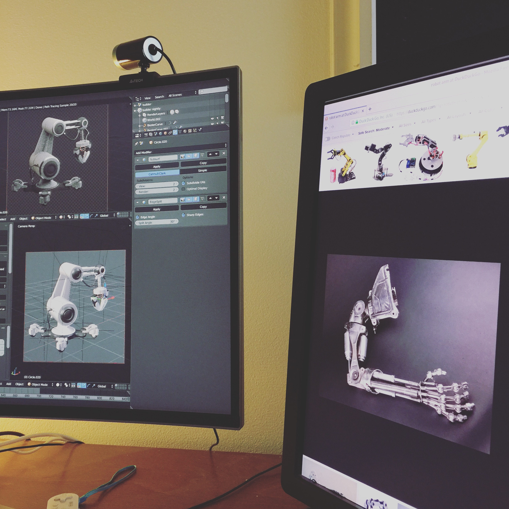
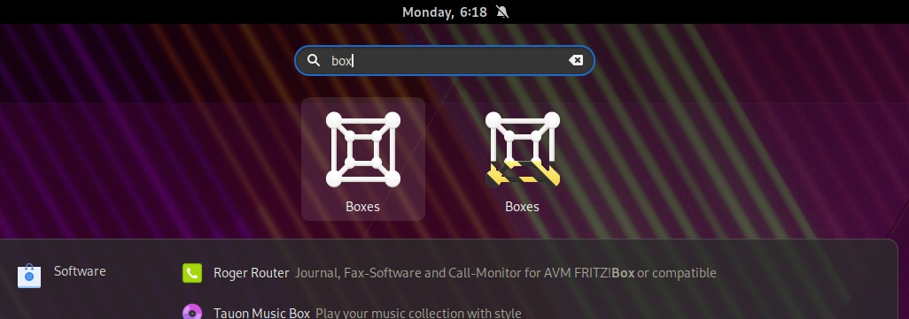

Over the weekend I was forced to unload all my photos from my phone due to limited storage space. As I went through a nice capture of Builder nighly caught my attention and I couldn't help but [post it on twitter](https://twitter.com/jimmac/status/1246208150233112577).

Obviously posting on twitter meant it was misunderstood immediately and quipped with entitled adjectives. And rather than responding on the wrong platform, I finally have an excuse to post on my blog again. So let's take a look at the *horrible situation* we ended up with.

Thanks to [Flatpak](https://flatpak.org) you now have a way to install a stable and development versions of an app, concurrenly. You can easily tell them apart without resorting to Name suffices in the shell, where the actual name gets horribly truncated due to ellipsization, while still clearly being the same app on a first glimpse.

There's plenty of apps already making use of this. So how does an app developer get one? We actually have the tooling for that. If you have an app icon, you can easily generate a nightly variant with zero effort in most cases.

<video class="full" muted="" controls="">
  <source src="./nightly-icons.mp4" type="video/mp4">
  <source src="./nightly-icons.webm" type="video/webm">
Your browser does not support the video tag.
</video>

So what was the situation twitter was praising? Let's count on how many GNOME applications shipped a custom nighly icon. Umm, how about **zero**?

A pretty picture an artist spends hours on, modelling, texturing, lighting, adjusting for low resolution screens is <em>not</em> a visual framework nor a reasonable thing to ask app developers to do.