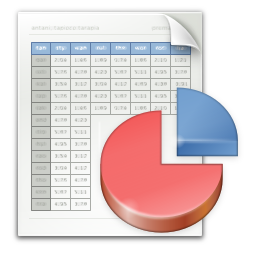

+++
title = "Updated App Icons"
description = "Kicking off the high-resolution app icon initiative for GNOME 3.12."
date = 2013-12-05
[taxonomies]
tags = ["gnome", "design", "icon", "work"]
[extra]
image = "software.png"
+++

GNOME 3.12 will feature an improved [Software](https://wiki.gnome.org/Apps/Software) experience. [Richard](http://blogs.gnome.org/hughsie/) has been fearlessly working on making the backend snappy and Software app itself cleaner and [more fun](http://blogs.gnome.org/hughsie/2013/10/08/how-to-take-169-screenshots/).

There are many great improvements to the App pages, where you can learn what the app is about and see it in action. Having a great overview of the apps showed just how many apps don't seem to care about their identities or didn't manage to attract any graphics designer and things aren't all rosy.

[We've identified some key apps](https://wiki.gnome.org/action/edit/GnomeGoals/HighResolutionAppIcons) that are either featured in individual categories or are part of a set that needs a facelift as a group, such as the [GNOME games](https://wiki.gnome.org/Apps/Games). Number of apps that publish proper [appdata](http://people.freedesktop.org/~hughsient/appdata/) is growing, so the todo list probably won't shrink any time soon. If you feel like helping [us](https://wiki.gnome.org/Design) out, check out the [guidelines](https://wiki.gnome.org/Design/HIG/IconsAndArtwork) and [get in touch](https://wiki.gnome.org/Design/Contribute)!
