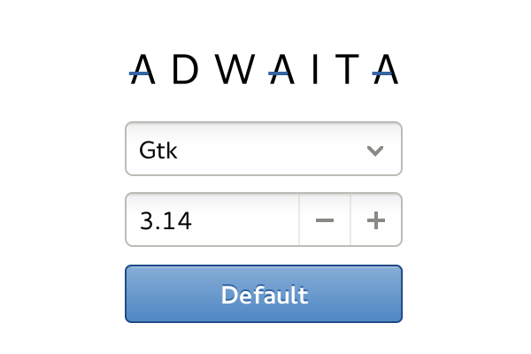
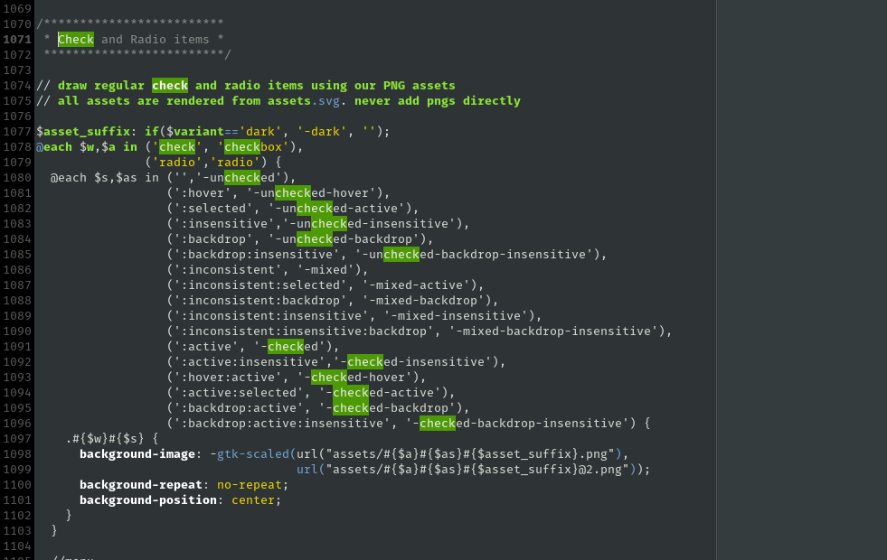

+++
title = "Adwaita 3.14"
description = "Major surgery on GNOME's default theme — fewer colors, no engine, all SASS."
date = 2014-06-14
[taxonomies]
tags = ["adwaita", "gnome", "design", "widget", "theme", "work"]
[extra]
image = "adwaita-314.svg"
+++

Now that the controversial 3.12 tab design has been validated by Apple, we're ready to tackle new challenges with the widgetry™.

Adwaita has grown into a fairly complex theme. We make sure unfocused windows are less eye-grabbing (flat). We provide a less light-polluting variant for visually-heavy content apps (*Adwaita:dark*). And last but not least we provide a specific widget style for overlay controls (OSD). All this complexity has made Adwaita quite a challenge to maintain and evolve. Since we were to relocate Adwaita [directly into gtk+](http://blogs.gnome.org/mclasen/2014/06/13/a-new-default-theme-for-gtk/), we had to bite the bullet and perform quite a [surgery on it](http://www.bonkersworld.net/building-software/).

There's a number of improvements we aimed to achieve. Limiting the number of distinct colors and making most colors derived makes it easier to adjust the overall feel of the theme and I'm sure 3rd party themers will enjoy this too. Not relying on image assets for majority of the drawing makes the workflow much more flexible as well. Many of the small graphical elements now make use of the icon theme assets so these remain recolorable based on the context, similar to how text is treated.

*We still rely on some image assets, but even that is much more manageable with [SASS](http://sass-lang.com/).*

[Benjamin](http://blogs.gnome.org/otte/) has been working hard to move the theme closer to the familiar CSS box model, further minimizing the reliance on odd property hacks and engines (Adwaita no longer makes use of any engine drawing).

Anything gtk related never happens without the giant help from Matthias, Cosimo and Benjamin, but I have to give extra credits to Lapo Calamandrei, without whom these dark caverns would be impossible for me to enter. Another major piece that I'm grateful for living right inside the toolkit, ready to be brought up any time, is the [awesome inspector](http://blogs.gnome.org/mclasen/2014/06/05/a-gtkinspector-update/). Really happy to see it mature and evolve.
