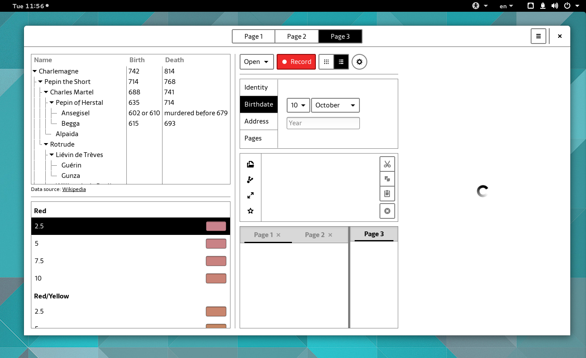
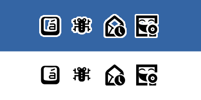
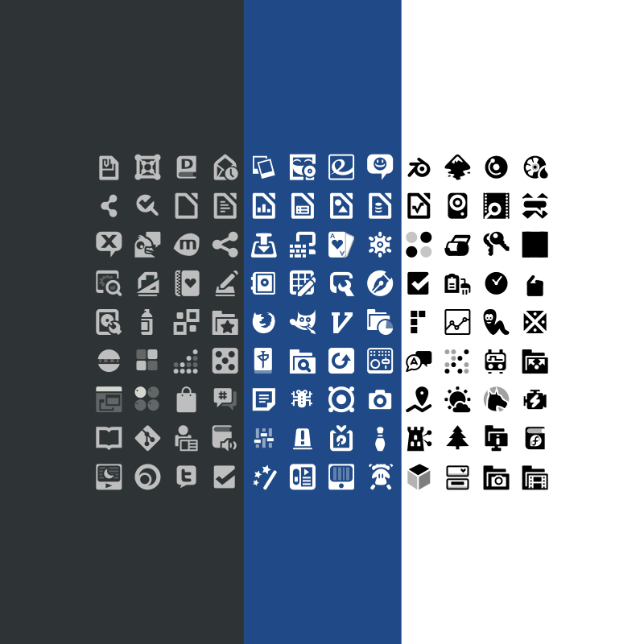

+++
title = "High Contrast Refresh"
description = "Replacing fuzzy double-stroked PNGs with crisp recolorable SVG symbolics."
date = 2015-03-24
[taxonomies]
tags = ["gnome", "design", "icon", "highcontrast", "work"]
[extra]
image = "hc-shell.png"
audio = "speech.opus"
+++

One of the major visual updates of the 3.16 release is the high contrast accessible theme. Both the shell and the toolkit have received attention in the HC department. One noteworthy aspect of the theme is the icons. To guarantee some decent amount of contrast of an icon against any background, back in GNOME 2 days, we solved it by "double stroking" every shape. The term double stroke comes from a special case, when a shape that was open, having only an outline, would get an additional inverted color outline. Most of the time it was a white outline of a black silhouette though.

*Fuzzy doublestroke PNGs of the old HC theme*

In the new world, we actually treat icons the same way we treat text. We can adjust the best contrast by controlling the color at runtime. We do this the same way we've done it for symbolic icons, using an embedded CSS stylesheet inside SVG icons. And in fact we are using the very same symbolic icons for the HC variant. You would be right arguing that there are specific needs for high contrast, but in reality majority of the double stroked icons in HC have already been direct conversions of their symbolic counterparts.

*Crisp recolorable SVGs of the post 3.16 world*

While centralized theme that overrides all application never seemed like a good idea, as the application icon is part of its identity and should be distributed and maintained alongside the actual app, the process to create a high contrast variant of an icon was extremely cumbersome and required quite a bit of effort. With the changes in place for both the toolkit and the shell, it's far more reasonable to mandate applications to include a symbolic/high contrast variant of its app icon now. I'll be spending my time transforming the existing double stroke assets into symbolic, but if you are an application author, please look into providing a scalable stencil variant of your app icon as well. Thank you!

  * [GNOME icon design guidelines](https://developer.gnome.org/hig/stable/icons-and-artwork.html.en)
  * [High Contrast App Icon Initiative](https://wiki.gnome.org/Initiatives/GnomeGoals/HighContrastAppIcons)
