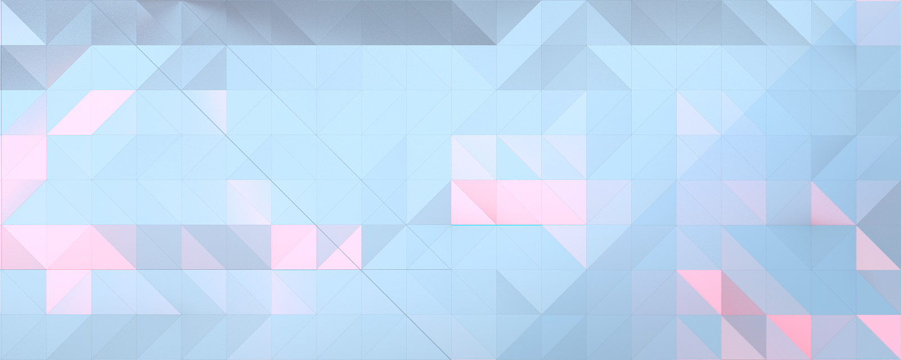
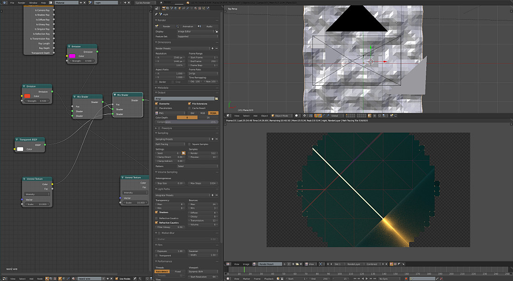
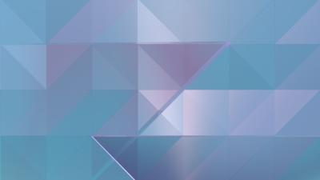

+++
title = "Wallpapers"
description = "How Blender, noise, and obsessive light play shape GNOME's default wallpapers."
date = 2015-10-21
[taxonomies]
tags = ["design", "blender", "wallpaper", "gnome", "work", "gimp", "inkscape", "3D"]
[extra]
image = "adwaita-318.jpg"
audio = "speech.opus"
+++

Part of [GNOME](http://gnome.org)'s visual identity are the default wallpapers. Ever since GNOME3 was released, regardless of the release version, you can tell a stock GNOME desktop from afar. Unlike what most Linux distributions do, we don't change the wallpaper thematically from release to release and there is a strong focus on *continuity*.

While both [Android](https://design.google.com/articles/the-art-behind-android-marshmallows-new-wallpapers/) and [Windows](https://www.youtube.com/watch?v=hL8BBOwupcI) are going analog, we're not that hipster. If you follow my journal, you probably wouldn't be shocked to hear I mainly use [Blender](http://blender.org) to create the wallpapers. In the past [Inkscape](http://inkscape.org) took a major part in the execution, but its [lacking implementation of gradients](https://bugs.launchpad.net/inkscape/+bug/180693) leads to dramatic [color banding](https://en.wikipedia.org/wiki/Colour_banding) in the subtle gradients we need for the wallpapers. I used to tediously compensate for this in [GIMP](http://gimp.org), using noisify filters while working in high bit depth and then reducing color using [GEGL](https://en.wikipedia.org/wiki/GEGL)'s magical color reduction operation that Hans Peter Jensen wrote a while a back. It allows to chose various dithering algorithms when lowering the bit depth.

However thanks to [Cycles](http://wiki.blender.org/index.php/Dev:2.6/Source/Render/Cycles), we get the noise for free :) Actually it's one of the things I spend hours and hours waiting for getting cleaned up with iterations. But it does help with color banding.

In my work I have always focused on execution. Many artists spend a great deal of time constructing a solid concept and have everything thought out. But unless the result is well executed, the whole thing falls apart. GNOME Wallpapers are really *just stripes and triangles*. But it's the detail, the light play, the sharpness, not too much high density information that make it all work.

First iterations of the GNOME 3.20 variants are beginning to land in the [gnome-backgrounds](https://git.gnome.org/browse/gnome-backgrounds) module. Check it out.

