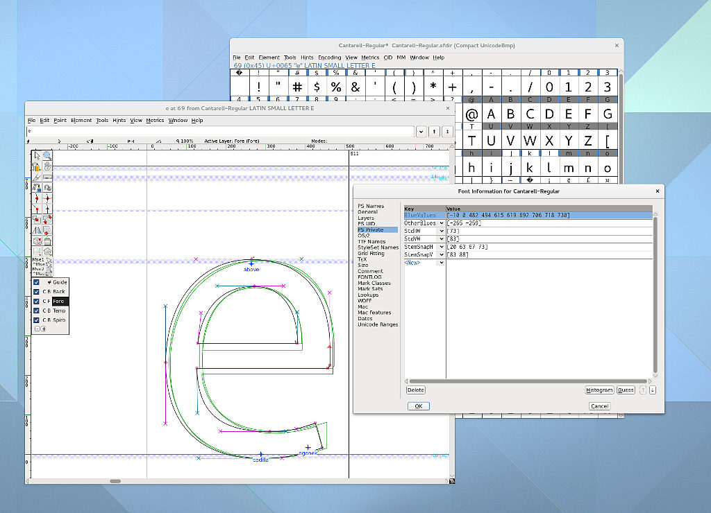

+++
title = "New Cantarell Maintainer"
description = "How Nikolaus Waxweiler fixed Cantarell's hinting and brought GNOME's typeface back to shape."
date = 2015-12-10
[taxonomies]
tags = ["font", "design", "gnome", "work"]
[extra]
image = "bluezones.jpg"
+++

GNOME's default UI typeface Cantarell gained a new maintainer, Nikolaus Waxweiler. Nikolaus was on a holy crusade to improve the state of text rendering on Linux by improving [FreeType](http://freetype.org/) and lobbying for changes in different projects. While he continues on those efforts, bug reports hinted (pun intended) that GNOME's font rendered worse as FreeType improved so he went on to investigate why. It turns out that Cantarell had many metric related issues and its development was quite stagnant.

The process of making fonts look good even on our crappy LoDPI screens is commonly called [hinting](https://github.com/fontforge/fontforge/wiki/How-TT-Hinting-Works) and it requires precision. Cantarell ships as an .otf font or OpenType font with Postscript-flavor. Hinting .otf fonts works differently from hinting common TrueType or .ttf fonts. You define several horizontal snapping zones, also called blue zones, like descender, x-height, capital height, ascender height, etc. so that they match your design. That means that the outlines you are designing must as a general rule be placed precisely within these blue zones or the hinting algorithm will ignore them. Blue zones must be constructed to contain everything they should contain. The idea is that a well designed typeface is consistent and regular enough that coarse blue zones describe the design well. The hinting algorithm of the font design application will then place stem information according to those blue zones, among other considerations. For a final rendering, glyphs are snapped to those horizontal blue zones, meaning they are *only* snapped on the Y-axis. Think ClearType.

Cantarell was full of off-by-ones-or-twos and technical don't-do-thats, diacritics were inconsistent and Cyrillics still need a look-over. The bold face was in an even poorer state. Back in June 2013 Adobe's contributed a new high-quality OpenType/Postscript-flavor hinting engine. The problems were only magnified because the new engine actually takes hinting information seriously and will spit out garbage when the font designer isn't careful.

Nikolaus has cleaned up the fonts considerably by fixing the blue zones, outline precision to fall within them and numerous other problems. You might also notice that letters like bdfklh are a bit taller for a more harmonious look. It should display consistently at all sizes now.

Oh, by the way: FreeType 2.6.2 brings more user-visible changes. If you are on a rolling-release distribution, you might have noticed them already. If you wish to read up more on those changes, Nikolaus wrote a lengthy article about the changes and future plans on [freetype.org](http://freetype.org).

For a Cantarell 0.1.0 release we plan to have all accented glyphs fixed. Nikolaus has finished a first pass at diacritics and is now looking for testers. Anyone who deals with diacritics in his/her language, especially central European people, please get the .otf fonts from the [git repo](https://git.gnome.org/browse/cantarell-fonts/tree/otf) and report bugs to the [GNOME bug tracker](https://bugzilla.gnome.org/page.cgi?id=browse.html&product=cantarell-fonts).

Do note that Nikolaus didn't just dive into maintainership, but wrote most of this post. My incentives to get him set up a blog and post on Planet GNOME have been fruitless so far.
