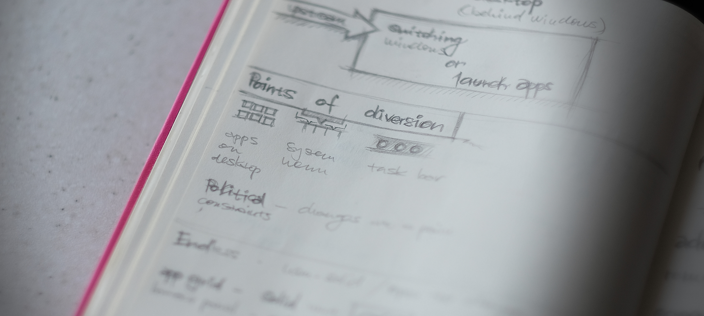

+++
title = "Rio"
description = "GNOME design hackfest in Rio — visiting favelas, meeting users, and bridging Endless and GNOME."
date = 2016-01-29
[taxonomies]
tags = ["gnome", "design", "travel", "work", "ux"]
[extra]
image = "notes.jpg"
+++

I was really pleased to see [Endless](https://endlessm.com/), the little company with big plans, initiate a [GNOME Design hackfest in Rio](https://wiki.gnome.org/Hackfests/UxDesign2016).

The ground team in Rio arranged a visit to two locations where we met with the users that Endless is targeting. While not strictly a user testing session, it helped to better understand the context of their product and get a glimpse of the lives in Rocinha, one of the Rio famous [favelas](https://en.wikipedia.org/wiki/Favela) or a more remote rural Magé. Probably wouldn't have a chance to visit Brazil that way.

During the workshop at the Endless offices we went through many areas we identified as being problematic in both the stock GNOME and Endless OS and tried to identify if we could converge on and cooperate on a common solution. Currently Endless isn't using the stock GNOME 3 for their devices. We aren't focusing as much on the shell now, as there is a ton of work to be done in the app space, but there are a few areas in the shell we could revisit.

GNOME could do a little better in terms of discoverability. We investigated the role of the app picker versus the window switcher in the overview and being able to enter the overview on boot. Some design choices have been explained and our solution was reconsidered to be a good way forward for Endless. Unified system menu, window controls, notifications, lock screen/screen shield have been analyzed.

Endless demoed how the GNOME app-provided system search has been used to great effect on their mostly offline devices. Think "offline google".

Another noteworthy detail was the use of CRT screens. The new mini devices sport a cinch connection to old PAL/NTSC CRT TVs. Such small resolutions and poor quality brings more constraints on the design to keep things legible. This also has had a nice effect in that Endless has investigated some responsive layout solutions for gtk+ they demoed.

I also presented GNOME design team's workflow, and the free software toolchain we use. Did a little demo of Inkscape for icon design and wireframing and Blender motion design.

Last but not least, I'd like to thank the GNOME Foundation for making it possible for me to fly to Rio.
