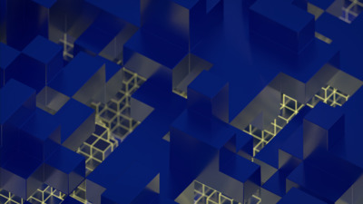

+++
title = "Shelved Wallpapers"
description = "GNOME wallpaper outtakes too nice to keep shelved."
date = 2018-02-12
[taxonomies]
tags = ["gnome", "design", "wallpaper", "download"]
+++

GNOME 3.28 will release with another batch of new wallpapers that only a freaction of you will ever see. Apart from those I also made a few for different purposes that didn't end up being used, but it would be a shame to keep shelved.

So here's a bit of isometric goodness I quite enjoy on my desktop, you might as well.

