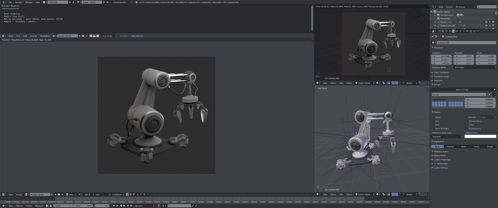
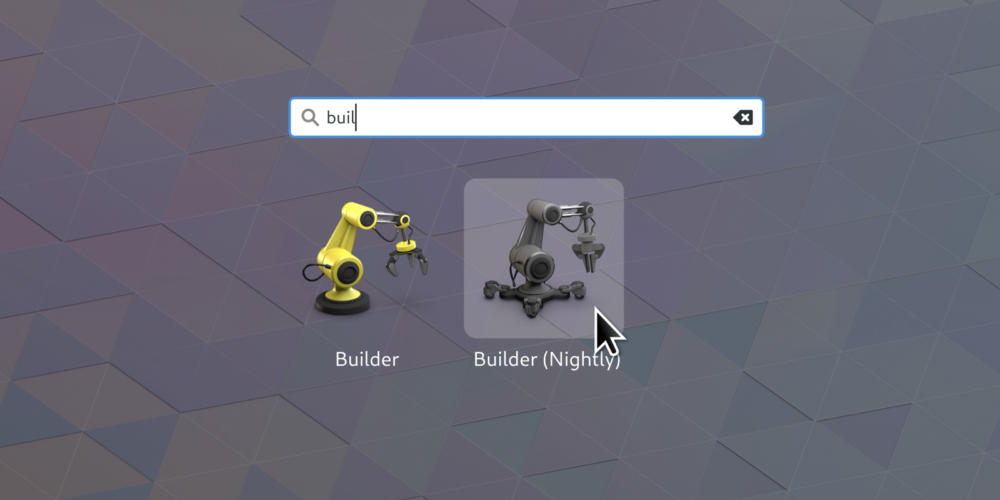

+++
title = "Builder Nightly"
description = "Designing an icon to tell nightly builds apart from the stable app."
date = 2018-03-14
[taxonomies]
tags = ["design", "icon", "flatpak", "gnome", "work", "blender", "3D"]
[extra]
image = "builder-nightly-icon.png"
mastodon_url = "https://mastodon.social/@jimmac/116254904395768866"
audio = "speech.opus"
related = [
  "posts/2017-03-31-recipe-icon/index.md",
  "posts/2015-03-24-high-contrast-refresh/index.md",
  "posts/2013-12-05-updated-app-icons/index.md",
]
+++

One of the great aspects of the [Flatpak model](http://flatpak.org), apart from separating apps from the OS, is that you can have multiple versions of the same app installed concurrently. You can rely on the stable release while trying things out in the development or nightly built version. This creates a need to easily identify the two versions apart when launching it with the shell.

I think Mozilla has set a great precedent on how to manage multiple version identities.

Thus came the desire to spend a couple of nights working on the Builder nightly app icon. While we've generally tried to simplify app icons to match what's happening on the mobile platforms and trickling down to the older desktop OSes, I've decided to retain the 3D workflow for the builder icon. Mainly because I want to get better at it, but also because it's a perfect platform for [kit bashing](https://en.wikipedia.org/wiki/Kitbashing).

For Builder specifically I've identified some properties I think should describe the 'nightly' icon:

  * Dark (nightly)
  * Modern (new stuff)
  * Not as polished — dangling cables, open panels, dirty
  * Unstable / indicating it can move (wheels, legs ...)
  

Next up is giving a stab at a few more apps and then it's time to develop some guidelines for these nightly app icons and emphasize it with some Shell styling. Overlaid emblems haven't particularly worked in the past, but perhaps some tag style for the label could do.
