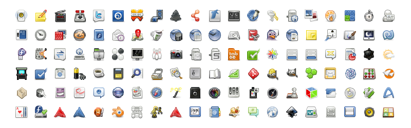

+++
title = "Detail Considered Harmful"
description = "Why our complex multi-size icon guidelines need a radical rethink."
date = 2018-07-18
[taxonomies]
tags = ["design", "icon", "gnome", "work"]
[extra]
image = "appgrid.svg"
audio = "speech.opus"
related = [
  "posts/2018-03-14-builder-nightly/index.md",
  "posts/2017-03-31-recipe-icon/index.md",
  "posts/2013-12-05-updated-app-icons/index.md",
]
+++

Ever since the dawn of times, we've been crafting pixel perfect icons, specifically adhering to the target resolution. As we moved on, we've kept with the times and added these highly detailed high resolution and 3D modelled app icons that WebOS and MacOS X introduced.

As many moons have passed since GNOME 3, it's fair to stop and reconsider the aesthetic choices we made. We don't actually present app icons at small resolutions anymore. Pixel perfection sounds like a great slogan, but maybe this is another area that dillutes our focus. Asking app authors to craft pixel precise variants that nobody actually sees? Complex size lookup infrastructure that prominent applications like Blender fail to utilize properly?

For the platform to become viable, we need to cater to app developers. Just like Flatpak aims to make it easy to distribute apps, and does it in a completely decetralized manner, we should emphasize with the app developers to design and maintain their own identity.

Having clear and simple guidelines for other major platforms and then seeing our super complicated ones, with destructive mechanisms of theming in place, makes me really question why we have anyone actually targeting GNOME.

The irony of the previous [blog post](/posts/builder-nightly/) is not lost on me, as I've been seduced by the shading and detail of these highres *artworks*. But every day it's more obvious that we need to do a dramatic redesign of the app icon style. Perhaps allowing to programatically generate the unstable/nightlies style. Allow a faster turnaround for keeping the style contemporary and in sync what other platforms are doing. Right now, the dated nature of our current guidelines shows.

Time to murder our darlings…
