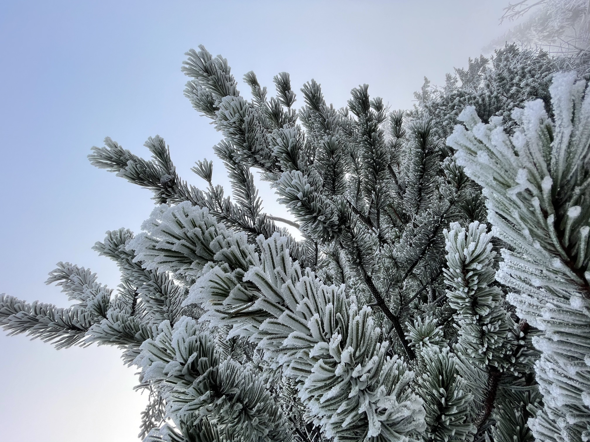

Singing praise to the most locked down device you can get is pretty dangerous for someone operating in the FOSS world. But I have to do it, as the risk of somebody angrily throwing his [Purism Librem 5](https://puri.sm/products/librem-5/) at me is pretty low.

Like most people I don't use my phone to do calls. Apart from failing to avoid all *the addictions* it throws at me, I love it for what it really is. An amazing video and photo *camera*.

I've owned (and still do) a decent number of cameras. Some of them I have really fond memories of, such as the Panasonic GF1. Mostly for its 20mm pancake lens I didn't sell along with the body when the time came, but kept it until a worthy body came along. That was the beast of a video camera I use until today, the GH5. Most of my [drone video b-roll](https://www.youtube.com/watch?v=MTLVFsEaOCg) is shot with it and its amazing slow motion. On my drone trips I've always been making a decision whether to take the best camera I have (gh5) or a compact one (Sony rx100m4). The latter wasn't even close to the big guy, but it was easy to fit into the bag and for the few establishing shots was good enough. Surprisingly the iphone 6 plus I had back then had better stabilisation than the RX100. But preferred the Sony for the colors and not having such oversharpened phone look.

One thing that really peaked my interest when Apple unrolled the iPhone 11 was the wide angle. Very unsharp on the corners and quite poor wrt capturing light, I was really hooked on the superwides being bombarded by gopro footage (and doing a lot of that bombardment myself). Even though the primary lens on the 12 is way better, the ultrawide shots have something that really appeals to me.

# Battery

Phones have gotten ridiculously big over the years. The iPhone 12 mini doesn't feel particularly small. It's after you hold any other current phone the size becomes apparent. I still wish it was a little smaller. I really miss the original Palm Pre form factor (and the most stylish OS ever).

People have reported poor battery performance even when the device is relatively new. We'll see how that's going to bite me when we will able to finally travel again, but so far the battery limitation hasn't been a constraint for me. 

# Lightning Port

Even though Apple is probably the corporation most trustworthy of keeping my photos, I'm still reluctant to have *everything* synchronized to someone elses computers. Thus the lighting cable and syncing over to a computer is a must. I really wish Apple bit the bullet and discontinued the dinosaur lightning connector in favor of a faster option. But sadly it looks like the successor won't be USB3, but no connector at all. 

I assume the days of connecting the iphone to my Linux workstation and having access to app storage as well as translated media (HEVC images are provided as JPEGs by the virtual camera), but it would be nice to have some sort of local workflow even if locked to the Apple walled garden.
