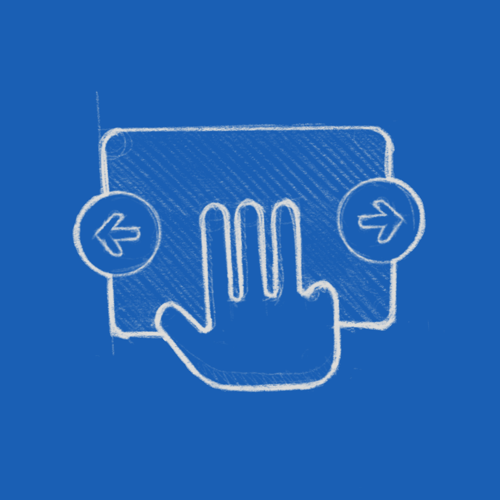

We've [struggled]() with bringing subtle animation to GNOME in the past. There is interest in bringing it in [some shape](https://gitlab.gnome.org/GNOME/gtk/-/tree/wip/otte/lottie) or form to *gtk4*. The bad news is the tools are still lacking on the production side. There's not much past [Glaxanimate](https://glaxnimate.mattbas.org/) to do even simple transforms.



While we iterated on the [GNOME 40 onboarding](https://gitlab.gnome.org/Teams/Design/os-mockups/-/issues/79), it became clear a subtle animation for the touch gestures would really help. And because the CSS machinery in gtk is fairly capable, I experimented implementing such a thing with good'ol `@keyframes`.

While anything more complex would be a nightmare, animating the hand going back and forth is well served by a simple CSS rule:

```
@keyframes left-and-right {
    from { background-position: 40% 30%, center 30%, center; }
    to { background-position: 60% 30%, center 30%, center; }
}

.page:nth-child(6) {   /* left right */
  background: url('/org/gnome/Tour/hand-fg.svg'),
              url('/org/gnome/Tour/leftright-bg.svg');
  background-repeat: no-repeat;
  background-position: center 30%;
  animation: left-and-right 2s ease-in-out infinite alternate;
}
```

It's a bit fragile, but a first shy step for animations in the UI. Hopefully first of many.

<video controls autoplay loop class="image full">
<source src="{{site.url}}{{page.url}}css-anim.webm" type="video/webm">
<source src="{{site.url}}{{page.url}}css-anim.mp4" type="video/mp4">
</video>