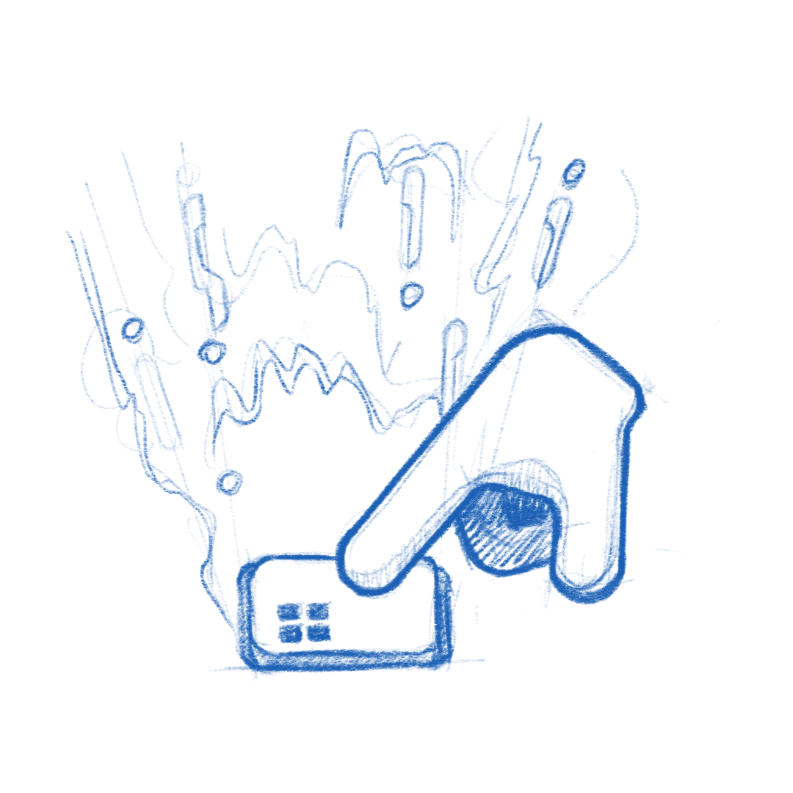
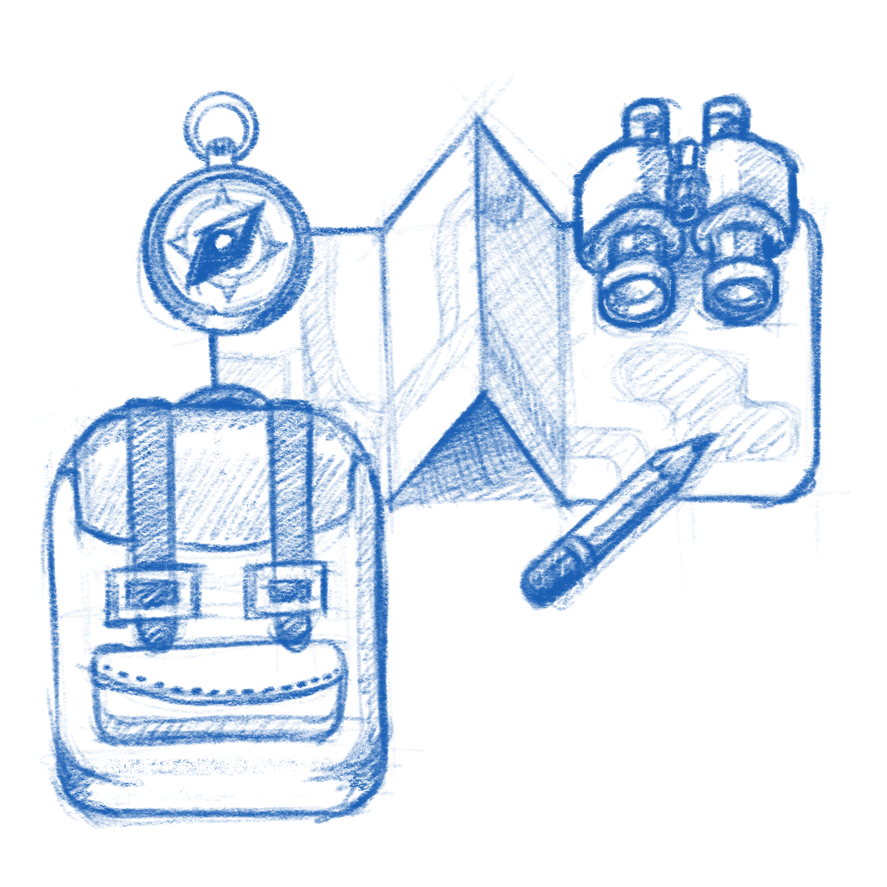
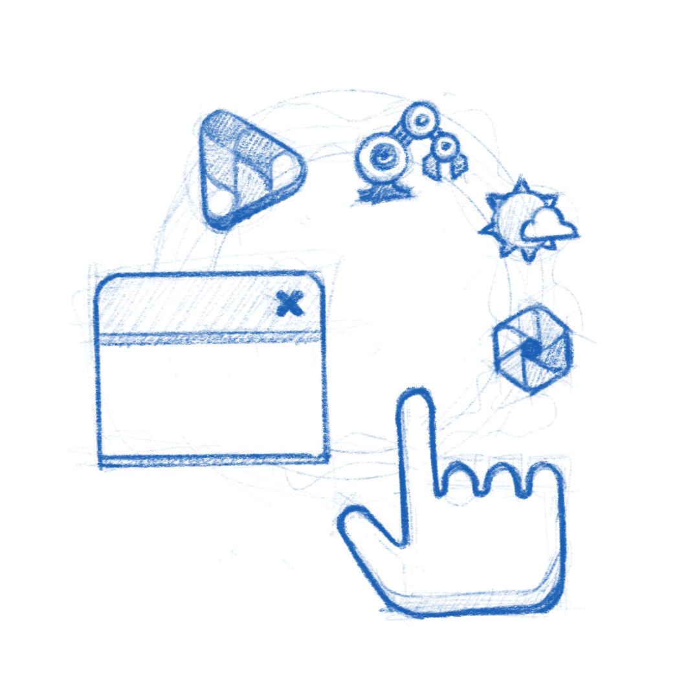
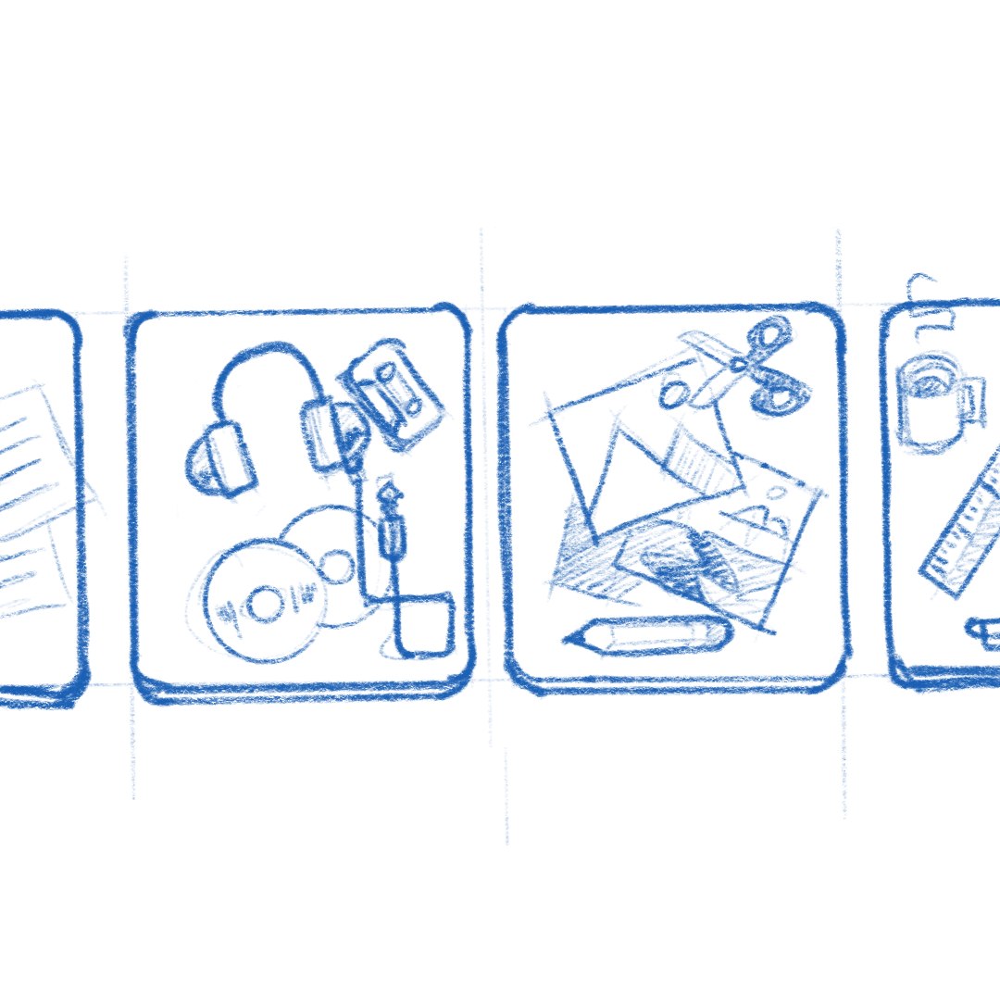

+++
title = "Tour Sketches"
description = "Sketching illustrations for the GNOME 40 onboarding experience."
date = 2021-02-25
[taxonomies]
tags = ["gnome", "design", "work", "sketch"]
+++

<!-- <a href="{{ site.url }}{{ page.url }}">absolute links</a> -->

One of the things that came up during [user testing](https://blogs.gnome.org/shell-dev/2021/02/15/shell-ux-changes-the-research/) GNOME 40 was that people went through the [Tour](https://gitlab.gnome.org/GNOME/gnome-tour) and all the abstract(ish) UI illustrations didn't really help people orient themselves on screen. We did get positive feedback on the feel of the tour though. For the new Tour [we iterated](https://gitlab.gnome.org/Teams/Design/os-mockups/-/issues/79) on some illustrations that help solidify [the style](https://gitlab.gnome.org/Teams/Design/app-illustrations) and give a nice welcoming vibe to the experience.

Because you can soon experience GNOME 40 yourself, here's a few sketches of the exploratory phase. Be sure to check out some background on how the [animations were done](/posts/animated-tour/).

