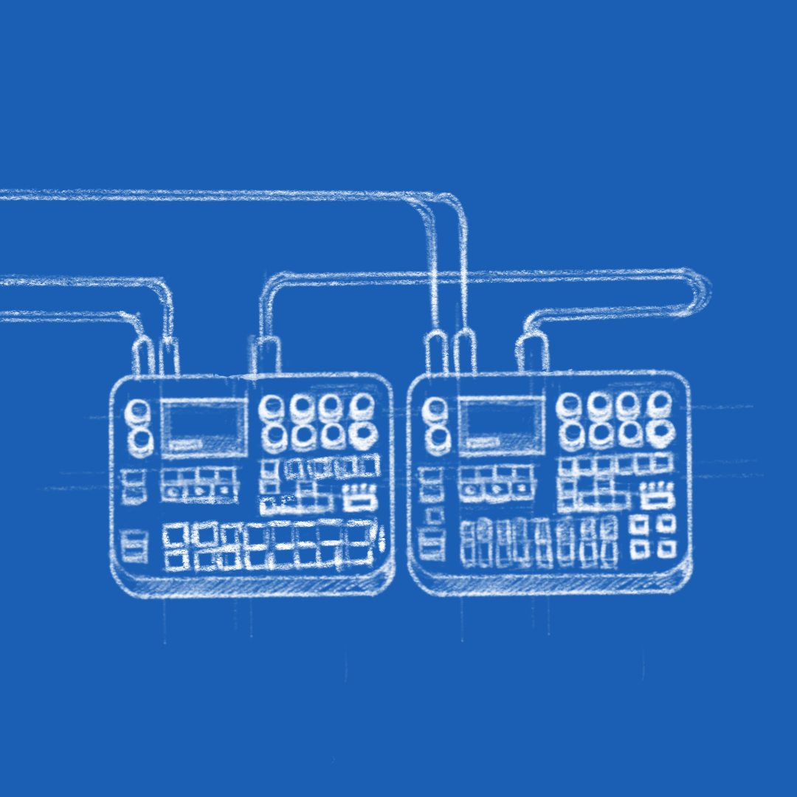

I avoid fiddling with batteries in the house, so I soldered up a [4S Li-Ion pack in the garden](battery.jpg) and tested a high speed cruise in the usual spot. Jammed a bit on my elektron boxes and here I present a super long test flight that's now almost watchable.

<iframe title="vimeo-player" src="https://player.vimeo.com/video/552584366" width="640" height="360" frameborder="0" allowfullscreen></iframe>

[Previously](),
[Previously]().
