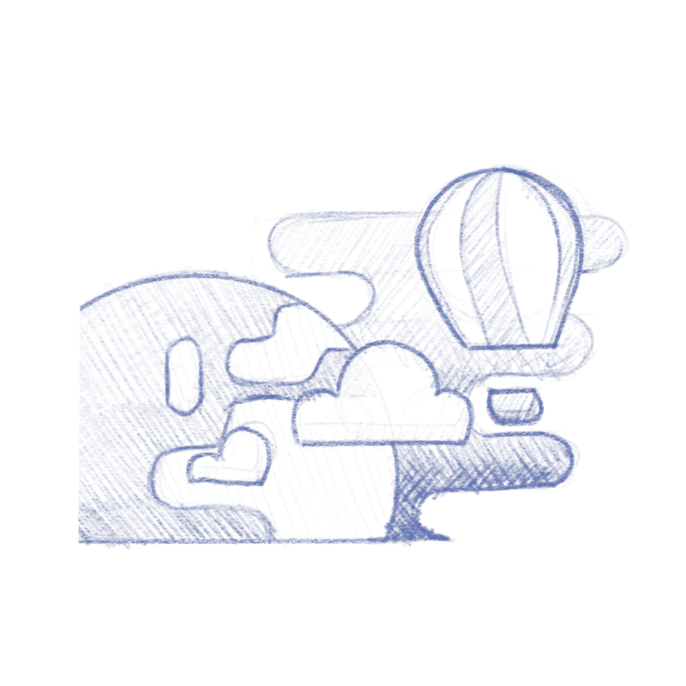
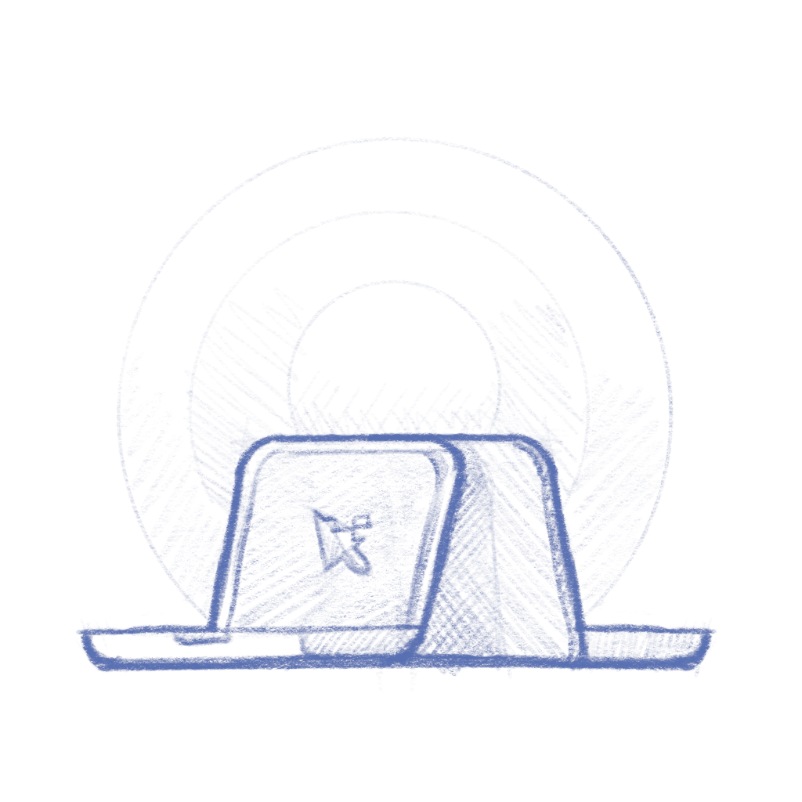
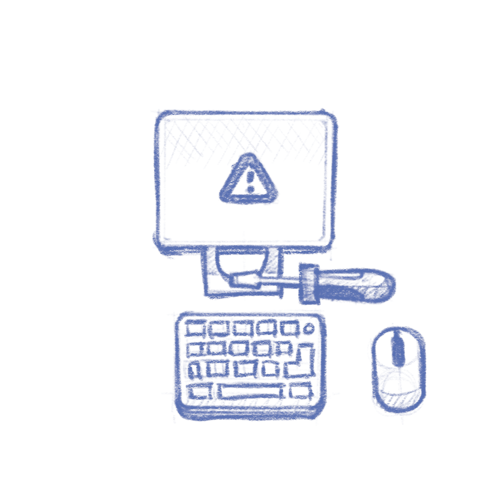
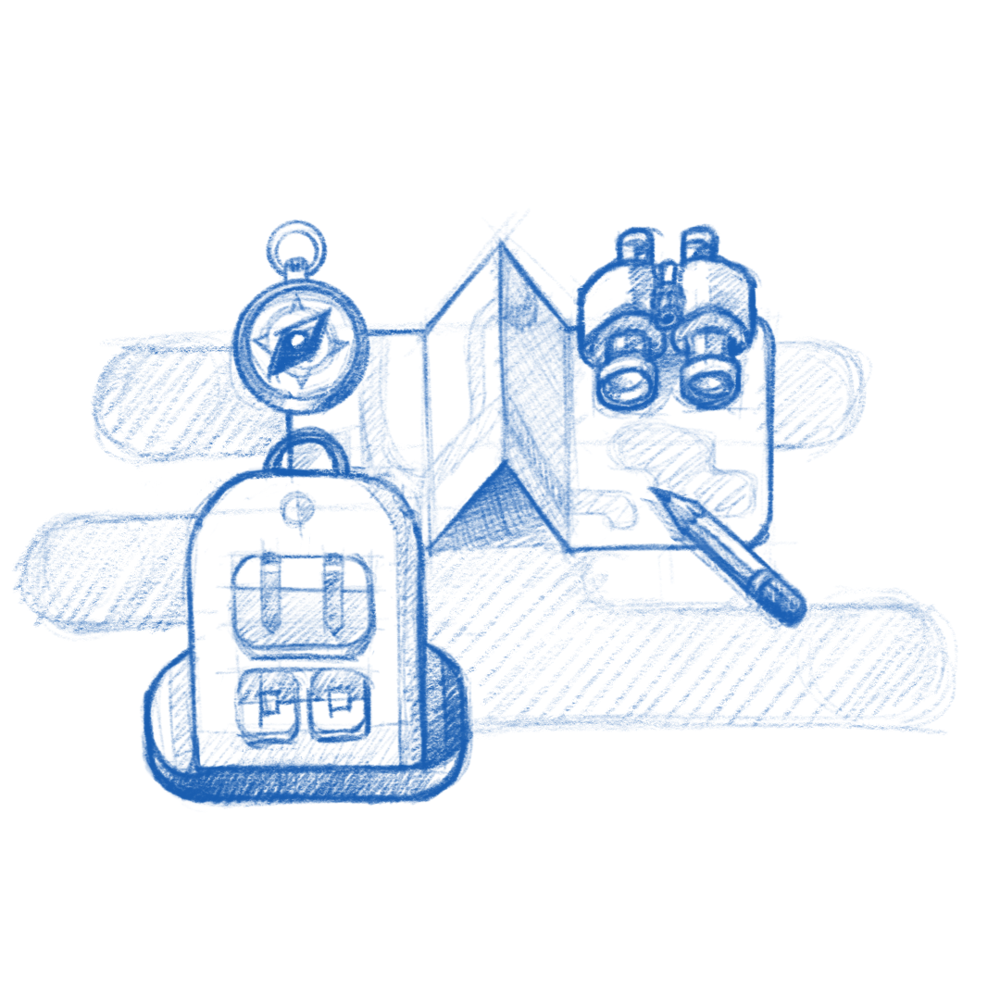
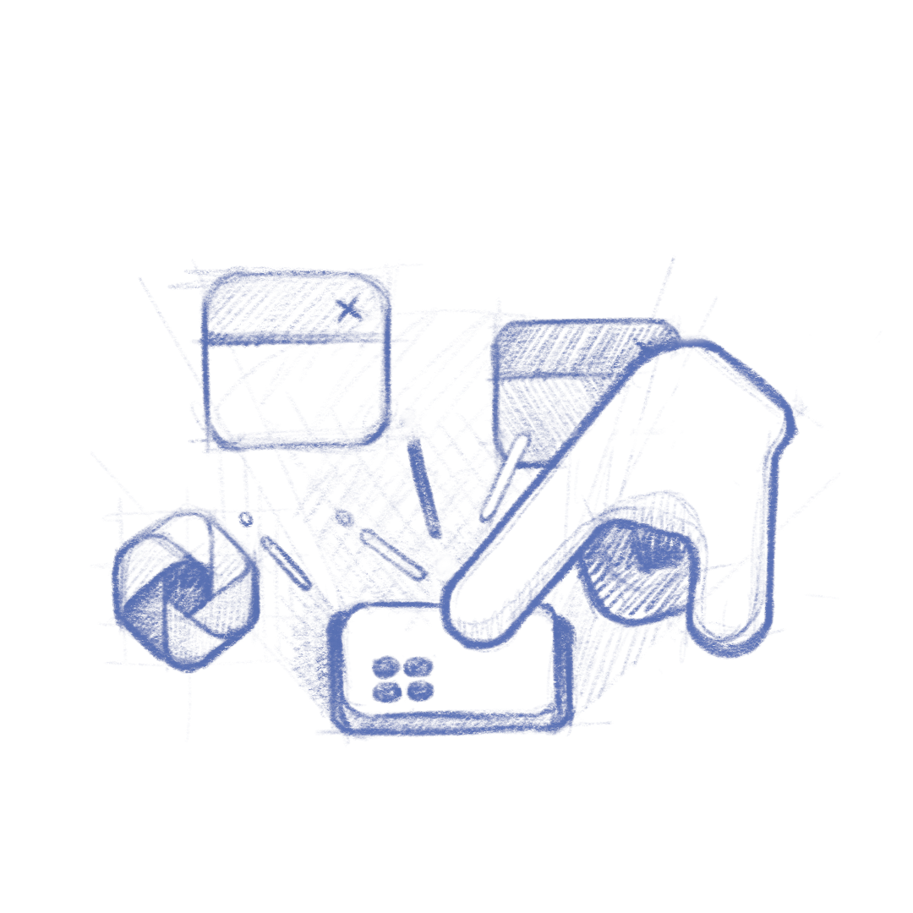
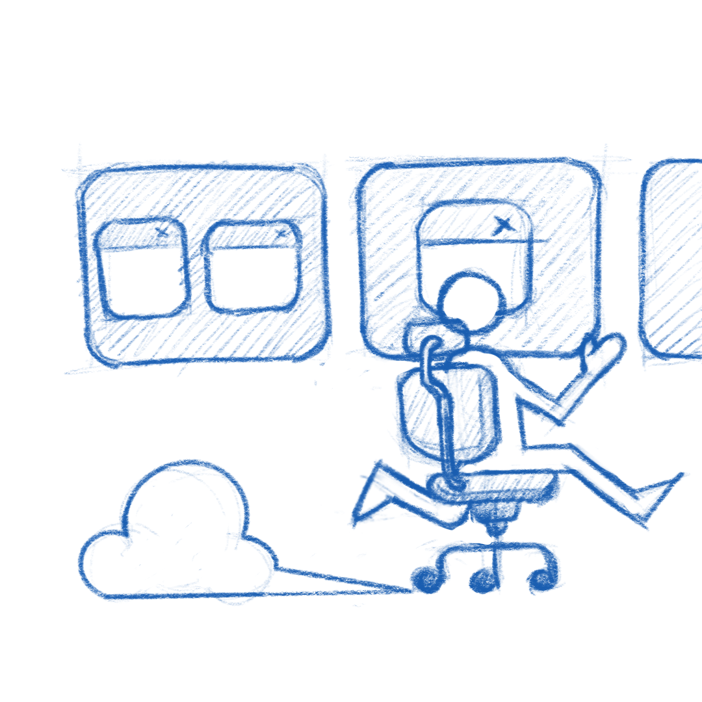
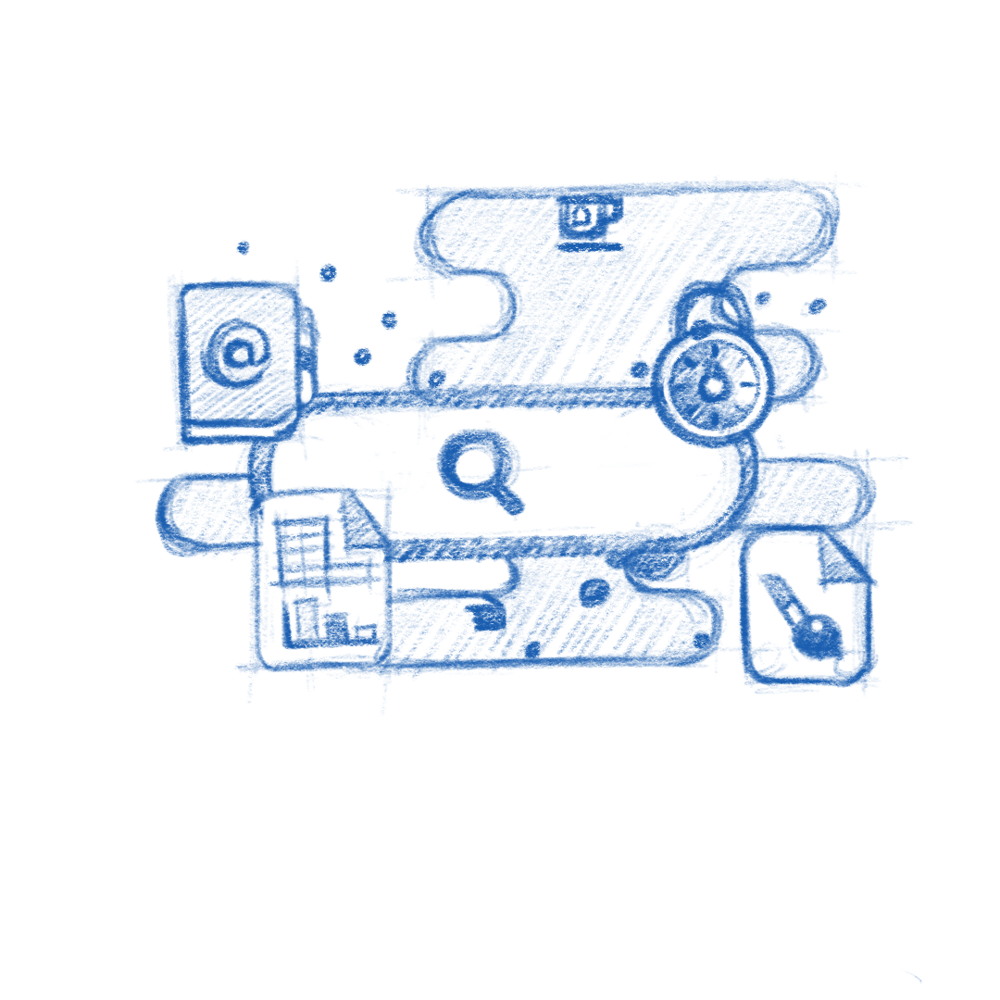
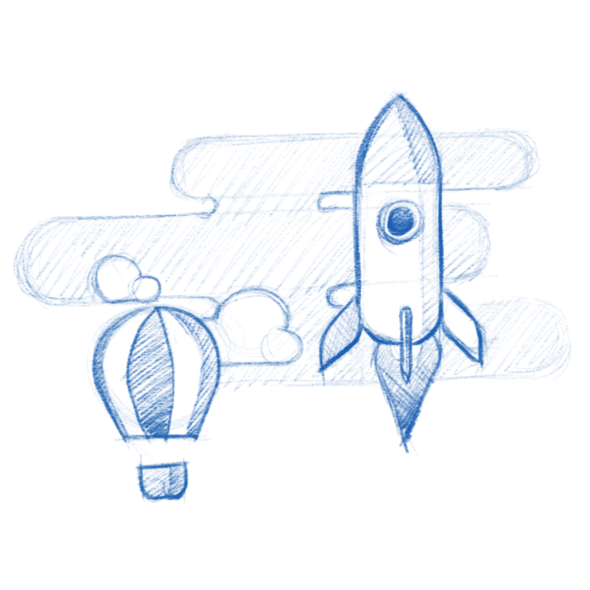

+++
title = "Onboarding Sketches"
description = "Explorations behind the GNOME 41 onboarding illustrations."
date = 2021-08-16
[taxonomies]
tags = ["gnome", "design", "work", "sketch"]
+++

<!-- <a href="{{ site.url }}{{ page.url }}">absolute links</a> -->

GNOME 41 is now UI frozen, so without spoiling the release much, I'd like to share some of the explorations that led to some of the onboarding in both app space (mostly [Connections](https://flathub.org/apps/details/org.gnome.Connections)) and the new [Tour](https://gitlab.gnome.org/GNOME/gnome-tour).

[Previously](/posts/tour-sketches/).