+++
title = "Pixel Inktober"
slug = "pixel-inktober-2021"
date = 2021-11-01
[taxonomies]
tags = ["pixel", "pixaki", "art", "inktober"]
+++

For the first time ever I actually finished a [monthly challenge](https://inktober.com/).

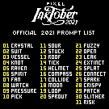
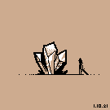
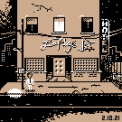
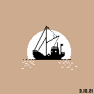
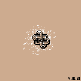
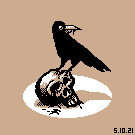
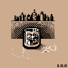

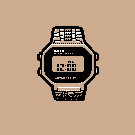
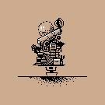
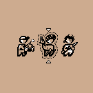
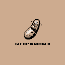

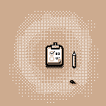

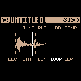

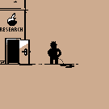

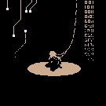

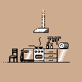
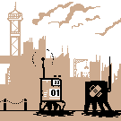

Off to the [Nodevember](https://nodevember.io/)!