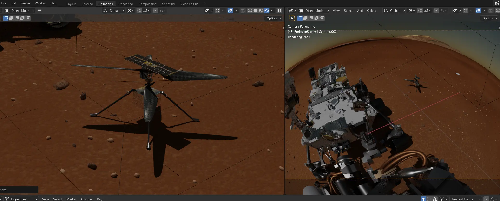

Next week it's going to be a year since Ingenuity made the first flight in an atmosphere of another planet. An atmosphere with about 1% of density of the one on Earth.

<iframe src="https://player.vimeo.com/video/686244806?h=f8f41b2cd3&amp;badge=0&amp;autopause=0&amp;player_id=0&amp;app_id=58479" frameborder="0" allow="autoplay; fullscreen; picture-in-picture" allowfullscreen style="width: 100%; height: auto; aspect-ratio: 16 / 9;" title="Ingenuity&amp;#039;s One Year of Mars Flights"></iframe>

Something that sounded unlikely became a great success with [24 flights](https://mars.nasa.gov/technology/helicopter/#Flight-Log) so far. To celebrate the occasion I revisited an older project of mine and used more appropriate footage shot by my friend [VOPO](https://www.vojtechpollak.com/) at Fuertaventura, Canary Islands. I rendered some overlays of the Ingenuity model kindly provided by NASA.

The music was composed on the [Dirtywave M8 Tracker](https://dirtywave.com/), went straight from the device, no mastering. The time constraints of [weeklybeats](https://weeklybeats.com/) is brutal. I used a hint to the *Close Encounters of the Third Kind* main theme, but because the flight is unrealistically dynamic, it leans on a mangled classic [Jungle Jungle](https://free-sample-packs.com/junglejungle-1989-1999-sample-pack/) break.

Thanks to the C-Base crew for taking good care of us and the GNOME Fundation to support the travel (mostly on the surface).

